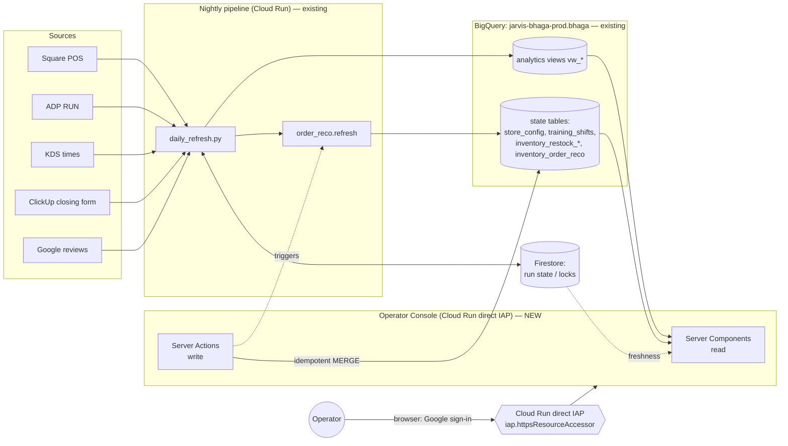
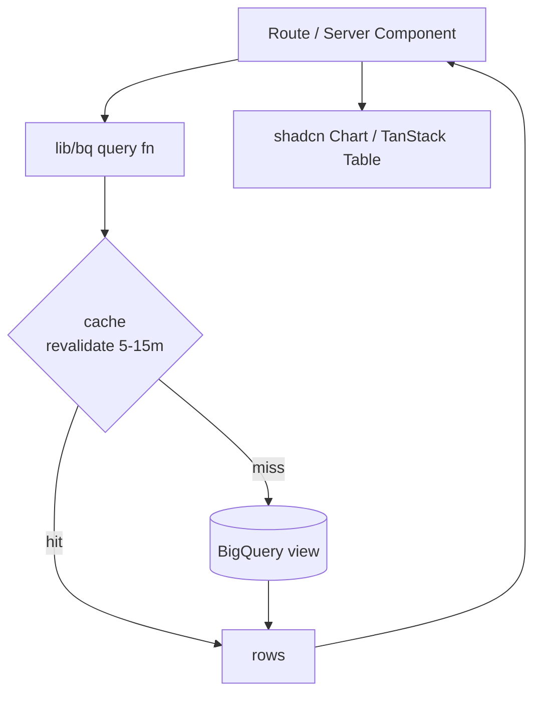
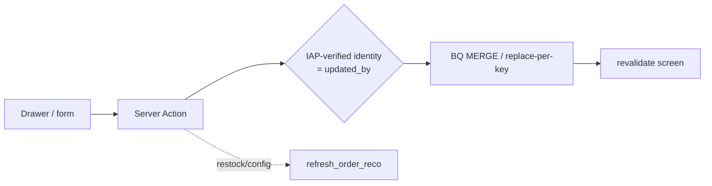
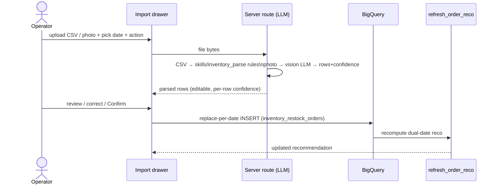
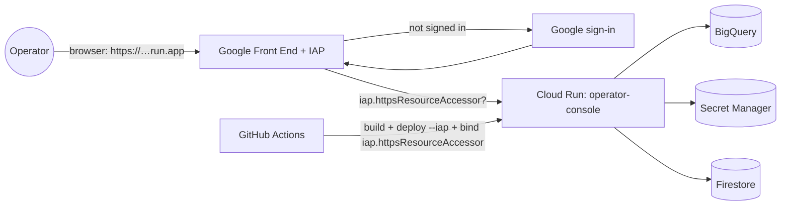

# Palmetto Operator Console — Architecture

> **Status:** Design / alignment draft (pre-milestones). This is the high-level
> component + technology design for the website that replaces the Grafana BHAGA
> Analytics dashboard. Milestones and execution plan follow **after** we align
> on this doc. See [`PLAN.md`](PLAN.md) for the living project plan.

The console is a single operator-facing web app (title: **Palmetto · Texas —
Operator Console**) that unifies data currently fragmented across Square, ADP,
ClickUp, Google, and Grafana into one navigable surface, and adds first-class
**write-backs** (goals, training shifts, recognition bonuses, restock schedule /
actuals) that today live only in Slack slash-commands or nowhere.

**Design reference:** [BHAGA Operator Console — Designs](https://www.figma.com/design/Mdlm8YGTIvi6WzgLcNdaXI/BHAGA-Operator-Console-%E2%80%94-Designs?node-id=0-1)
(fileKey `Mdlm8YGTIvi6WzgLcNdaXI`) — see [`PLAN.md`](PLAN.md) § Design status for
per-screen node IDs and the Figma-tooling path-length caveat.

---

## 1. Design principles

1. **The app is a thin, read-mostly skin over the existing BHAGA warehouse.** All
   analytics already exist as `jarvis-bhaga-prod.bhaga.*` BigQuery views. The app
   does **no** metric math — it renders views, exactly like Grafana does today
   (`scripts/check_grafana_no_logic.py` philosophy). New numbers = new BQ view, not
   app logic.
2. **Every write goes through the sanctioned MERGE layer.** Writes reuse the exact
   idempotent BQ MERGE / replace-per-key patterns already in
   `cloud/webhook/handler.py` (training shifts, `store_config`, restock schedule /
   orders). The app is another caller of the same contracts — never a new,
   divergent write path.
3. **Prod runs on hosted infra.** Cloud Run (native IAM) + BigQuery + Secret Manager.
   No laptop runtime. (Matches the repo-wide convention.)
4. **Config-driven, multi-store from day one.** `store` is a first-class filter;
   goals and capacity live in `store_config`, never hardcoded.
5. **Grafana coexists during migration.** The dashboard stays live until the
   console reaches parity; both read the same views, so they can't diverge.

---

## 2. Technology stack (with trade-offs)

### 2.1 Framework

| Option | Pros | Cons | Verdict |
|---|---|---|---|
| **Next.js 15 (App Router, RSC)** | Server Components query BQ directly (no separate API tier); server actions for writes; one deployable; great DX | React Server Component learning curve | **Chosen** |
| Remix | Great data loaders/mutations | Smaller ecosystem for our chart/table libs | No |
| Vite SPA + separate API | Clean split | Two deploy units, must hand-build API + auth plumbing | No |

**Why:** RSC lets each screen fetch its BQ views on the server (credentials never
reach the browser), and **server actions** give us typed, CSRF-safe write-backs
without a bespoke REST layer.

### 2.2 UI, charts, tables

| Concern | Choice | Alternatives considered |
|---|---|---|
| Component kit | **shadcn/ui + Tailwind v4** | MUI (heavier), Chakra |
| Charts | **Recharts** via shadcn `Chart` | visx (lower-level), ECharts, Tremor |
| Tables (sortable, frozen cols) | **TanStack Table v8** | AG Grid (heavy/licensed) |
| Icons | **lucide-react** | — |

TanStack Table's column pinning covers the Order Assistant "freeze Item / Current
Qty / Avg per day while scrolling the date column-groups" requirement (mirrors
Grafana panel 83's `frozenColumns.left = 3`).

### 2.3 Data, auth, infra

| Concern | Choice | Notes |
|---|---|---|
| Warehouse client | **`@google-cloud/bigquery`** (server-only) | Parameterized queries; ADC on Cloud Run |
| Reads | RSC, `export const dynamic = "force-dynamic"` | Not `revalidate` — Next's Full Route Cache would serve a cached render at the CDN edge to a *new* unauthenticated caller even after Cloud Run's IAM check passed for the original request, bypassing auth for that path (found 2026-07-05 while re-locking the preview: `/home` kept returning cached 200s after IAM was re-enabled). Views still refresh nightly; the per-request BQ read is cheap enough that always-dynamic has no material cost here. |
| Client interactivity | **TanStack Query** (only where needed) | Most screens are static RSC |
| Writes | **Next.js server actions** → BQ MERGE | Same contracts as `handler.py` |
| Auth | **Cloud Run direct IAP** (`--no-allow-unauthenticated --iap`, custom External OAuth client) | Reverses the 2026-07-04 "no IAP" pivot: that pivot hit the Google-managed brand flow, which needs a Workspace org; a custom **External** OAuth client (Console-only, one-time) works without one — see PLAN.md decisions log 2026-07-05. Browser-native Google sign-in; access is `roles/iap.httpsResourceAccessor` IAM, no app-level allowlist |
| Secrets | **Secret Manager** + ADC | No secrets in image/git |
| LLM ingestion | Server route → Gemini/Claude (vision) | CSV/photo → structured rows → operator confirm |
| Hosting | **Cloud Run** (Next.js `output: standalone` container) | Autoscale to zero |
| CI/CD | **GitHub Actions** (build → deploy) | Mirrors existing `deploy.yml` |

### 2.4 Proposed repo location

```
apps/operator-console/          # Next.js app (new)
  app/                          # App Router routes (one dir per screen)
  components/                   # shared UI (charts, tables, KPI, drawers)
  lib/bq/                       # BigQuery data-access layer (query fns per view)
  lib/actions/                  # server actions (write-backs)
  lib/auth/                     # IAP identity extraction (JWT-verified) + store scoping
  Dockerfile
docs/operator-console/          # this doc + PLAN.md
```

---

## 3. System context

How the console sits in the existing BHAGA data flow. The **left half already
exists** (nightly pipeline → BQ). The console is the new read/write client on the
right.



**Key point:** the console does not replace the pipeline or the Slack command —
it's a parallel, richer client on the same tables. A restock uploaded in the app
and one uploaded via `/bhaga-cloud restock` converge on the same rows.

---

## 4. Read architecture

Each screen is a route whose Server Component calls typed query functions in
`lib/bq/` that `SELECT * FROM vw_*` (plus store/date params). No math in the app.



### Screen → data source → write-back matrix

| Screen | Reads (BQ `vw_*` / tables) | Write-backs |
|---|---|---|
| **Home** | labor/sales/orders (`vw_model_labor_daily`), speed (`vw_order_quality_daily`), inventory risk (`vw_inventory_order_assistant`), goals (`store_config`), freshness (Firestore + `refresh_date`) | Goals → `store_config` |
| **Sales** | `vw_model_labor_daily`, `square_item_daily` | — |
| **Labor** | `vw_model_labor_daily` / `_weekly` | — |
| **Forecast** | `vw_model_forecast`, `vw_forecast_accuracy`, `vw_forecast_exclusions` | — |
| **Order Quality** | `vw_order_quality_daily`, `vw_kds_order_quality_by_source_daily` | — |
| **Payroll & People** | `vw_model_payroll_period` (+ per-review), `training_shifts` | `training_shifts`, **recognition bonuses (new table)**, `employee_aliases` |
| **Inventory / Ordering** | `vw_order_assistant_table`, `vw_inventory_order_assistant`, `vw_order_reco_combined`, `vw_order_reco_next_dates`, `inventory_restock_schedule/orders` | `inventory_restock_schedule`, `inventory_restock_orders` (+ trigger `refresh_order_reco`), `order_reco_max_tubs` → `store_config` |
| **Pipeline Health** | Firestore run state, per-view `refresh_date`, `status.py` logic | (optional) trigger refresh |

---

## 5. Write architecture

Writes are **server actions** that call the same idempotent contracts as
`cloud/webhook/handler.py`. Nothing is written to BQ until the operator confirms.



Reused write contracts (already proven in `handler.py`):

- **Training shift** → MERGE into `training_shifts` (key: store, employee, date).
- **Goals / capacity** → MERGE into `store_config` (key: store, key). Capacity =
  `order_reco_max_tubs`; changing it re-runs `refresh_order_reco`.
- **Restock schedule** → MERGE into `inventory_restock_schedule` (key: store, date).
- **Restock actuals** → **replace-per-date**: DELETE `inventory_restock_orders`
  for (store, date), INSERT parsed rows, then `refresh_order_reco`.
- **Reset to estimated** → DELETE actuals for (store, date), then refresh.
- **Recognition bonus** → *new* MERGE table (mirror `training_shifts`) — no write
  path exists on `main` yet (flagged in PLAN.md).

### 5.1 LLM restock import (CSV or photo) — the superset of the Slack modal

The Slack `/bhaga-cloud restock` modal accepts a **CSV** (`base,quantity`). The
console generalizes this to **CSV or a photo of the delivery slip**, parsed by an
LLM, with a mandatory human confirm step before any BQ write.



---

## 6. Order Assistant coverage (dual-date model)

The Inventory / Ordering screen must render the **dual-date** recommendation from
`vw_order_reco_combined`, not a single list. Layout:

- **Frozen identity columns** (left, pinned): `Item`, `Current Qty`, `Avg per day`.
- **Per-date column group ×2** (the next two future registered delivery dates from
  `vw_order_reco_next_dates`): `On Hand at Restock`, `Order Tubs`,
  `Order Weight (lbs)`, `After Restock`, `Days Left After Restock`, and a
  **Source badge** (`Estimated` vs `Actuals`).
- **TOTAL row** per date incl. pallet weight (`Σ weight + 50·CEIL(Σtubs/40)`).
- **Restock schedule panel** with the three operator actions from the Slack modal:
  **Register date (estimated)**, **Add order (actuals)** (CSV/photo → §5.1),
  **Reset to estimated**.
- **Capacity control** bound to `order_reco_max_tubs` (default 120); editing it
  recomputes the recommendation.
- **Days of cover** chart from `vw_inventory_order_assistant` (already designed).

Freshness for the closing-form source (`inventory_closing_daily` /
`vw_inventory_base_latest_daily`) and the restock schedule is surfaced on
**Pipeline Health**.

---

## 7. Auth & deployment



- **Cloud Run direct IAP** (custom External OAuth client, no load balancer, no
  added cost — reverses the 2026-07-04 "no IAP" pivot, see PLAN.md decisions log
  2026-07-05) fronts the service; only the IAP service agent holds
  `run.invoker` on Cloud Run itself, so `X-Goog-Authenticated-User-Email` is
  trustworthy. The app additionally verifies the signed `X-Goog-IAP-JWT-Assertion`
  via `google-auth-library` and cross-checks its `email` claim against the plain
  header before using it as `updated_by` / for store scoping.
- **Cloud Run** service account has least-privilege BQ (dataset-scoped) +
  Firestore read + Secret Manager access via ADC.
- **CI**: build the standalone container, push to Artifact Registry, deploy with
  `--iap`, grant `roles/iap.httpsResourceAccessor` per operator — a new workflow
  modeled on the existing `deploy.yml`.

---

## 8. Open decisions (for alignment)

1. **Repo location** — `apps/operator-console/` (proposed) vs a separate repo.
2. **Recognition-bonus storage** — new `recognition_bonuses` MERGE table + ADP
   bonus reconciliation (no write path exists today).
3. **LLM provider for photo parsing** — Gemini (native GCP) vs Claude.
4. **One-shot PR vs staged** — you asked for one-shot; §PLAN captures how we keep
   it reviewable (feature-flag unfinished screens, land read-only first internally).
5. **Goals model granularity** — per-store weekly + monthly targets in
   `store_config` (keys like `goal_net_sales_weekly`).

---

## 9. Responsive design

The console is used on operator phones as much as the office desktop, so every
screen must render without horizontal page-overflow at **390px** (mobile) and
**768px** (tablet); the sidebar collapses to a `Sheet`-based `MobileNav` below
the `md` breakpoint (unchanged).

- **Dense tables keep horizontal scroll, not a stacked-card redesign.** Pinned
  identity columns (`DataTable` `pinLeft`) stay `sticky`, but their `left`
  offset is **measured from rendered header widths** (`useLayoutEffect` +
  `ResizeObserver` in `components/tables/DataTable.tsx`), not hardcoded to
  `left:0` — a fixed offset made every pinned column collapse onto the first
  one as soon as the table scrolled. A right-edge fade (`bg-gradient-to-l`)
  signals there is more to scroll; it disappears once the container reaches
  `scrollWidth`.
- **Stat-card grids default to 2-up on mobile** (`grid-cols-2 …`) instead of
  1-up, so KPI tiles stay legible without an oversized single column
  (Pipeline Health, Payroll reconciliation).
- **Tap targets** (mobile nav rows, filter pills) target ~44px per the
  standard mobile hit-area guideline.

## 10. Filter-control convention

One rule, applied everywhere a screen exposes a filter:

| Option count | Control | Examples |
|---|---|---|
| ≤4 fixed options | `components/filters/FilterPills.tsx` | Payroll `View` (Reconciliation / Detail) |
| ≥5 options, or a dynamic/data-driven set | `components/filters/FilterSelect.tsx` (dropdown) | `Period` (6 date-range presets, every Performance screen + Home); Order Quality `Source` (9 channels) |

Both are thin client components that read/write the same URL search param via
`useRouter`/`usePathname` (so filters are shareable/bookmarkable links, and the
Server Component re-fetches on navigation) — `FilterSelect` differs only in
rendering a `ui/select.tsx` trigger instead of a pill row, which keeps a
long option list from wrapping into multiple rows at narrow widths.

## 11. Grafana / console shared dataset

The console and the Grafana BHAGA Analytics dashboard read the **same**
`jarvis-bhaga-prod.bhaga.vw_*` views, populated by the **same** nightly
`daily_refresh.py` run (§3). There is no separate sync layer and none is
needed: a write from the console (goals, training shifts, restock) lands via
the same idempotent MERGE contracts the Slack path uses (§5), so the next
Grafana panel render and the next console page render both see it — they are
two read clients of one warehouse, not two warehouses.

## 12. Date range + aggregation

Every Performance screen (Sales, Labor, Forecast, Order Quality) shares one
range/grain contract from `lib/filters/range.ts`:

- **Range**: the 6 calendar presets (`7d`/`30d`/`this_week`/`this_month`/
  `last_week`/`last_month`, Monday-start weeks, America/Chicago) plus
  `custom`, which reads `?from=&to=` (two `<input type="date">`s in
  `DateRangePicker`) instead of a fixed window. Invalid/missing custom bounds
  fall back to the `30d` default — never a thrown error on a malformed URL.
- **Grain** (`day`/`week`/`month`, `AggregationSelect`): NOT a bind param —
  `bucketSql(grain)` returns one of three **whitelisted** SQL fragments
  (`date`, `DATE_TRUNC(date, WEEK(MONDAY))`, `DATE_TRUNC(date, MONTH)`),
  never string-interpolated from user input. `formatBucket(date, grain)`
  renders the bucket label (`"Jun 30"` / `"Wk of Jun 29"` / `"Jan 2026"`) by
  parsing the `YYYY-MM-DD` string with a regex, deliberately bypassing
  `Date`/`Intl.DateTimeFormat` — those convert through UTC and shift the
  displayed calendar date by up to a day (and, for month grain, sometimes
  the wrong month) once a timezone offset is applied.
- **Rollup correctness**: additive metrics (`net_sales`, `orders`,
  `total_hours`, …) are `SUM()`-ed per bucket in `lib/bq/queries.ts`
  (`laborByGrain`, `forecastByGrain`, `forecastAccuracyByGrain`); ratios
  (`labor_pct`, `orders_vs_prior_wk`, …) are **recomputed** from the summed
  components with `SAFE_DIVIDE`, never averaged — averaging a ratio across
  days silently gives the wrong number the moment day-to-day volume varies.
  `dow` (day-of-week) is `NULL` for `week`/`month` grain and the column is
  hidden client-side rather than shown blank.
- **Percentiles cannot be rolled up from a daily view** — `orderQualityByGrain`
  instead re-derives `APPROX_QUANTILES` per bucket from the raw per-ticket
  `vw_kds_per_item_min` view (migration 034), so weekly/monthly percentiles
  are exact, not an average-of-medians approximation.

## 13. Order Quality parity

Grafana's "Order KDS Times" panel (`dashboard.json` panel 52) is a per-order
investigation table filtered by date range, `order_source`, and a "Min /
Item" threshold — this had no console equivalent before. `kdsOrderInvestigation`
reproduces it: one row per ticket (`date_local`, `ticket_name`, `order_source`,
start/end, item counts, `min_per_item`, and a correlated `staff_on_shift`
lookup), filtered server-side by the same `source`/`onTime` params as the
percentile chart above it — so the Source dropdown now drives **both** the
aggregate percentile table and the per-order drill-down, matching Grafana's
"one filter row governs every panel on the tab" behavior instead of the two
diverging independently.
