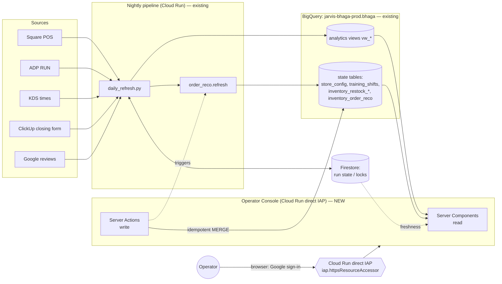
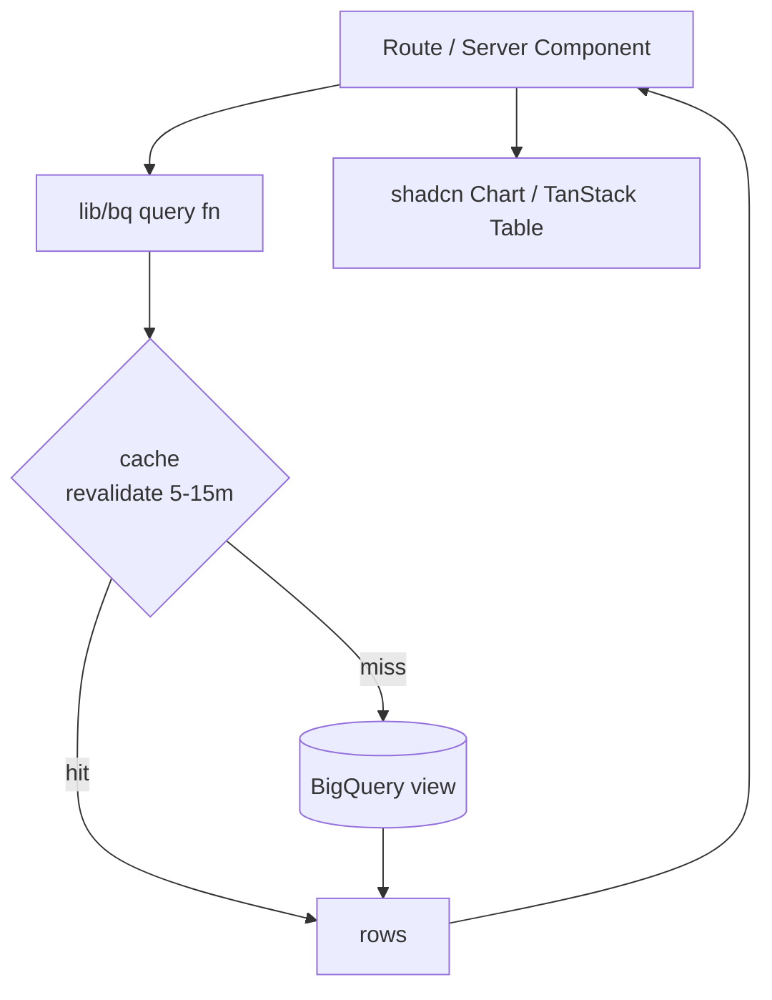
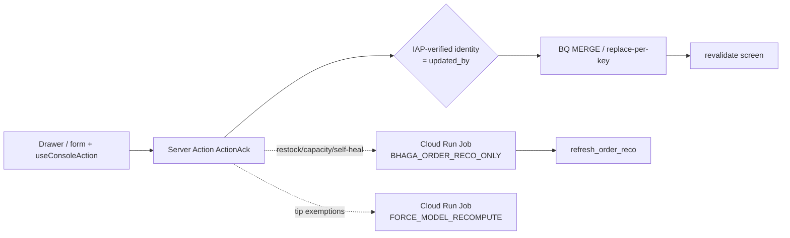
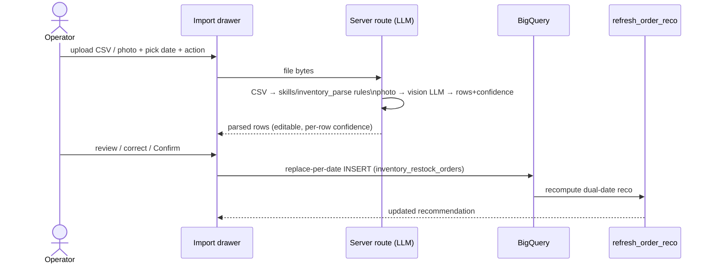
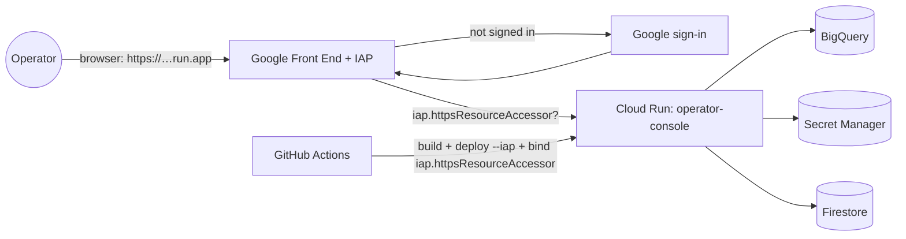

# Palmetto Operator Console — Architecture

> **Status:** Design / alignment draft (pre-milestones). This is the high-level
> component + technology design for the website that replaces the Grafana BHAGA
> Analytics dashboard. Milestones and execution plan follow **after** we align
> on this doc. See [`PLAN.md`](PLAN.md) for the living project plan.

The console is a single operator-facing web app (title: **Palmetto · Texas —
Operator Console**) that unifies data currently fragmented across Square, ADP,
ClickUp, Google, and Grafana into one navigable surface, and adds first-class
**write-backs** (goals, training shifts, recognition bonuses, restock schedule /
actuals) that today live only in Slack slash-commands or nowhere.

**Design reference:** [BHAGA Operator Console — Designs](https://www.figma.com/design/Mdlm8YGTIvi6WzgLcNdaXI/BHAGA-Operator-Console-%E2%80%94-Designs?node-id=0-1)
(fileKey `Mdlm8YGTIvi6WzgLcNdaXI`) — see [`PLAN.md`](PLAN.md) § Design status for
per-screen node IDs and the Figma-tooling path-length caveat.

---

## 1. Design principles

1. **The app is a thin, read-mostly skin over the existing BHAGA warehouse.** All
   analytics already exist as `jarvis-bhaga-prod.bhaga.*` BigQuery views. The app
   does **no** metric math — it renders views, exactly like Grafana does today
   (`scripts/check_grafana_no_logic.py` philosophy). New numbers = new BQ view, not
   app logic.
2. **Every write goes through the sanctioned MERGE layer.** Writes reuse the exact
   idempotent BQ MERGE / replace-per-key patterns already in
   `cloud/webhook/handler.py` (training shifts, `store_config`, restock schedule /
   orders). The app is another caller of the same contracts — never a new,
   divergent write path.
3. **Prod runs on hosted infra.** Cloud Run (native IAM) + BigQuery + Secret Manager.
   No laptop runtime. (Matches the repo-wide convention.)
4. **Config-driven, multi-store from day one.** `store` is a first-class filter;
   goals and capacity live in `store_config`, never hardcoded.
5. **Grafana coexists during migration.** The dashboard stays live until the
   console reaches parity; both read the same views, so they can't diverge.

---

## 2. Technology stack (with trade-offs)

### 2.1 Framework

| Option | Pros | Cons | Verdict |
|---|---|---|---|
| **Next.js 15 (App Router, RSC)** | Server Components query BQ directly (no separate API tier); server actions for writes; one deployable; great DX | React Server Component learning curve | **Chosen** |
| Remix | Great data loaders/mutations | Smaller ecosystem for our chart/table libs | No |
| Vite SPA + separate API | Clean split | Two deploy units, must hand-build API + auth plumbing | No |

**Why:** RSC lets each screen fetch its BQ views on the server (credentials never
reach the browser), and **server actions** give us typed, CSRF-safe write-backs
without a bespoke REST layer.

### 2.2 UI, charts, tables

| Concern | Choice | Alternatives considered |
|---|---|---|
| Component kit | **shadcn/ui + Tailwind v4** | MUI (heavier), Chakra |
| Charts | **Recharts** via shadcn `Chart` | visx (lower-level), ECharts, Tremor |
| Tables (sortable, frozen cols) | **TanStack Table v8** | AG Grid (heavy/licensed) |
| Icons | **lucide-react** | — |

TanStack Table's column pinning covers the Order Assistant "freeze Item / Current
Qty / Avg per day while scrolling the date column-groups" requirement (mirrors
Grafana panel 83's `frozenColumns.left = 3`).

### 2.3 Data, auth, infra

| Concern | Choice | Notes |
|---|---|---|
| Warehouse client | **`@google-cloud/bigquery`** (server-only) | Parameterized queries; ADC on Cloud Run |
| Reads | RSC, `export const dynamic = "force-dynamic"` | Not `revalidate` — Next's Full Route Cache would serve a cached render at the CDN edge to a *new* unauthenticated caller even after Cloud Run's IAM check passed for the original request, bypassing auth for that path (found 2026-07-05 while re-locking the preview: `/home` kept returning cached 200s after IAM was re-enabled). Views still refresh nightly; the per-request BQ read is cheap enough that always-dynamic has no material cost here. |
| Client interactivity | **TanStack Query** (only where needed) | Most screens are static RSC |
| Writes | **Next.js server actions** → BQ MERGE | Same contracts as `handler.py` |
| Auth | **Cloud Run direct IAP** (`--no-allow-unauthenticated --iap`, custom External OAuth client) | Reverses the 2026-07-04 "no IAP" pivot: that pivot hit the Google-managed brand flow, which needs a Workspace org; a custom **External** OAuth client (Console-only, one-time) works without one — see PLAN.md decisions log 2026-07-05. Browser-native Google sign-in; access is `roles/iap.httpsResourceAccessor` IAM, no app-level allowlist |
| Secrets | **Secret Manager** + ADC | No secrets in image/git |
| LLM ingestion | Server route → Gemini/Claude (vision) | CSV/photo → structured rows → operator confirm |
| Hosting | **Cloud Run** (Next.js `output: standalone` container) | Autoscale to zero |
| CI/CD | **GitHub Actions** (build → deploy) | Mirrors existing `deploy.yml` |

### 2.4 Proposed repo location

```
apps/operator-console/          # Next.js app (new)
  app/                          # App Router routes (one dir per screen)
  components/                   # shared UI (charts, tables, KPI, drawers)
  lib/bq/                       # BigQuery data-access layer (query fns per view)
  lib/actions/                  # server actions (write-backs)
  lib/auth/                     # IAP identity extraction (JWT-verified) + store scoping
  Dockerfile
docs/operator-console/          # this doc + PLAN.md
```

---

## 3. System context

How the console sits in the existing BHAGA data flow. The **left half already
exists** (nightly pipeline → BQ). The console is the new read/write client on the
right.


```mermaid
flowchart LR
  subgraph Sources
    SQ[Square POS]
    ADP[ADP RUN]
    KDS[KDS times]
    CU[ClickUp closing form]
    GR[Google reviews]
  end
  subgraph Pipeline["Nightly pipeline (Cloud Run) — existing"]
    DR[daily_refresh.py]
    OR[order_reco.refresh]
  end
  subgraph BQ["BigQuery: jarvis-bhaga-prod.bhaga — existing"]
    V[(analytics views vw_*)]
    T[(state tables:\nstore_config, training_shifts,\ninventory_restock_*, inventory_order_reco)]
  end
  FS[(Firestore:\nrun state / locks)]

  SQ & ADP & KDS & CU & GR --> DR --> V
  DR --> OR --> T
  DR <--> FS

  subgraph Console["Operator Console (Cloud Run direct IAP) — NEW"]
    RSC[Server Components\nread]
    ACT[Server Actions\nwrite]
  end
  IAP{{Cloud Run direct IAP\niap.httpsResourceAccessor}}
  OP((Operator)) -->|browser: Google sign-in| IAP --> Console
  V --> RSC
  T --> RSC
  FS -. freshness .-> RSC
  ACT -->|idempotent MERGE| T
  ACT -.triggers.-> OR
```

**Key point:** the console does not replace the pipeline or the Slack command —
it's a parallel, richer client on the same tables. A restock uploaded in the app
and one uploaded via `/bhaga-cloud restock` converge on the same rows.

---

## 4. Read architecture

Each screen is a route whose Server Component calls typed query functions in
`lib/bq/` that `SELECT * FROM vw_*` (plus store/date params). No math in the app.


```mermaid
flowchart TD
  Screen[Route / Server Component] --> Q[lib/bq query fn]
  Q --> C{cache\nrevalidate 5-15m}
  C -->|miss| BQ[(BigQuery view)]
  C -->|hit| R[rows]
  BQ --> R --> Screen --> UI[shadcn Chart / TanStack Table]
```

### Screen → data source → write-back matrix

| Screen | Reads (BQ `vw_*` / tables) | Write-backs |
|---|---|---|
| **Home** (Goal and Tracking) | labor/sales (`vw_model_labor_daily`), **Finance** bank in/out/cash flow (`vw_plaid_money_in_daily` + spend view, exclude-from-accounting), **Cost** taxonomy parents, **Labor** PT/FT/Total rates + bank payroll twin; prep p95; bases at risk; goals | Goals → `store_config` |
| **Accounting** | Square net sales (`vw_model_labor_daily`), Plaid spend/in (`plaid_transactions`, spend + money-in views), `plaid_items`, taxonomy exclude; ledger From/To last-4 via amount sign | Plaid Link; category override; propose-rule (name regex ± from/to masks); taxonomy exclude toggles |
| **Sales** | `square_transactions` + `square_item_lines` via `salesByGrain` (Source multi-select; **Composition** bars with Aggregate/By-source stacks, or **Trend** lines with optional prior-period compare; unfiltered Composition totals match `vw_model_labor_daily`) | — |
| **Labor** | `vw_model_labor_daily` / `_weekly`, `adp_shifts` + `adp_scheduled_shifts` (actual vs schedule, concurrent, coverage); Sync → `BHAGA_ADP_SCHEDULE_ONLY` | Sync scheduled shifts |
| **Order Quality** | `vw_kds_per_item_min` (grain percentiles + avg), live by-source from `square_kds_tickets` | — |
| **Payroll & People** | `vw_model_payroll_period` (+ per-review), `training_shifts` (tip exemptions), `adp_shifts` | `training_shifts` (batch tip exemptions + recompute), **recognition bonuses (new table)**, `employee_aliases` |
| **Inventory / Ordering** | `vw_order_assistant_table`, `vw_inventory_order_assistant`, `vw_order_reco_combined`, `vw_order_reco_next_dates`, `vw_inventory_base_runway`, `inventory_restock_schedule/orders` | `inventory_restock_schedule`, `inventory_restock_orders` (+ trigger `refresh_order_reco`), `order_reco_max_tubs` → `store_config` |
| **Pipeline Health** | Firestore run state, per-view `refresh_date`, `status.py` logic | (optional) trigger refresh |
| **Automations** | `automations`, `automation_posts`, `model_review_bonus_period` (open-period leaderboard + `materialized_at_utc` freshness) | MERGE `automations`; Preview/Post once compose from open rollup; Gemini single-message vary (multi-draft rejected); Post once → ClickUp + INSERT `automation_posts` (once/CT-day soft gate + UI busy lock) |

---

## 5. Write architecture

Writes are **server actions** that call the same idempotent contracts as
`cloud/webhook/handler.py`. Nothing is written to BQ until the operator confirms.
Issue **#175 (Option B):** every mutating control uses the shared
`useConsoleAction` shell (`lib/actions/`); heavy follow-ups enqueue Cloud Run
Jobs (`bhaga-daily-refresh`) instead of blocking the click path. Audit + gate:
`lib/actions/MUTATING_ACTIONS.md`, `scripts/check_operator_console_actions.py`.


```mermaid
flowchart LR
  UI[Drawer / form + useConsoleAction] --> SA[Server Action ActionAck]
  SA --> AU{IAP-verified identity\n= updated_by}
  AU --> M[BQ MERGE / replace-per-key]
  M --> OK[revalidate screen]
  SA -. restock/capacity/self-heal .-> Job[Cloud Run Job\nBHAGA_ORDER_RECO_ONLY]
  SA -. tip exemptions .-> Job2[Cloud Run Job\nFORCE_MODEL_RECOMPUTE]
  Job --> RR[refresh_order_reco]
```

Reused write contracts (already proven in `handler.py`):

- **Tip exemption** → batch MERGE/DELETE into `training_shifts` (key: store, employee, date;
  optional `exempt_start`/`exempt_end` HH:MM window) via Payroll Detail **Update**, then
  Cloud Run Jobs recompute-only for touched dates. Editable only for the open pay period.
- **Goals / capacity** → MERGE into `store_config` (key: store, key). Capacity =
  `order_reco_max_tubs`; changing it enqueues order-reco refresh (`FEATURES.asyncOrderReco`).
- **Restock schedule** → MERGE into `inventory_restock_schedule` (key: store, date).
- **Restock actuals** → **replace-per-date**: DELETE `inventory_restock_orders`
  for (store, date), INSERT parsed rows, then enqueue `refresh_order_reco`.
- **Reset to estimated** → DELETE actuals for (store, date), then enqueue refresh.
- **Move date** (console-only) → read Actuals + Manual tub overrides for `from`,
  DELETE schedule (+ orphans) for `from`, MERGE `to`, re-INSERT carried rows on
  `to`, then enqueue `refresh_order_reco`. Works when `from` already has Actuals
  (e.g. wrong-date upload 8/17 → 8/20). Slack modal does not expose this.
- **Remove date** (console-only) → DELETE schedule + actuals + overrides for a
  date, then enqueue refresh. Requires an explicit confirm in the drawer.
- **Replace estimated date** (console-only, Estimated-only) → same as Move but
  refuses dates that already have Actuals. UI prefers **Move date**.
- **Recognition bonus** → *new* MERGE table (mirror `training_shifts`) — no write
  path exists on `main` yet (flagged in PLAN.md).

### 5.1 LLM restock import (CSV or photo) — the superset of the Slack modal

The Slack `/bhaga-cloud restock` modal accepts a **CSV** (`base,quantity`). The
console generalizes this to **CSV or a photo of the delivery slip**, parsed by an
LLM, with a mandatory human confirm step before any BQ write.


```mermaid
sequenceDiagram
  actor Op as Operator
  participant UI as Import drawer
  participant API as Server route (LLM)
  participant BQ as BigQuery
  participant RR as refresh_order_reco
  Op->>UI: upload CSV / photo + pick date + action
  UI->>API: file bytes
  API->>API: CSV → skills/inventory_parse rules\nphoto → vision LLM → rows+confidence
  API-->>UI: parsed rows (editable, per-row confidence)
  Op->>UI: review / correct / Confirm
  UI->>BQ: replace-per-date INSERT (inventory_restock_orders)
  BQ->>RR: recompute dual-date reco
  RR-->>UI: updated recommendation
```

---

## 6. Order Assistant coverage (dual-date model)

The Inventory / Ordering screen must render the **dual-date** recommendation from
`vw_order_reco_combined`, not a single list. Layout:

- **Frozen identity columns** (left, pinned): `Item`, `Current Qty`, `Avg per day`.
- **Per-date column group ×N** (live dates from `vw_order_reco_next_dates`,
  capped by `order_reco_max_slots` default 4 — migration 052; includes
  **today** until a base closing for today exists — migration 051): `On Hand
  at Restock`, `Order Tubs`, `Order Weight (lbs)`, `After Restock`, `Days Left
  After Restock`, and a **Source badge** (`Estimated` / `Manual` / `Actuals`).
  `Manual` is a per-base pin on an Estimated date (`inventory_order_tub_overrides`,
  migration 055) — does not flip the date to Actuals. Console
  pivots `inventory_order_reco` long-format so adding another registered
  schedule date adds another column group automatically.
- **Edit estimates / actuals** (Issues #225 / #238): click an **Order tubs**
  cell (or the header pencil) to open a batch Sheet for that date. Estimated
  dates: set Estimated vs Manual tubs, then Apply → replace-per-date overrides +
  one `refresh_order_reco`. Actuals dates: edit qty → replace-per-date
  `inventory_restock_orders` (same write as Restock Add actuals). Water-fill
  budget shrinks by pinned tubs on Estimated dates; pinned items (incl. 0) are
  excluded from candidates.
- **TOTAL row** per date incl. pallet weight (`Σ weight + 50·CEIL(Σtubs/40)`).
- **Restock schedule panel** with the three shared operator actions from the Slack
  modal (**Register date (estimated)**, **Add / update actuals** (estimate-prefilled
  form; optional CSV/photo → §5.1), **Reset to estimated**) plus console-only
  **Move date** (rekey schedule + Actuals/Manual pins `from → to`, then refresh
  dual-date reco) and **Remove date** (delete schedule + Actuals + overrides after
  confirm).
- **Base runway table** (Issue #164, `vw_inventory_base_runway`): urgency view
  at the top of Inventory / Ordering. Columns: Base, Stock, Vel/day, Days left
  (burn-down from today, ignores future restocks), **Stockout 1 / Restock 1 /
  Qty 1 / Status 1** and **Stockout 2 / Restock 2 / Qty 2 / Status 2**. Restock
  dates are **Actuals only** (up to two future `inventory_restock_orders`
  dates per base — estimated schedule dates do not appear). Stockout 2 chains
  after Restock 1 Actuals qty. Status is **Risky** when that slot’s restock is
  empty or stockout is before the restock date; **Fine** when restock arrives
  on or before stockout. Rows highlight when Status 1 or Status 2 is Risky.
  Default sort: Days left ascending. Dual-date reco below remains the source
  for order tubs / weight / Estimated vs Actuals (and still shows Estimated
  schedule dates).
- **Capacity control** bound to `order_reco_max_tubs` (default 120); editing it
  recomputes the recommendation.

Freshness for the closing-form source (`inventory_closing_daily` /
`vw_inventory_base_latest_daily`) and the restock schedule is surfaced on
**Pipeline Health**.

---

## 7. Auth & deployment


```mermaid
flowchart LR
  Op((Operator)) -->|browser: https://…run.app| GFE[Google Front End + IAP]
  GFE -->|"not signed in"| Consent[Google sign-in]
  Consent --> GFE
  GFE -->|iap.httpsResourceAccessor?| CR[Cloud Run: operator-console]
  CR --> BQ[(BigQuery)]
  CR --> SM[(Secret Manager)]
  CR --> FS[(Firestore)]
  GH[GitHub Actions] -->|build + deploy --iap + bind iap.httpsResourceAccessor| CR
```

- **Cloud Run direct IAP** (custom External OAuth client, no load balancer, no
  added cost — reverses the 2026-07-04 "no IAP" pivot, see PLAN.md decisions log
  2026-07-05) fronts the service; only the IAP service agent holds
  `run.invoker` on Cloud Run itself, so `X-Goog-Authenticated-User-Email` is
  trustworthy. The app additionally verifies the signed `X-Goog-IAP-JWT-Assertion`
  via `google-auth-library` and cross-checks its `email` claim against the plain
  header before using it as `updated_by` / for store scoping.
- **Cloud Run** service account has least-privilege BQ (dataset-scoped) +
  Firestore read + Secret Manager access via ADC.
- **CI**: build the standalone container, push to Artifact Registry, deploy with
  `--iap`, grant `roles/iap.httpsResourceAccessor` per operator — a new workflow
  modeled on the existing `deploy.yml`.

---

## 8. Open decisions (for alignment)

1. **Repo location** — `apps/operator-console/` (proposed) vs a separate repo.
2. **Recognition-bonus storage** — new `recognition_bonuses` MERGE table + ADP
   bonus reconciliation (no write path exists today).
3. **LLM provider for photo parsing** — Gemini (native GCP) vs Claude.
4. **One-shot PR vs staged** — you asked for one-shot; §PLAN captures how we keep
   it reviewable (feature-flag unfinished screens, land read-only first internally).
5. **Goals model granularity** — per-store weekly + monthly targets in
   `store_config` (keys like `goal_net_sales_weekly`).

---

## 9. Responsive design

The console is used on operator phones as much as the office desktop, so every
screen must render without horizontal page-overflow at **390px** (mobile) and
**768px** (tablet).

- **`< md` (768px):** sidebar is hidden; navigation is the `Sheet`-based
  `MobileNav` hamburger in the topbar (unchanged).
- **`md+`:** docked left sidebar with an **icon-rail collapse** toggle
  (`components/shell/Sidebar.tsx` + `useSidebarCollapsed.ts`). Expanded =
  `w-60` with group labels + icon + text; collapsed = `~w-14` icons only
  (still navigable, tooltips on hover). Preference persists in
  `localStorage` key `oc_sidebar_collapsed`. When unset, viewports below
  **`lg` (1024px)** default to collapsed.

- **Dense tables keep horizontal scroll, not a stacked-card redesign.** Pinned
  identity columns (`DataTable` `pinLeft`) stay `sticky`, but their `left`
  offset is **measured from rendered header widths** (`useLayoutEffect` +
  `ResizeObserver` in `components/tables/DataTable.tsx`), not hardcoded to
  `left:0` — a fixed offset made every pinned column collapse onto the first
  one as soon as the table scrolled. A right-edge fade (`bg-gradient-to-l`)
  signals there is more to scroll; it disappears once the container reaches
  `scrollWidth`.
- **Stat-card grids default to 2-up on mobile** (`grid-cols-2 …`) instead of
  1-up, so KPI tiles stay legible without an oversized single column
  (Pipeline Health, Payroll reconciliation).
- **Tap targets** (mobile nav rows, filter pills) target ~44px per the
  standard mobile hit-area guideline.

## 10. Filter-control convention

One rule, applied everywhere a screen exposes a filter:

| Option count | Control | Examples |
|---|---|---|
| ≤4 fixed options | `components/filters/FilterPills.tsx` | Payroll `View` (Reconciliation / Detail) |
| ≥5 options, or a dynamic/data-driven set | `components/filters/FilterSelect.tsx` (dropdown) | `Period` (6 date-range presets, every Performance screen + Home); Order Quality `Source` (9 channels) |

Both are thin client components that read/write the same URL search param via
`useRouter`/`usePathname` (so filters are shareable/bookmarkable links, and the
Server Component re-fetches on navigation) — `FilterSelect` differs only in
rendering a `ui/select.tsx` trigger instead of a pill row, which keeps a
long option list from wrapping into multiple rows at narrow widths.

## 11. Grafana / console shared dataset

The console and the Grafana BHAGA Analytics dashboard read the **same**
`jarvis-bhaga-prod.bhaga.vw_*` views, populated by the **same** nightly
`daily_refresh.py` run (§3). There is no separate sync layer and none is
needed: a write from the console (goals, training shifts, restock) lands via
the same idempotent MERGE contracts the Slack path uses (§5), so the next
Grafana panel render and the next console page render both see it — they are
two read clients of one warehouse, not two warehouses.

## 12. Date range + aggregation

Every Performance screen (Sales, Labor, Order Quality) shares one
range/grain contract from `lib/filters/range.ts` + `lib/filters/period.ts`:

- **Cross-page persistence**: Period is stored in cookie `oc_range` (and
  `oc_from`/`oc_to` when custom). Aggregation is stored in `oc_grain`.
  `resolvePageRange` / `resolvePageGrain` prefer URL params, then cookies,
  then defaults (`this_month` / `day`). Home exposes Period only; Performance
  pages that show Aggregation inherit the shared grain cookie when the URL
  omits `?grain=`.
- **Range**: the 6 calendar presets (`7d`/`30d`/`this_week`/`this_month`/
  `last_week`/`last_month`, Monday-start weeks, America/Chicago) plus
  `custom`, which reads `?from=&to=` (two `<input type="date">`s in
  `DateRangePicker`) instead of a fixed window. Invalid/missing custom bounds
  fall back to the page default — never a thrown error on a malformed URL.
- **Grain** (`day`/`week`/`month`/`weekday`/`hour`/`all`, `AggregationSelect`): NOT a
  bind param — `bucketSql(grain)` returns one of the **whitelisted** SQL
  fragments (`date`, `DATE_TRUNC(…, WEEK(MONDAY))`, `DATE_TRUNC(…, MONTH)`,
  weekday DOW anchors, or `DATE '1970-01-01'` for **Entire period**), never
  string-interpolated from user input. **Hour of day** (Issue #227) is on
  Sales + Labor (`options={GRAINS}`); Accounting / Order Quality keep
  `GRAINS_WITHOUT_HOUR`. Sales Hour buckets on the **ops clock**
  (`ops_hour_local` / `ops_at_local_iso`, migration 056 — promised
  `pickup_at`/`deliver_at`, else ready/closed/created), falling back to
  `created_at_local_iso` when ops_* is null. Labor Hour explodes ADP
  `adp_shifts` in→out across clock hours (same DATE anchors) and pairs %
  with ops-hour Square net sales; schedule stacks / scheduled concurrent are
  hidden on Hour and Weekday (collapsing grains = finished clocked rollups
  only; Hour also lacks JSON range hour-bucketing). Hour extract always goes through
  `DATETIME(..., 'America/Chicago')` — bare `EXTRACT(HOUR FROM TIMESTAMP(...))`
  returns UTC and during CDT maps 7pm CT → hour 0 / "12am". `hourBucketSql`
  maps 0–23 onto DATE anchors `1970-01-01`…`1970-01-24`; labels are `12am`…`11pm`.
  **Stat** (`?stat=avg|total`, Issue #227): on Weekday / Hour of day only
  (Sales + Labor), FilterPills Average | Total — **Average** (default) = sum /
  calendar days in Period (hour) or / weekday occurrences in Period (weekday);
  **Total** = sum across the Period. Sparse hours no longer make Average ==
  Total. Day/week/month/all ignore `stat`. Labor % ratios are unchanged by
  Stat (num and denom scale together).
  `formatBucket(date, grain)` renders the bucket label
  (`"Jun 30"` / `"Wk of Jun 29"` / `"Jan 2026"` / `"Monday"` / `"2pm"` /
  `"Entire period"`) by parsing the `YYYY-MM-DD` string with a regex,
  deliberately bypassing `Date`/`Intl.DateTimeFormat` — those convert through
  UTC and shift the displayed calendar date by up to a day (and, for month
  grain, sometimes the wrong month) once a timezone offset is applied.
  **Entire period** (Issue #225) collapses the selected Period into one chart
  bar / table row across every Performance page that uses `AggregationSelect`.
- **Labor hours chart unit** (Issue #227): `/labor?unit=hours|pct` FilterPills —
  Hours (default) keeps PT/FT (+ schedule) stacks; **% of net sales** switches the
  Y-axis to BQ `hourly_pct`/`fulltime_pct`/`labor_pct` (completed actuals only —
  no schedule stacks / weekly hours goal).
- **Composition / Trend chart modes** (Sales first; reuse on other screens):
  Shared stack — do **not** fork per page:
  - Mode gating: `lib/filters/chart-mode.ts` (`parseChartMode`, `parseCompare`,
    `COMPARE_OPTIONS`, `assertModeFilterCoherence` — Breakdown only in Composition;
    Compare only in Trend as Off / Previous day / week / month dropdown).
  - Prior window: `priorWindow(win, displayGrain, compareGrain)` + `enumerateBucketStarts`
    in `lib/filters/range.ts` (Compare lag independent of Aggregation; e.g. day
    grain + previous week = each day vs same weekday last week).
  - Overlay + `% change`: `lib/charts/compare-series.ts` (`mergePriorSeries`,
    `pctChange`, `compareGrainLabel`) — two lines only (current + dashed prior);
    `% change` is tooltip-only (no third line / no right axis).
  - Rendering: `LineChartCard` (tooltip shows abs + `% change` when Compare is on)
    and `BarChartCard` for Composition.
  - Domain spine fillers stay page-local (e.g. Sales `fillSalesSpine`); merge
    helpers stay shared.
  Sales today: Composition may stack by Source (`breakdown=1`); Trend Compare
  uses `compare=day|week|month` (legacy `compare=1` = lag-1 Aggregation). Goal line only in Composition at day grain with all sources
  and no breakdown.
- **Rollup correctness**: additive metrics (`net_sales`, `orders`,
  `total_hours`, …) are `SUM()`-ed per bucket in `lib/bq/queries.ts`
  (`laborByGrain`, `forecastByGrain`, `forecastForwardByGrain`, `forecastAccuracyByGrain`); ratios
  (`labor_pct`, `orders_vs_prior_wk`, …) are **recomputed** from the summed
  components with `SAFE_DIVIDE`, never averaged — averaging a ratio across
  days silently gives the wrong number the moment day-to-day volume varies.
  `dow` (day-of-week) is `NULL` for `week`/`month` grain and the column is
  hidden client-side rather than shown blank.
- **Percentiles cannot be rolled up from a daily view** — `orderQualityByGrain`
  instead re-derives `APPROX_QUANTILES` per bucket from the raw per-ticket
  `vw_kds_per_item_min` view (migration 034), so weekly/monthly percentiles
  are exact, not an average-of-medians approximation.

## 13. Order Quality parity

Grafana's "Order KDS Times" panel (`dashboard.json` panel 52) is a per-order
investigation table filtered by date range, `order_source`, and a "Min /
Item" threshold — this had no console equivalent before. `kdsOrderInvestigation`
reproduces it: one row per ticket (`date_local`, `ticket_name`, `order_source`,
start/end, item counts, `min_per_item`, and a correlated `staff_on_shift`
lookup), filtered server-side by the same `source`/`onTime` params as the
percentile chart above it — so the Source dropdown now drives **both** the
aggregate percentile table and the per-order drill-down, matching Grafana's
"one filter row governs every panel on the tab" behavior instead of the two
diverging independently.

Issue #225: the dual line charts (aggregate + by-source) are replaced by **one
`BarChartCard`** with **Metric** (P95 | Average = `AVG(per_item_min)`) and
**View** (Aggregate | By-source, grouped bars). On-time goal defaults to **8m**
(pills 5/8/10). **Source** is a multi-select (`FilterMultiSelect` / `?sources=`,
same contract as Sales).

## 14. Labor page (Issue #213)

`/labor` shows historical ADP hours plus forward ADP Team Schedule (no forecast-model numbers):

- **Scheduled vs actual** cut at yesterday CT; Sync scheduled shifts runs `BHAGA_ADP_SCHEDULE_ONLY` (local or Cloud Run) → purge-before-upsert into `adp_scheduled_shifts`. Horizon: up to **8** forward weeks (stop when the Team Schedule › chevron does not advance); draft weeks are included when ADP shows them in the same grid (Issue #230).
- **Paid PTO** (ADP “Approved Time Off” / PERSONAL cells) counts toward scheduled hours so emp sums match the ADP footer; rows are tagged `hour_kind` (`shift` | `pto`). Labor page **PTO** filter defaults to Include; **Exclude PTO** drops `hour_kind=pto` from scheduled charts/coverage.
- **Wall → paid**: per-employee week chip scales wall-clock ranges down (unpaid meal); never inflates when days are missing.
- **Avg concurrent** uses per-bucket first→last span (one FT ≈ 1); schedule concurrent from wall-clock ranges.

- **L1** one bar chart: Period + Aggregation (incl. Weekday / Hour of day) +
  Stat Average|Total on those grains; Hours | % of Square net sales
  (`labor $ / net_sales`); schedule stacks omitted on Weekday / Hour
  (finished clocked rollups only; day/week/month still stack when Period
  includes today).
- **L2** avg concurrent (same Aggregation/Stat; Hour = fractional headcount
  in that clock hour).
- **L3** hours-per-person bar for the same Period (`adp_shifts`).
- Forecast nav/page removed from Operator Console; BQ/Grafana forecast pipeline kept.
- Forward Wage/Paid/Blended lenses and `laborForwardSummary` are no longer
  surfaced on the Labor page (scheduled-shifts UI deferred).

Legacy spike notes for ADP schedule / burden: `docs/operator-console/adp-forward-labor-spike.md`.

