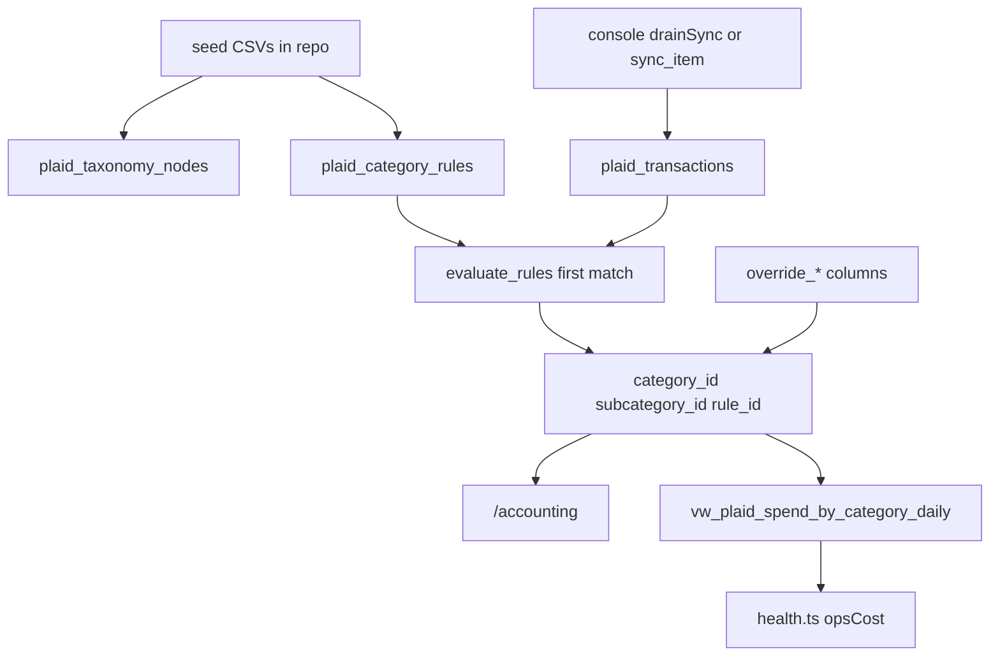

# Accounting Copilot category rules (Issue #160)

Derived from jam + §4 approved 2026-07-23 (Cursor chat; labels `approved:jam`, `approved:define-evidence` on #160).

**Seed source (operator):** `/Users/adiniekkajj/Desktop/copilot build/` — copy into repo at implement time (not a runtime path).

**Evidence tier: sandbox-e2e** (CI console/webhook regression) **+ mandatory prod-live Operator Console screenshots** (G5 portal paths).

---

## Locked decisions (jam)

| Decision | Choice |
|---|---|
| Seed taxonomy | Private CSV tree + ordered rules (not in git); portal CRUD after |
| Marketplace purchases | `Inventory / food / supplies` → purchases subcategory |
| Money-in | In scope (POS / delivery / P2P / refund patterns) |
| Franchise inventory brand | Inventory (ambiguous suffix → Review) |
| Supplies / freight vendors | Logistics (supplies / freight), not Inventory |
| Non-seed high $ | Extend via private `extension_rules.csv`: transfers, rent, capital inflows |
| Override v1 | Per-txn only; “save as rule” deferred |
| Feature flag | **No new flag** — cutover behind existing `FEATURES.accounting` ([features.ts:12](apps/operator-console/lib/config/features.ts)); mitigate wrong Home numbers via §4 coverage + reapply evidence |
| PFC | Keep columns; never primary display |

---

## Architecture



**Effective resolution:** `override → first enabled rule by priority ASC → Uncategorized` (null category_id).

---

## Feature-flag decision

- **No new behavioral flag.** Wrong taxonomy would silently mis-bucket Home `opsCost` ([health.ts:140](apps/operator-console/lib/kpi/health.ts)). Mitigation: seed+extensions ≥80% spend coverage before merge; reapply idempotency in §4; document cutover in [`docs/FEATURE_FLAGS.md:21`](docs/FEATURE_FLAGS.md) Accounting row (Palmetto taxonomy live; PFC debug-only).
- Keep `FEATURES.accounting` / `writePlaidLink` on ([features.ts:12–20](apps/operator-console/lib/config/features.ts)).

---

## Invariants preserved

- Idempotent MERGE on `transaction_id` ([writes.ts:472–518](apps/operator-console/lib/bq/writes.ts), [sync.py:71–128](skills/plaid_api/sync.py)) — categorize **after** upsert; never clear operator override.
- `is_internal` heuristics unchanged ([internal.ts:28](apps/operator-console/lib/plaid/internal.ts), [sync.py:234](skills/plaid_api/sync.py)); still excluded from Money out + spend view.
- `pfc_primary` / `pfc_detailed` still written on sync ([sync.py:47–62](skills/plaid_api/sync.py), [actions.ts:51](apps/operator-console/app/accounting/actions.ts)).
- America/Chicago date windows unchanged (`resolvePageRange` / `health.ts`).
- Access tokens never in BQ; no PII/secrets in git or §4.
- Square money-in KPI math unchanged (category labels may change).
- Plaid float-dollar convention unchanged (not integer-cents).

---

## Milestone 1 — Schema, seed import, pure rule eval

**Model: Sonnet 5 medium thinking**

### 1A. Migration `045_plaid_taxonomy_rules.sql`

New file [`core/migrations/045_plaid_taxonomy_rules.sql`](core/migrations/045_plaid_taxonomy_rules.sql) (next after [`044`](core/migrations/044_plaid_internal_flag.sql)):

```sql
-- 045_plaid_taxonomy_rules.sql — Palmetto taxonomy + Copilot rules (#160)

CREATE TABLE IF NOT EXISTS `jarvis-bhaga-prod.bhaga.plaid_taxonomy_nodes` (
  id STRING NOT NULL,
  parent_id STRING,
  slug STRING NOT NULL,
  label STRING NOT NULL,
  definition STRING,
  default_pnl_treatment STRING,
  sort_order INT64,
  enabled BOOL,
  updated_at TIMESTAMP
);

CREATE TABLE IF NOT EXISTS `jarvis-bhaga-prod.bhaga.plaid_category_rules` (
  id STRING NOT NULL,           -- rule_id from seed e.g. payroll_adp_wages
  priority INT64 NOT NULL,
  match_field STRING NOT NULL,  -- name | merchant_name | name_or_merchant
  match_operator STRING NOT NULL, -- contains | contains_any | equals_or_contains | regex
  match_pattern STRING NOT NULL,
  amount_sign STRING,           -- positive | negative | any (NULL=any)
  category_id STRING NOT NULL,
  subcategory_id STRING,
  confidence STRING,            -- high | medium | low
  enabled BOOL,
  notes STRING,
  updated_at TIMESTAMP
);

ALTER TABLE `jarvis-bhaga-prod.bhaga.plaid_transactions`
  ADD COLUMN IF NOT EXISTS category_id STRING,
  ADD COLUMN IF NOT EXISTS subcategory_id STRING,
  ADD COLUMN IF NOT EXISTS rule_id STRING,
  ADD COLUMN IF NOT EXISTS override_category_id STRING,
  ADD COLUMN IF NOT EXISTS override_subcategory_id STRING,
  ADD COLUMN IF NOT EXISTS categorized_at TIMESTAMP;
```

Apply via existing migrator ([`core/datastore.py:127`](core/datastore.py) `run pending SQL migrations`).

Structural test: [`core/test_migration_045_plaid_taxonomy_rules.py`](core/test_migration_045_plaid_taxonomy_rules.py) — assert DDL mentions `plaid_taxonomy_nodes`, `plaid_category_rules`, and the six txn columns (mirror [`core/test_migration_037_plaid_transactions.py`](core/test_migration_037_plaid_transactions.py)).

### 1B. Seed files in repo

Copy from Desktop Copilot build into:

- Private seed dir (never commit merchant/brand CSVs): `PLAID_TAXONOMY_SEED_DIR` or gitignored `local/plaid-taxonomy-seed/` — see [`.../seed/README.md`](apps/operator-console/lib/plaid/taxonomy/seed/README.md).

Loader (Python, one-shot + idempotent MERGE):

```python
# skills/plaid_api/taxonomy_seed.py
def seed_taxonomy(*, dry_run: bool = True) -> dict:
    """Load CSVs → plaid_taxonomy_nodes + plaid_category_rules. Idempotent on id/slug."""
    ...

def extend_corpus_rules(*, dry_run: bool = True) -> dict:
    """Merge optional private extension_rules.csv (transfers, occupancy, capital).

    Live merchant patterns are never hardcoded here — see seed README.
    """
    ...
```

CLI:

```bash
BHAGA_DATASTORE=bigquery python3 -c "
from skills.plaid_api.taxonomy_seed import seed_taxonomy, extend_corpus_rules
print(seed_taxonomy(dry_run=False))
print(extend_corpus_rules(dry_run=False))
"
```

Slug convention: parent `payroll_labor`, child `payroll_adp_wage_pay`; rule `id` = seed `rule_id`.

### 1C. Pure rule eval (TS + Python, mirrored)

New [`apps/operator-console/lib/plaid/category-rules.ts`](apps/operator-console/lib/plaid/category-rules.ts):

```typescript
export type MatchOperator = "contains" | "contains_any" | "equals_or_contains" | "regex";
export type AmountSign = "positive" | "negative" | "any";

export interface CategoryRule {
  id: string;
  priority: number;
  match_field: "name" | "merchant_name" | "name_or_merchant";
  match_operator: MatchOperator;
  match_pattern: string;
  amount_sign: AmountSign | null;
  category_id: string;
  subcategory_id: string | null;
  enabled: boolean;
}

export interface TxnForRules {
  name: string | null;
  merchant_name: string | null;
  amount: number | null;
}

export interface RuleMatch {
  rule_id: string;
  category_id: string;
  subcategory_id: string | null;
}

/** First enabled rule by ascending priority; null if none. */
export function evaluateRules(txn: TxnForRules, rules: CategoryRule[]): RuleMatch | null;
```

Effective category helper:

```typescript
export function effectiveCategory(
  txn: { override_category_id?: string | null; override_subcategory_id?: string | null },
  match: RuleMatch | null,
): { category_id: string | null; subcategory_id: string | null; rule_id: string | null; source: "override" | "rule" | "none" };
```

Python twin: [`skills/plaid_api/category_rules.py`](skills/plaid_api/category_rules.py) — `evaluate_rules(txn, rules) -> RuleMatch | None` with identical semantics (like `suggestInternal` TS/Python split).

**Match semantics:**

- `contains`: case-insensitive substring on chosen field(s).
- `contains_any`: pattern split on `|`; any part matches.
- `equals_or_contains`: exact (trim, casefold) OR contains.
- `regex`: `re.IGNORECASE` / JS `i` flag; invalid pattern → no match + breadcrumb (never throw into sync).
- `amount_sign`: `positive` ⇒ `amount > 0`; `negative` ⇒ `amount < 0`; else any.
- Field `name_or_merchant`: concatenate with space (used when seed says `name` but merchants exist — seed `match_field=name` searches **both** `name` and `merchant_name` via `name_or_merchant` when loading seed, to catch Plaid merchant fills).

**Priority gotcha (F1):** Payroll rules must stay before entity-name inventory rules; unit-test a payroll ACH blob that also contains an entity string → payroll wins.

Unit tests:

- [`apps/operator-console/__tests__/plaid-category-rules.test.ts`](apps/operator-console/__tests__/plaid-category-rules.test.ts)
- [`skills/plaid_api/test_category_rules_unit.py`](skills/plaid_api/test_category_rules_unit.py)

Cases: priority order, amount_sign, marketplace refund vs purchase, payroll vs entity blob, contains_any supply patterns, override beats rule, disabled rule skipped.

**Verify (copy-paste):**

```bash
python3 -m pytest core/test_migration_045_plaid_taxonomy_rules.py skills/plaid_api/test_category_rules_unit.py -q
cd apps/operator-console && npx vitest run __tests__/plaid-category-rules.test.ts
python3 scripts/check_doc_freshness.py
```

**Pass criterion:** migration test green; ≥8 unit cases including F1/F2; private seed loader documented; no live merchant CSVs in git.

---

## Milestone 2 — Sync + reapply

**Model: Sonnet 5 medium thinking**

### 2A. Persist category on txn

Add [`apps/operator-console/lib/bq/writes.ts`](apps/operator-console/lib/bq/writes.ts) after `setPlaidTransactionInternal` (~L529):

```typescript
export async function setPlaidTransactionCategory(row: {
  transaction_id: string;
  category_id: string | null;
  subcategory_id: string | null;
  rule_id: string | null;
  // When touchOverride=false, do not write override_* columns.
}): Promise<void>;

export async function setPlaidTransactionOverride(
  transactionId: string,
  overrideCategoryId: string | null,
  overrideSubcategoryId: string | null,
): Promise<void>; // null,null clears override

export async function reapplyPlaidCategories(opts?: {
  itemId?: string;
}): Promise<{ updated: number; unchanged: number }>;
```

`reapplyPlaidCategories`: load enabled rules + all non-pending txns (or per item); for each without override, `evaluateRules` → UPDATE only if category/rule changed; set `categorized_at`; **never** overwrite when `override_category_id IS NOT NULL`.

Python: `skills/plaid_api/category_rules.py` → `reapply_categories(bq, item_id=None) -> dict` and call from [`sync_item`](skills/plaid_api/sync.py) after `_mark_suggested_internals` (~L226):

```python
    try:
        from skills.plaid_api.category_rules import categorize_upserted
        categorize_upserted(bq, [r["transaction_id"] for r in upsert_rows])
    except Exception as exc:
        result.errors.append(f"categorize: {exc}")
```

Console: after suggestInternal block in [`actions.ts`](apps/operator-console/app/accounting/actions.ts) `drainSync` (~L102–128), call TS reapply for upserted ids (or full item).

### 2B. Server actions

In [`apps/operator-console/app/accounting/actions.ts`](apps/operator-console/app/accounting/actions.ts):

```typescript
export async function reapplyPlaidCategoriesAction(): Promise<{ updated: number; unchanged: number }>;
export async function setTxnCategoryOverrideAction(
  transactionId: string,
  categoryId: string | null,
  subcategoryId: string | null,
): Promise<void>;
```

Gate writes with `FEATURES.writePlaidLink` (same as Link/sync).

**Verify:**

```bash
python3 -m pytest skills/plaid_api/test_category_rules_unit.py skills/plaid_api/test_sync_unit.py -q
# After seed applied to prod BQ (agent-owned):
BHAGA_DATASTORE=bigquery python3 -c "
from skills.plaid_api.category_rules import reapply_categories
from google.cloud import bigquery
print(reapply_categories(bigquery.Client(project='jarvis-bhaga-prod')))
print(reapply_categories(bigquery.Client(project='jarvis-bhaga-prod')))  # second → updated=0
"
```

**Pass criterion:** first reapply `updated>0`; second `updated==0` (F4); sync path does not wipe overrides.

**Failure recovery:** if regex rule blows up, catch → skip that rule, breadcrumb `plaid categorize skip rule_id=…`; remaining rules still apply.

---

## Milestone 3 — Accounting UI + taxonomy/rules CRUD

**Model: Sonnet 5 medium thinking**

### 3A. Display cutover

[`page.tsx:84–85`](apps/operator-console/app/accounting/page.tsx) — map from taxonomy labels + rule, not PFC:

```typescript
category: t.category_label || "Uncategorized",
category_detail: t.subcategory_label || "—",
// plus: category_id, subcategory_id, rule_id, rule_summary, definition, is_override
```

Extend [`plaidTransactions`](apps/operator-console/lib/bq/queries.ts) (L1063–1087) to LEFT JOIN `plaid_taxonomy_nodes` (cat + sub) and `plaid_category_rules` for explain; select override columns.

Rename Detail column header to **Subcategory** in [`AccountingLedger.tsx:179–201`](apps/operator-console/components/accounting/AccountingLedger.tsx).

Replace PFC explain sheet ([AccountingLedger.tsx:77–80](apps/operator-console/components/accounting/AccountingLedger.tsx), ~L354–378) — drop [`pfc-definitions.ts`](apps/operator-console/lib/plaid/pfc-definitions.ts) from primary path (keep file for optional debug toggle only). New explain content: taxonomy `definition` + `Matched rule {id}: {operator} '{pattern}'` + override badge.

### 3B. Per-txn override UI

Row action / sheet picker: category + subcategory selects from enabled taxonomy tree; **Clear override** calls `setTxnCategoryOverrideAction(id, null, null)` then local re-eval display from `rule_id`.

### 3C. Taxonomy + rules admin

New drawer or route [`apps/operator-console/app/accounting/rules/page.tsx`](apps/operator-console/app/accounting/rules/page.tsx) (prefer drawer from Accounting header to avoid nav sprawl — implement as `AccountingRulesDrawer` under `components/accounting/`):

- List taxonomy tree; **Add / rename / soft-disable** category & subcategory (BQ writes). Soft-disable preferred over hard DELETE when rules reference the node (H6).
- List rules sorted by priority; edit priority/pattern/enabled; **dry-run count** = COUNT matching current corpus without write.
- **Reapply all** button → `reapplyPlaidCategoriesAction`.

Actions in `actions.ts`: `upsertTaxonomyNodeAction`, `setTaxonomyNodeEnabledAction`, `upsertCategoryRuleAction`, `dryRunRuleAction`.

**Verify:**

```bash
cd apps/operator-console && npx tsc --noEmit
cd apps/operator-console && npx vitest run __tests__/plaid-category-rules.test.ts __tests__/plaid-accounting-phase-a.test.ts
```

**Pass criterion:** tsc green; ledger shows Palmetto labels on local/dev against BQ; override round-trip unit-tested.

---

## Milestone 4 — View/Home, docs, §4 evidence

**Model: Sonnet 5 medium thinking**; Opus only if Home numbers diverge.

### 4A. Migration `046_plaid_spend_view_effective.sql`

Replace view from [`044:13–22`](core/migrations/044_plaid_internal_flag.sql):

```sql
CREATE OR REPLACE VIEW `jarvis-bhaga-prod.bhaga.vw_plaid_spend_by_category_daily` AS
SELECT
  t.date,
  COALESCE(c.label, 'Uncategorized') AS category_label,
  COALESCE(c.slug, 'uncategorized') AS category_slug,
  -- keep pfc_primary alias for one release? NO — cut over query consumers.
  SUM(IF(t.amount > 0, t.amount, 0)) AS spend,
  COUNT(*) AS txn_count
FROM `jarvis-bhaga-prod.bhaga.plaid_transactions` t
LEFT JOIN `jarvis-bhaga-prod.bhaga.plaid_taxonomy_nodes` c
  ON c.id = COALESCE(t.override_category_id, t.category_id)
WHERE t.pending IS NOT TRUE
  AND IFNULL(t.is_internal, FALSE) IS NOT TRUE
GROUP BY t.date, category_label, category_slug;
```

Update [`plaidSpendByCategory`](apps/operator-console/lib/bq/queries.ts:1095–1103) to select `category_label` (rename interface field; Home only sums spend so [health.ts:140](apps/operator-console/lib/kpi/health.ts) stays valid).

Structural test [`core/test_migration_046_plaid_spend_view_effective.py`](core/test_migration_046_plaid_spend_view_effective.py).

### 4B. Docs lock-step

| Doc | Update |
|---|---|
| [`RUNBOOK.md:1758–1795`](RUNBOOK.md) | Taxonomy tables, reapply, PFC debug-only, seed path |
| [`docs/FEATURE_FLAGS.md:21`](docs/FEATURE_FLAGS.md) | Accounting row: Palmetto taxonomy live (#160) |
| [`skills/plaid_api/README.md`](skills/plaid_api/README.md) | categorize + seed CLI |
| [`apps/operator-console/README.md`](apps/operator-console/README.md) | Rules drawer / category columns |
| [`PROGRESS.md`](PROGRESS.md) | Dated entry via PR or retro |
| [`scripts/check_doc_freshness.py`](scripts/check_doc_freshness.py) | Add coupling if new skill path ↔ README |

```bash
python3 scripts/check_doc_freshness.py
python3 scripts/verify.py --full
```

### 4C. PR §4 evidence assembly

Screenshots (hosted https only):

```bash
python3 apps/operator-console/scripts/capture_evidence.py --path /accounting --label i160-accounting-taxonomy
python3 apps/operator-console/scripts/capture_evidence.py --path /home --label i160-home-ops
```

Coverage query for §4:

```bash
python3 -c "
from google.cloud import bigquery
c=bigquery.Client(project='jarvis-bhaga-prod')
print(list(c.query('''
SELECT ROUND(SAFE_DIVIDE(
  SUM(IF(COALESCE(override_category_id, category_id) IS NOT NULL AND amount>0, amount, 0)),
  SUM(IF(amount>0, amount, 0))), 4) AS categorized_spend_pct
FROM \`jarvis-bhaga-prod.bhaga.plaid_transactions\`
WHERE pending IS NOT TRUE AND IFNULL(is_internal, FALSE) IS NOT TRUE
''').result())[0])
"
```

Open PR:

```bash
gh pr create --base main --head fix/i160-accounting-copilot-style-category-rules-palmetto \
  --title "feat(accounting): Palmetto taxonomy + Copilot category rules (#160)" \
  --body "... Refs #160"
python3 scripts/pr_cost_ledger.py bind-pr --branch fix/i160-accounting-copilot-style-category-rules-palmetto
python3 scripts/pr_cost_ledger.py sync --pr <N>
```

Babysit per `pr-workflow.mdc`; never self-merge; all GitHub as `jarvis-agent-bot328`.

**Pass criterion:** §4 scenarios below all evidenced; Claude confidence ≥95%; `verify.py --full` green.

---

## Per-scenario evidence (PR §4) — jam contract

### Happy path

| # | Scenario | Pass criterion |
|---|---|---|
| H1 | Seed load | ≥40 rules + taxonomy nodes in BQ; June parents present |
| H2 | Reapply | Payroll pattern→Payroll; produce vendor→Produce; POS deposit neg→deposits; marketplace pos→purchases |
| H3 | Accounting UI | Palmetto Category/Subcategory; not PFC codes as primary |
| H4 | Explain | Definition + matched rule_id/pattern |
| H5 | Override | Set persists; clear restores rule |
| H6 | Taxonomy CRUD | Add/rename/soft-disable subcategory in portal |
| H7 | Rules admin | Dry-run count; disable rule + reapply changes matches |
| H8 | Sync | Same effective category as reapply for unchanged rules |
| H9 | Home/view | Spend view by effective category; internals excluded |
| H10 | Coverage | ≥80% non-internal spend dollars categorized |

### Failure / recovery

| # | Scenario | Pass criterion |
|---|---|---|
| F1 | Payroll + entity blob in IND NAME | Still Payroll |
| F2 | Amazon refund | Contra/refund, not Revenue |
| F3 | Bad rule | Invalid regex skipped; no category wipe |
| F4 | Reapply×2 | Second updates 0 non-override rows |

### Legacy

| # | Scenario | Pass criterion |
|---|---|---|
| L1 | `is_internal` | Still excluded from Money out / view |
| L2 | PFC columns | Still populated on sync |
| L3 | Square KPI | Money-in totals math unchanged |
| L4 | verify | `python3 scripts/verify.py --full` green |

### Post-merge verification

```bash
python3 -c "
from google.cloud import bigquery
c=bigquery.Client(project='jarvis-bhaga-prod')
print(list(c.query('''
SELECT ROUND(SAFE_DIVIDE(
  SUM(IF(COALESCE(override_category_id, category_id) IS NOT NULL AND amount>0, amount, 0)),
  SUM(IF(amount>0, amount, 0))), 4) AS categorized_spend_pct
FROM \`jarvis-bhaga-prod.bhaga.plaid_transactions\`
WHERE pending IS NOT TRUE AND IFNULL(is_internal, FALSE) IS NOT TRUE
''').result())[0])
print(list(c.query('''
SELECT COUNT(*) n FROM \`jarvis-bhaga-prod.bhaga.plaid_transactions\` t
WHERE REGEXP_CONTAINS(UPPER(IFNULL(t.name,\"\")), r\"ADP WAGE\")
  AND COALESCE(t.override_category_id, t.category_id) IS NOT NULL
''').result())[0])
"
```

---

## Branch / PR mechanics

- Branch: `fix/i160-accounting-copilot-style-category-rules-palmetto` (this worktree)
- One coherent PR → `gh pr create --base main`; `Refs #160` / `Closes #160`
- GitHub as `jarvis-agent-bot328`; never self-merge; babysit; reply every review thread
- Cost: `bind-pr` + `sync` after PR exists; `validate --require-build`
- Never commit live merchant/brand/person seed CSVs; use `PLAID_TAXONOMY_SEED_DIR` / gitignored `local/`
- No secrets / full account numbers in §4

---

## Model routing

| Milestone | Model |
|---|---|
| M1 schema + eval | Sonnet 5 medium thinking |
| M2 sync + reapply | Sonnet 5 medium thinking |
| M3 UI + CRUD | Sonnet 5 medium thinking |
| M4 view + evidence + babysit | Sonnet 5 medium; Opus only on Home/accounting hard fail |
| Jam / this plan | Opus 4.8 thinking high (done) |

One chat per PR for implement after this plan passes `check_plan_readiness.py`.
