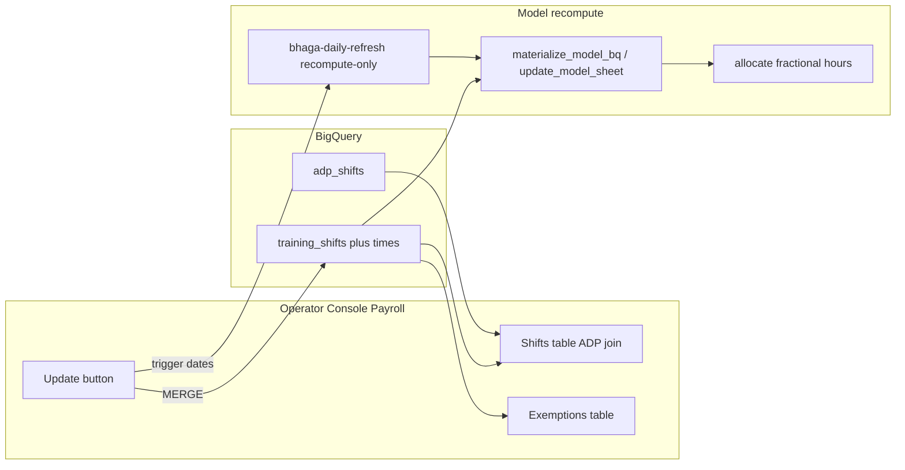

# Tip Exemptions (Issue #167)

## Locked decisions (jam)

- Product name: **Tip Exemptions** (UI); keep physical table `bhaga.training_shifts` (additive columns — less blast radius than rename).
- Partial math: **subtract overlap minutes only**; tip on remainder (Option B).
- Surface: **operator console only** for edits; Slack `training set/rm` stays whole-day compatible (NULL times).
- Historical / closed periods: **view-only**. Editable only when selected period has `is_open === true` (current unpaid open payroll).
- Batch UX: edit multiple draft rows → one **Update** → MERGE all + recompute affected dates.
- Orphans: **store windows even with no ADP shift**; exemptions table shows “no shift associated”; when a shift later appears, overlap applies.
- Sheet rows 15+ (Meeting): **operator enters in console after ship** — no automated Meeting-row migrate in this PR (whole-day rows already in BQ).
- Evidence tier: **sandbox-e2e** + console screenshot pack.

## Architecture



## Data model

**Migration `038_tip_exemption_windows.sql`** (next after `037_plaid_transactions.sql`):

```sql
ALTER TABLE `jarvis-bhaga-prod.bhaga.training_shifts`
  ADD COLUMN IF NOT EXISTS exempt_start STRING,  -- HH:MM America/Chicago; NULL = whole-day
  ADD COLUMN IF NOT EXISTS exempt_end   STRING;

CREATE OR REPLACE VIEW `jarvis-bhaga-prod.bhaga.vw_training_shifts` AS
SELECT employee_name, date, exempt_start, exempt_end, note, updated_at, updated_by
FROM `jarvis-bhaga-prod.bhaga.training_shifts`
WHERE store = 'palmetto'
ORDER BY date DESC, employee_name;
```

- Natural key unchanged: `(store, employee_name, date)` — **one exemption per employee-day** (whole **or** one window). Matches sheet grain.
- Semantics: `exempt_start IS NULL AND exempt_end IS NULL` → whole-day (legacy). Both set → window. Reject writes where only one is set.
- Apply: `BHAGA_DATASTORE=bigquery python3 -c "from core.datastore import ensure_schema; print(ensure_schema())"`

**No feature flag** — NULL/NULL path must stay bit-identical to today’s whole-day exclusion (`docs/FEATURE_FLAGS.md`: document as N/A additive / backward-compatible).

## Pipeline changes (tip math)

### Pure helper (new)

Add to [`agents/bhaga/scripts/update_model_sheet.py`](agents/bhaga/scripts/update_model_sheet.py) near `_spread_shift_minutes_by_hour` (~line 1339):

```python
def _overlap_hours(in_time: str, out_time: str, exempt_start: str, exempt_end: str) -> float:
    """Minutes of [exempt_start, exempt_end) overlapping [in_time, out_time) / 60.
    Malformed / inverted / empty → 0.0. No overnight wrap (same as _spread_shift_minutes_by_hour)."""

def _tip_hours_after_exemption(
    total_hours: float,
    in_time: str,
    out_time: str,
    *,
    whole_day: bool,
    exempt_start: str | None,
    exempt_end: str | None,
) -> float:
    if whole_day:
        return 0.0
    if not exempt_start or not exempt_end:
        return total_hours
    return max(0.0, total_hours - _overlap_hours(in_time, out_time, exempt_start, exempt_end))
```

Unit-test in `agents/bhaga/scripts/test_update_model_sheet.py` (or new `test_tip_exemption_hours.py`):
- whole day → 0
- 13:30–20:30 shift, exempt 18:00–18:30 → 6.5 hours tip-eligible (7.0 − 0.5)
- orphan (no shift caller) → N/A at this layer
- inverted window → 0 subtract

### Read shape

Change [`model_inputs.read_training_shifts`](agents/bhaga/scripts/model_inputs.py) lines 23–42:

```python
def read_training_shifts(store: str = "palmetto") -> dict[tuple[str, str], dict]:
    """Return {(canonical_name, date_iso): {exempt_start, exempt_end, note}}.
    Missing/NULL times ⇒ whole-day."""
```

Update callers:
- [`update_model_sheet._read_training_shifts_from_sheet`](agents/bhaga/scripts/update_model_sheet.py) ~618–629
- [`materialize_model_bq.materialize`](agents/bhaga/scripts/materialize_model_bq.py) ~420–438 (alias re-normalize keys only)

### Exclusion chokepoint

Replace bool-only skip in:
- `build_daily_rows` ~1286–1290
- `build_period_results` ~2398–2403

With:

```python
# pseudo
meta = training_shifts.get((emp, d))  # dict or None
if meta is None:
    # also check permanent / training_through via existing _is_excluded for those only
    ...
whole = meta["exempt_start"] is None and meta["exempt_end"] is None
eligible = _tip_hours_after_exemption(
    s["total_hours"], s.get("in_time",""), s.get("out_time",""),
    whole_day=whole or _is_excluded(... permanent/through only ...),
    exempt_start=meta.get("exempt_start"), exempt_end=meta.get("exempt_end"),
)
if eligible <= 0:
    continue
daily_hours[k] = daily_hours.get(k, 0.0) + eligible
```

Keep `_is_excluded` for permanent + `training_through`; **stop** using it for per-shift overlay (or pass `training_shifts=None` and handle overlay separately). Do **not** change `process_reviews` nested `_is_excluded` (still ignores per-shift marks — current behavior).

`allocate()` in `skills/tip_pool_allocation` needs **no change** — it already takes fractional `daily_hours`.

### Sandbox evidence

Extend [`assert_exemptions_applied`](agents/bhaga/scripts/sandbox_e2e.py) ~442–591:
- Keep whole-day asserts.
- Add partial case: fixture employee with window; assert `tip_alloc_daily` hours ≈ non-exempt remainder; pool conserved.
- Prefer extending existing full-live / prod-raw path (user pref J5/TGOOD) over a brand-new scenario name unless fixture needs it.

Verify cmd:

```bash
python3 -m pytest agents/bhaga/scripts/test_update_model_sheet.py agents/bhaga/scripts/test_model_inputs.py agents/bhaga/scripts/test_sandbox_e2e.py -q
# + CI sandbox-e2e label on PR
```

## Operator console

### Queries — [`apps/operator-console/lib/bq/queries.ts`](apps/operator-console/lib/bq/queries.ts)

Add:

```ts
export interface AdpShiftRow {
  employee_name: string; date: string; in_time: string; out_time: string; total_hours: number;
}
export function adpShiftsForPeriod(store: string, start: string, end: string): Promise<AdpShiftRow[]>
// SELECT canonical_name AS employee_name, date, in_time, out_time, total_hours
// FROM adp_shifts WHERE date BETWEEN @start AND @end ORDER BY date, employee_name

export interface TipExemptionRow {
  employee_name: string; date: string;
  exempt_start: string | null; exempt_end: string | null; note: string;
  updated_by: string; updated_at: string;
  has_shift: boolean; // LEFT JOIN adp_shifts existence
}
export function tipExemptions(store: string, start: string, end: string): Promise<TipExemptionRow[]>
```

Extend `trainingShifts` SELECT to include `exempt_start`/`exempt_end` or replace usages with `tipExemptions`.

### Writes — [`apps/operator-console/lib/bq/writes.ts`](apps/operator-console/lib/bq/writes.ts)

```ts
export type TipExemptionDraft = {
  employeeName: string; date: string; // YYYY-MM-DD
  mode: "clear" | "whole" | "window";
  exemptStart?: string; // HH:MM
  exemptEnd?: string;
  note?: string;
};

export async function applyTipExemptions(
  store: string, drafts: TipExemptionDraft[], by: string,
): Promise<void>
// For each draft:
//   clear → DELETE WHERE store/employee/date
//   whole → MERGE note, exempt_start=NULL, exempt_end=NULL
//   window → MERGE with times (validate both present, end > start)
```

Server-side **hard guard**: resolve open period from `vw_model_payroll_period` (`is_open`); reject any draft whose `date` is outside `[open.period_start, open.period_end]` with error `"Tip exemptions are editable only for the current open pay period"`.

### Recompute — new [`apps/operator-console/lib/bhaga/recompute.ts`](apps/operator-console/lib/bhaga/recompute.ts)

Mirror [`scripts/trigger_dated_refresh.py`](scripts/trigger_dated_refresh.py) `_build_env_overrides(..., recompute_only=True)` + `run_v2.JobsClient().run_job`:
- Env: `REFRESH_DATE=<d>`, `BHAGA_FORCE_MODEL_RECOMPUTE=1`, skip scrape flags as in `_build_refresh_env_overrides` ([`cloud/webhook/handler.py`](cloud/webhook/handler.py) ~596).
- Dedupe dates from applied drafts; fire one job execution per date (or document multi-date if webhook worker pattern is easier — prefer one execution per date like Slack refresh).
- IAM (same PR docs + deploy note): grant Cloud Run runtime SA for `operator-console` permission to run job `bhaga-daily-refresh` (`roles/run.developer` on that job). Without this, Update writes BQ but recompute fails loud with breadcrumb.

### Server actions — [`apps/operator-console/app/payroll/actions.ts`](apps/operator-console/app/payroll/actions.ts)

```ts
export async function applyTipExemptionsAction(drafts: TipExemptionDraft[]) {
  if (!FEATURES.writeTipExemptions) throw new Error("...");
  const by = await operatorEmail();
  await applyTipExemptions(DEFAULT_STORE, drafts, by);
  const dates = [...new Set(drafts.filter(d => d.mode !== "clear").map(d => d.date))];
  // also recompute cleared dates so tips restore
  await triggerModelRecompute(dates);
  revalidatePath("/payroll");
}
```

Add `writeTipExemptions: true` to [`features.ts`](apps/operator-console/lib/config/features.ts); gate UI; retire or hide `TrainingQuickAdd` behind `writeTraining: false` (or remove from header and fold into new UX).

### UI — Payroll detail view

Replace “Training shifts — last 30 days” + `TrainingQuickAdd` with:

1. **Shifts (period)** — client component `TipExemptionsEditor.tsx` (RestockImportDrawer pattern: local draft state, nothing writes until Update):
   - Rows = `adpShiftsForPeriod` ⟕ exemptions for selected period.
   - Columns: date, employee, in/out, hours, **Is exempted** (checkbox), **Exempt window** (start/end time inputs; disabled if whole-day checkbox “entire shift”), **Notes**, status chip.
   - `editable = periodRows.some(r => r.is_open) && period === "current"`. Else inputs disabled + banner “Historical — view only”.
2. **Exemptions** — second table of `tipExemptions` for same period (and optionally trailing open orphans): show window/whole, note, **`has_shift === false` → “No shift associated”** highlight via `DataTable` `rowHighlight` or custom cell.
   - Allow adding orphan rows in open period only (employee + date + window + note) into the same draft batch.
3. Single **Update** button → `applyTipExemptionsAction(drafts)` → pending state → success/error.

Period selection stays `FilterPills` current/last ([`page.tsx`](apps/operator-console/app/payroll/page.tsx) ~122–132).

Name handling: prefer employee picker from ADP shift rows / payroll period names (canonical). Orphan add: free-text must match a known canonical name from recent ADP or `employee_aliases` — add small `listCanonicalEmployees(store)` query; reject unknown (parity with Slack `normalize_input_name`).

## Docs lock-step

| Change | Doc |
|---|---|
| Schema + Recipe E partial windows | [`agents/bhaga/scripts/README.md`](agents/bhaga/scripts/README.md) Recipe E (~321) |
| Domain meaning | [`agents/bhaga/knowledge-base/DOMAIN.md`](agents/bhaga/knowledge-base/DOMAIN.md) / store-profile `_doc_training_shifts` in [`palmetto.json`](agents/bhaga/knowledge-base/store-profiles/palmetto.json) |
| Console IA | [`docs/operator-console/ARCHITECTURE.md`](docs/operator-console/ARCHITECTURE.md), [`EXECUTION.md`](docs/operator-console/EXECUTION.md) |
| Recompute from console | [`RUNBOOK.md`](RUNBOOK.md) Common tasks / exempt shift |
| Invariants | [`.cursor/rules/bhaga.mdc`](.cursor/rules/bhaga.mdc) brief note: tip hours may be partial after exemption windows |

`python3 scripts/check_doc_freshness.py`

## PR §4 evidence contract (define-evidence)

Evidence tier: **sandbox-e2e**

| # | Scenario | Pass |
|---|---|---|
| 1 | Open-period shifts table editable; last/closed view-only | Screenshots |
| 2 | Batch: mark 2 whole + 1 window + 1 clear → Update | BQ rows match; one Update |
| 3 | Partial math | Sandbox assert: overlap hours removed; pool conserved |
| 4 | Orphan exemption | Row in exemptions table with “No shift associated”; no tip effect until shift exists |
| 5 | Recompute | Job triggered for touched dates; tip_alloc before/after differs as expected (log or BQ snippet) |
| 6 | Legacy | Existing NULL-time rows still whole-day; `assert_exemptions_applied` green |
| 7 | Guard | Write for closed-period date rejected; screenshot/error |

Screenshots: upload to GitHub releases/`user-attachments` https URLs only (pref 18).

## Branch / PR mechanics

- Branch: `fix/i167-improve-training-shifts-option` → PR `--base main`, `Closes #167`
- Bot: `jarvis-agent-bot328`; babysit via `pr_triage.py`; no auto-merge
- Cost: `bind-pr` + `pr_cost_ledger.py sync` after PR exists
- Phase: after jam/define-evidence approved → plan → implement…

## Model routing

| Milestone | Model |
|---|---|
| M1 schema + pure hours helper + unit tests | Sonnet |
| M2 pipeline read/`build_*` + sandbox asserts | Sonnet |
| M3 console queries/writes/editor + recompute invoke | Sonnet |
| Plan review / hard tip-math review if needed | Opus |

## Invariants preserved

- Pool-by-day fairness; integer cents; `allocate` pure
- Idempotent MERGE on `(store, employee_name, date)`
- America/Chicago date boundaries
- Sandbox isolation for e2e
- Ghost-row `replace_scope=True` unchanged on model tables
- Labor% still ignores training exemptions (unchanged)

---

## Milestone 1 — Schema + pure overlap hours

**Files:** `core/migrations/038_tip_exemption_windows.sql`; `update_model_sheet.py` helpers; new unit tests.

**Verify:**
```bash
BHAGA_DATASTORE=bigquery python3 -c "from core.datastore import ensure_schema; print(ensure_schema())"
python3 -m pytest agents/bhaga/scripts/test_tip_exemption_hours.py -q
```
Pass: migration applied; overlap cases green.

## Milestone 2 — Pipeline wiring + sandbox

**Files:** `model_inputs.py`; `update_model_sheet.build_daily_rows` / `build_period_results`; `materialize_model_bq.py`; `sandbox_e2e.assert_exemptions_applied` + tests; Slack MERGE optionally sets NULL times (no signature change).

**Verify:**
```bash
python3 -m pytest agents/bhaga/scripts/test_model_inputs.py agents/bhaga/scripts/test_update_model_sheet.py agents/bhaga/scripts/test_sandbox_e2e.py -q
```
Pass: whole-day regression + new partial assert.

## Milestone 3 — Console UX + batch Update + recompute

**Files:** `queries.ts`, `writes.ts`, `recompute.ts`, `actions.ts`, `features.ts`, `TipExemptionsEditor.tsx`, `payroll/page.tsx`; IAM/deploy note; docs listed above.

**Verify:**
```bash
cd apps/operator-console && npm test && npm run lint && npm run build
python3 scripts/verify.py --full
# Manual: open-period batch Update → screenshots; closed period cannot save
```
Pass: build green; §4 screenshots captured on deployed or local IAP-bypass console.

## Milestone 4 — PR evidence + babysit

Assemble §4; `sandbox-e2e` label; reply-all threads; cost ledger sync.