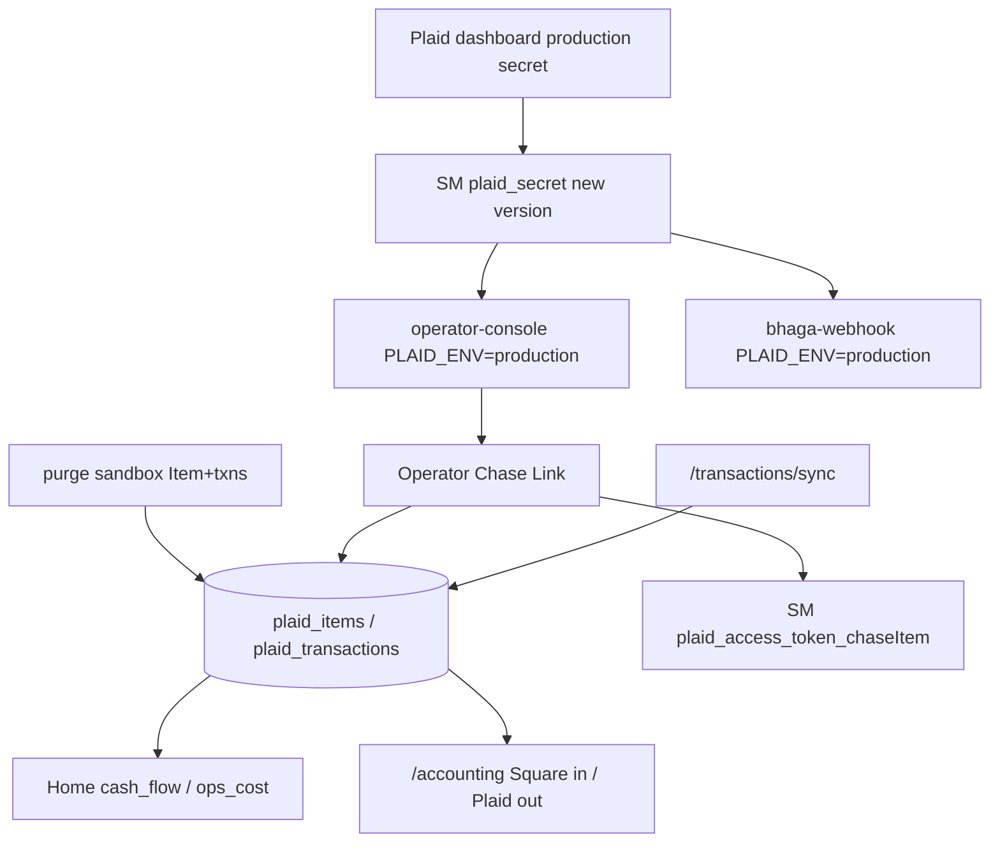

# Plaid production cutover (Issue #168)

Derived from jam + §4 approved 2026-07-16. Prior ship: PR #162 (`FEATURES.accounting` / `writePlaidLink`, migration `037`, sandbox e2e). This PR makes Home + Accounting use a **real Chase** bank feed.

## Locked decisions (jam)

| Decision | Choice |
|---|---|
| Scope | Production cutover only — env + secret + purge sandbox + Chase Link + evidence |
| Out | #160 management taxonomy, #161 QBO, Goal hierarchy redesign |
| Sandbox data | **Purge** Platypus Item `PJyBoy5kvRH5dj1DjDJguvgjEDpDRNCwxwe7q` + 50 txns **before** Chase Link |
| Operator step | One Chase Link + bank auth on `/accounting`; agent owns everything else |
| Evidence | `sandbox-e2e` regression + **mandatory prod-live** Chase proof in PR §4 |

**Evidence tier: sandbox-e2e** (unit/deploy regression) **+ prod-live Chase Link/sync/screenshots** (acceptance gate for this issue).

## Architecture (cutover)



## Feature-flag decision

- Keep `FEATURES.accounting` / `FEATURES.writePlaidLink` **on** (`apps/operator-console/lib/config/features.ts` lines 11–20) — already gating the UI/writes.
- `PLAID_ENV` is a **runtime cutover**, not a new behavioral flag. Documented in `docs/FEATURE_FLAGS.md` line 21 (“flip env + `plaid_secret`”).
- **Silent wrong-numbers risk:** flipping env **without** purge leaves sandbox outflows in `vw_plaid_spend_by_category_daily` → Home cash/ops wrong. Purge is mandatory in M2 before Link. No new flag.

## Invariants preserved

- Access tokens **never** in BQ (only SM `plaid_access_token_<item_id>`) — `skills/plaid_api/auth.py:81–88`, migration `037` has no `access_token` column.
- Integer-cents N/A for Plaid (existing float-dollar display convention, same as #162).
- America/Chicago period windows unchanged (`lib/kpi/health.ts` / `resolvePageRange`).
- Idempotent MERGE on `transaction_id` (`apps/operator-console/lib/bq/writes.ts:414–417`, `skills/plaid_api/sync.py`).
- Read-only ADP / Square money math unchanged; Plaid is additive spend side.
- No PII/secrets in git; never paste production secret or access_token into PR §4.

---

## Milestone 1 — Deploy config, purge helper, docs

**Model: Sonnet 5 medium thinking**

### Changes (file:line)

1. [`.github/workflows/operator-console-deploy.yml:76`](.github/workflows/operator-console-deploy.yml) — change `PLAID_ENV=sandbox` → `PLAID_ENV=production` in `--set-env-vars`.
2. [`.github/workflows/deploy.yml:98`](.github/workflows/deploy.yml) — change `PLAID_ENV=sandbox` → `PLAID_ENV=production` in `--update-env-vars` for `bhaga-webhook`.
3. [`apps/operator-console/app/accounting/page.tsx:112`](apps/operator-console/app/accounting/page.tsx) — fix stale copy `migration 036` → `migration 037`.
4. New helper in [`skills/plaid_api/sync.py`](skills/plaid_api/sync.py) (after `list_linked_items` ~line 230):

```python
def purge_item(store: str, item_id: str, *, dry_run: bool = True) -> dict:
    """Delete all plaid_transactions for item_id, then the plaid_items row.
    Does not call Plaid /item/remove (sandbox Item is disposable).
    Returns {'transactions_deleted': N, 'item_deleted': bool, 'dry_run': bool}.
    """
```

   CLI smoke (module `__main__` or thin `python3 -c`):

```bash
BHAGA_DATASTORE=bigquery python3 -c "
from skills.plaid_api.sync import purge_item
print(purge_item('palmetto', 'PJyBoy5kvRH5dj1DjDJguvgjEDpDRNCwxwe7q', dry_run=True))
"
```

5. Unit test in [`skills/plaid_api/test_sync_unit.py`](skills/plaid_api/test_sync_unit.py) — mock BQ client; assert dry_run issues no DELETE; live path calls DELETE txns then DELETE item (order matters).
6. Docs lock-step:
   - [`RUNBOOK.md:1745–1747`](RUNBOOK.md) — **Current env:** `PLAID_ENV=production`; document purge + Chase Link ops steps.
   - [`docs/FEATURE_FLAGS.md:21`](docs/FEATURE_FLAGS.md) — note production cutover landed (#168).
   - [`skills/plaid_api/README.md:13`](skills/plaid_api/README.md) — `PLAID_ENV` production default for Cloud Run.
   - [`apps/operator-console/README.md:27–28`](apps/operator-console/README.md) — local optional env note.
   - [`PROGRESS.md`](PROGRESS.md) — dated entry after merge (or in PR body; retrospective may own PROGRESS).

**Verify (copy-paste):**

```bash
rg -n 'PLAID_ENV=sandbox' .github/workflows/operator-console-deploy.yml .github/workflows/deploy.yml
# expect: no matches
rg -n 'PLAID_ENV=production' .github/workflows/operator-console-deploy.yml .github/workflows/deploy.yml
# expect: both files
python3 -m pytest skills/plaid_api/test_sync_unit.py -q
python3 scripts/check_doc_freshness.py
```

**Pass criterion:** zero `PLAID_ENV=sandbox` in those two workflows; pytest green; doc freshness clean for touched paths.

---

## Milestone 2 — Secret rotation, live env flip, sandbox purge

**Model: Sonnet 5 medium thinking** (ops + Playwright for Plaid dashboard if needed)

### Ops sequence (agent-owned; no secret values in chat/PR)

1. **Fetch production secret** from https://dashboard.plaid.com/developers/keys (Playwright / MCP) — copy **Production** `secret` only.
2. **Rotate SM** (new version; do not delete old until verified):

```bash
# pipe secret from local temp file — never echo
printf '%s' "$(cat /tmp/plaid_prod_secret.txt)" | \
  gcloud secrets versions add plaid_secret --project=jarvis-bhaga-prod --data-file=-
rm -P /tmp/plaid_prod_secret.txt
gcloud secrets versions list plaid_secret --project=jarvis-bhaga-prod --limit=3
```

3. **Flip live Cloud Run env now** (so evidence can be gathered before merge; PR workflows prevent revert on next deploy):

```bash
gcloud run services update operator-console \
  --project=jarvis-bhaga-prod --region=us-central1 \
  --update-env-vars PLAID_ENV=production
gcloud run services update bhaga-webhook \
  --project=jarvis-bhaga-prod --region=us-central1 \
  --update-env-vars PLAID_ENV=production
# Confirm (no secret values):
gcloud run services describe operator-console --project=jarvis-bhaga-prod --region=us-central1 \
  --format='yaml(spec.template.spec.containers[0].env)' | rg 'PLAID_'
```

4. **Purge sandbox** (after dry-run):

```bash
BHAGA_DATASTORE=bigquery python3 -c "
from skills.plaid_api.sync import purge_item
print(purge_item('palmetto', 'PJyBoy5kvRH5dj1DjDJguvgjEDpDRNCwxwe7q', dry_run=False))
"
# Disable orphan SM secret (do not print payload):
gcloud secrets delete plaid_access_token_PJyBoy5kvRH5dj1DjDJguvgjEDpDRNCwxwe7q \
  --project=jarvis-bhaga-prod --quiet || true
```

**Verify:**

```bash
python3 -c "
from google.cloud import bigquery
c=bigquery.Client(project='jarvis-bhaga-prod')
print(list(c.query('SELECT COUNT(*) n FROM \`jarvis-bhaga-prod.bhaga.plaid_items\`').result())[0].n)
print(list(c.query('SELECT COUNT(*) n FROM \`jarvis-bhaga-prod.bhaga.plaid_transactions\`').result())[0].n)
"
# expect: both 0 until Chase Link
```

**Pass criterion:** both services `PLAID_ENV=production`; `plaid_secret` has new version; BQ Item+txn counts = 0; Home ops/cash show no Platypus spend.

**Failure recovery:** if Link still hits sandbox host → check env on **revision** actually serving traffic; if secret wrong → add another SM version and redeploy/restart services to pick `latest`.

---

## Milestone 3 — Chase Link, sync evidence, PR §4

**Model: Sonnet 5 medium thinking**; Opus only if Link/sync hard-fails.

### Operator gate (you)

After agent posts “ready to Link” on the tracking issue / chat: open Operator Console `/accounting` behind IAP → **Link bank** → Chase login / biometric.

### Agent after Link

1. Confirm Item:

```bash
python3 -c "
from google.cloud import bigquery
c=bigquery.Client(project='jarvis-bhaga-prod')
print([dict(r) for r in c.query('SELECT item_id, institution_name, linked_by, CAST(linked_at AS STRING) linked_at FROM \`jarvis-bhaga-prod.bhaga.plaid_items\`').result()])
"
# expect: Chase (or real institution), not Platypus
```

2. Sync twice (console **Sync now** or webhook):

```bash
# Prefer console Sync; or:
# curl -X POST "$WEBHOOK_URL/plaid/sync" -H "X-Plaid-Sync-Token: $TOKEN"
# Capture: sync1 added=N>0; sync2 added=0
python3 -c "
from google.cloud import bigquery
c=bigquery.Client(project='jarvis-bhaga-prod')
print(list(c.query('SELECT COUNT(*) n FROM \`jarvis-bhaga-prod.bhaga.plaid_transactions\`').result())[0])
print(list(c.query('SELECT transaction_id, COUNT(*) c FROM \`jarvis-bhaga-prod.bhaga.plaid_transactions\` GROUP BY 1 HAVING c>1').result()))
"
# expect: n>0; zero duplicate rows
```

3. Screenshots via hosted Playwright / Grafana-style upload to `evidence-screenshots` release:
   - Home — Cash flow / Operations / Total cost with real Plaid spend
   - Accounting — Chase linked; Square in + Plaid out; category or txn table

4. Regression:

```bash
cd apps/operator-console && npx tsc --noEmit
python3 -m pytest core/test_migration_037_plaid_transactions.py skills/plaid_api/test_sync_unit.py -q
python3 scripts/verify.py --full
```

5. Open PR `--base main`, bind cost ledger, babysit per `pr-workflow.mdc`.

**Verify / pass criterion:** §4 happy path + failure rows from jam contract all green; Claude evidence confidence ≥ 95%.

---

## Per-scenario evidence (PR §4)

| Scenario | Pass criterion |
|---|---|
| Happy path — prod env | `PLAID_ENV=production` on console + webhook |
| Happy path — purge | No Platypus Item; sandbox txn count 0 |
| Happy path — Chase Link | `plaid_items.institution_name` is real bank |
| Happy path — sync | sync1 `added>0`, sync2 `added=0`; no `transaction_id` dupes |
| Happy path — UI | Hosted Home + Accounting screenshots |
| Failure — Link before secret/env | Loud error; no partial Item (or purged) |
| Failure — re-link after purge | New `item_id`; no sandbox residue |
| Failure — sync with no Item | Clear error string; no crash |
| Legacy / regression | tsc + pytest migration 037 + plaid unit green |
| Security | No secrets/tokens/account numbers in git or §4 |

### Post-merge verify

```bash
gcloud run services describe operator-console --project=jarvis-bhaga-prod --region=us-central1 \
  --format='value(spec.template.spec.containers[0].env)' | tr ',' '\n' | rg PLAID_ENV
# expect: PLAID_ENV=production (workflow durable)
python3 -c "
from google.cloud import bigquery
c=bigquery.Client(project='jarvis-bhaga-prod')
print([dict(r) for r in c.query('SELECT institution_name, item_id FROM \`jarvis-bhaga-prod.bhaga.plaid_items\`').result()])
"
```

---

## Docs lock-step

| Doc | Update |
|---|---|
| `RUNBOOK.md` | Current env production; purge + Link ops |
| `docs/FEATURE_FLAGS.md` | Cutover note on Accounting row |
| `skills/plaid_api/README.md` | Production env |
| `apps/operator-console/README.md` | Env comment |
| `PROGRESS.md` | Dated entry (via PR or retro follow-up) |
| `check_doc_freshness.py` | Must pass |

## Branch / PR mechanics

- Branch: `fix/i168-plaid-account-has-been-approved-and` (this worktree)
- One coherent PR → `--base main`; `Closes #168`
- All GitHub ops as `jarvis-agent-bot328`
- Never self-merge; babysit to green; reply every review thread
- Cost: `pr_cost_ledger.py bind-pr` + `sync` after PR exists; `validate --require-build`
- Do **not** commit secrets; do **not** leave sandbox Item in BQ after cutover

## Model routing

| Milestone | Model |
|---|---|
| M1 deploy/docs/purge helper | Sonnet 5 medium thinking |
| M2 secret + gcloud ops | Sonnet 5 medium thinking |
| M3 Link evidence + PR babysit | Sonnet 5 medium; Opus only on hard Link/sync failures |
| Plan review / jam (done) | Opus 4.8 thinking high |

One chat per PR after this plan is approved for implement.
