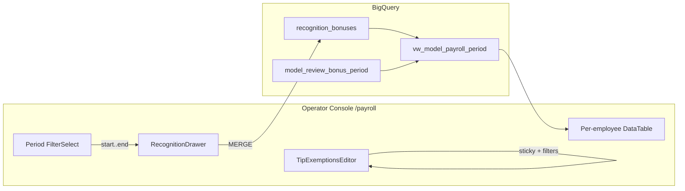

# Payroll Page + Access (Issue #206)

Evidence tier: sandbox-e2e

## Jam / §4 (approved)

- **Access:** grant `lindsay@mypalmetto.co` IAP `roles/iap.httpsResourceAccessor` (deploy loop + live).
- **Recognition drawer:** auto-fill period as `${period_start}..${period_end}` from header Period; searchable employee dropdown from `listCanonicalEmployees`.
- **Model view:** migration `049` replaces `vw_model_payroll_period` — LEFT JOIN aggregated `recognition_bonuses` next to `model_review_bonus_period`; `est_total_pay` and `bonus_diff` include recognition; `wage_diff` stays wages-only.
- **Console table:** Recognition bonus + Bonus reason columns; Est. total from view; Recognition headline card; paid periods show **Bonus diff** (review+recognition − ADP Bonus).
- **Tip exemptions:** sticky `thead` (UsageDayAuditTable pattern); Date + Employee local multi-select + typeahead filters.
- **Evidence:** operator console web portal screenshots only + unit tests + `verify.py --full` + post-merge IAP/IAM.

Feature flag: **none** — additive view columns + UX; recognition write path already on (`FEATURES.writeRecognition`). Silent wrong numbers risk is mitigated by unit tests on join math; no FEATURE_FLAGS.md entry (additive / backward-compatible NULL→0).

Model routing: Sonnet for all milestones. One chat per PR.

## Architecture



## Citations / stubs

### M1 — `core/migrations/049_payroll_recognition_in_period.sql`

Full `CREATE OR REPLACE VIEW` copied from `core/migrations/005_raw_parity.sql:280-327` with:

```sql
rec AS (
  SELECT
    store,
    SAFE.PARSE_DATE('%Y-%m-%d', SPLIT(pay_period, '..')[SAFE_OFFSET(0)]) AS period_start,
    SAFE.PARSE_DATE('%Y-%m-%d', SPLIT(pay_period, '..')[SAFE_OFFSET(1)]) AS period_end,
    employee,
    SUM(amount_cents) / 100.0 AS recognition_bonus,
    STRING_AGG(reason, '; ' ORDER BY updated_at) AS recognition_reason
  FROM `jarvis-bhaga-prod.bhaga.recognition_bonuses`
  GROUP BY store, period_start, period_end, employee
)
-- JOIN: LEFT JOIN rec ON period_start/end/employee (store='palmetto' or match tip grain)
-- review_bonus unchanged
-- recognition_bonus / recognition_reason columns
-- est_total_pay += COALESCE(recognition_bonus,0)
-- bonus_diff = (review + recognition) - adp_bonus_paid
```

Apply: `BHAGA_DATASTORE=bigquery python3 -c "from core.datastore import ensure_schema; print(ensure_schema())"`

Status doctor: no new GRAFANA_VIEWS target (same view name). Comment in `agents/bhaga/scripts/status.py` near migration 033 note for 049.

Unit: `apps/operator-console/lib/payroll/recognitionPeriod.test.ts` — pure helpers for period key + total math (mirror SQL). Optional SQL string assert in a small Python test if status parses migrations.

### M2 — Console payroll surface

| File | Change |
|---|---|
| `apps/operator-console/lib/bq/queries.ts` `PayrollPeriodRow` (~673) | Add `recognition_bonus`, `recognition_reason` |
| `apps/operator-console/lib/payroll/periodKey.ts` (new) | `export function payPeriodKey(start: string, end: string): string` → `` `${start}..${end}` `` |
| `apps/operator-console/components/drawers/RecognitionDrawer.tsx` | Props: `defaultPayPeriod`, `employees: string[]`. Sync period via `useEffect` when prop changes. Employee: searchable Popover list (reuse Popover+Input pattern from `FilterMultiSelect.tsx:23-80`, local state not URL). |
| `apps/operator-console/app/payroll/page.tsx` | Pass `payPeriodKey(selectedPeriodStart, periodEnd)` + `employees` to drawer; columns + Recognition card; paid: add `bonus_diff` column; Total pay uses `est_total_pay` (already includes recognition after M1). |
| UX polish | shadcn `Input`/`Button`/`Label`/`Sheet`; Popover focus-visible; ~44px tap; muted headers — `docs/contributing/ui-polish.md` |

### M3 — Tip exemptions filters + sticky

`TipExemptionsEditor.tsx`:
- Scrollport: `max-h-[min(36rem,70vh)] overflow-auto` + `thead sticky top-0 z-30 bg-muted/95 backdrop-blur` (cite `UsageDayAuditTable.tsx:55-60`).
- Local state `dateFilter: string[] \| null`, `employeeFilter: string[] \| null` (`null` = all).
- Reuse Popover multi-select UI extracted as `components/filters/LocalMultiSelect.tsx` (same API as FilterMultiSelect but `onChange` callback, no router) — used for Date + Employee above shifts table.
- Filter `shifts` / display rows client-side.

Unit: `apps/operator-console/__tests__/local-multi-filter.test.ts` — facet options + row filter predicate.

### M4 — Access

`.github/workflows/operator-console-deploy.yml:96` — add `"user:lindsay@mypalmetto.co"` to the for-loop.

Live (post-merge or with deploy): `gcloud iap web add-iam-policy-binding … --member=user:lindsay@mypalmetto.co --role=roles/iap.httpsResourceAccessor` (RUNBOOK §17).

Docs lock-step: `RUNBOOK.md` IAP member list if enumerated; `docs/operator-console/PLAN.md` short row for #206; `check_doc_freshness.py`.

## Invariants

- Integer cents on write (`amount_cents`); display via `formatCents` / dollars columns consistent with existing review_bonus dollars.
- America/Chicago period calendar unchanged (`openPeriod.ts`).
- Idempotent recognition MERGE `(store, pay_period, employee)`.
- Read-only ADP; tip exemptions unpaid-only guard unchanged.
- Sandbox isolation N/A (console + view); no tip-pool formula change.

## Milestones

### M1 — View + helpers (Sonnet)
**Verify:** unit tests for `payPeriodKey` + recognition total/bonus_diff helpers green; migration file present.
```bash
cd apps/operator-console && npx vitest run lib/payroll
```

### M2 — Drawer + table + headlines (Sonnet)
**Verify:**
```bash
cd apps/operator-console && npm run build && npx vitest run
```

### M3 — Tip exemption UX (Sonnet)
**Verify:** sticky+filter unit tests; visual via `capture_evidence.py` against local or staging console when available.
```bash
cd apps/operator-console && npx vitest run __tests__/local-multi-filter.test.ts
```

### M4 — IAP + docs + ship (Sonnet)
**Verify:** `python3 scripts/verify.py --full`; workflow YAML contains lindsay; PR §4 screenshots (console only).

PR mechanics: `--base main`, bot account, never self-merge, reply-every-comment, babysit.

## Per-scenario evidence (§4)

1. Happy: Lindsay IAP binding; drawer period+employee; add bonus; table columns+headlines; sticky+filters screenshots.
2. Failure: drawer validation empty/non-positive amount.
3. Legacy: paid period view-only tip exemptions; bonus_diff visible; wage_diff unchanged meaning.
4. Post-merge: IAM get-policy + prod `/payroll` spot-check.
