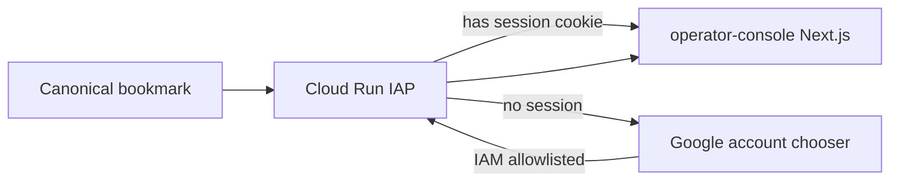

# Operator Console: one-URL IAP login (Issue #208)

Evidence tier: unit-only  
waiver: No BHAGA tip/payroll money path; change is Operator Console IAP host policy + docs. Runtime proof = hosted prod idle-sim / screenshots (G5 — unit-only cannot waive portal screenshots).

## Jam / §4 (approved)

**User UX (100% of the time):** one URL  
`https://operator-console-887772634501.us-central1.run.app`  
- Valid IAP session → console  
- No session → Google account chooser → tap allowlisted account (IAP IAM `roles/iap.httpsResourceAccessor`) → console  
- No recovery URL, no hash host, no “re-enter URL” as product behavior  

**Fix (S0, $0 infra):** stop post-IAP **hash → canonical** middleware bounce (Issue #194). That bounce forces a second OAuth onto a host with no `__Host-GCP_IAP_*` cookies and is the dual-jar failure mode we reproduced (Error code 9 when XSRF missing). Operators use **canonical only**; hash form remains reachable but is unsupported and must not redirect mid-login.

**§4 evidence**

| # | Scenario | Pass |
|---|---|---|
| E1 | Session present | Open canonical → `/home` (screenshot) |
| E2 | Idle-sim | Clear IAP auth cookies only; keep Google session; open canonical `/` → chooser → tap allowlisted account → console **first try** (Playwright seed) |
| E3 | Host policy | Middleware does **not** 302 hash→canonical; unit test green |
| E4 | Docs + verify | RUNBOOK §17 one-URL UX; `verify.py --full` green |

Feature-flag decision: **none / out of scope** — host routing only; cannot silently produce wrong tip/payroll numbers (not a money path). No `FEATURE_FLAGS.md` entry.

Model routing: Sonnet for all milestones. One chat per PR. Closes #208.

## Architecture



**Non-goals:** custom domain / LB, IAP replacement, inventory UI, user-facing CLEAR_LOGIN_COOKIE product flow (ops-only for IAM cache edge cases remains in RUNBOOK).

## Citations / stubs

### M1 — Remove cross-host bounce

| File | Change |
|---|---|
| [`apps/operator-console/middleware.ts`](apps/operator-console/middleware.ts) lines 5–27 | Stop `NextResponse.redirect` hash→canonical. Optional breadcrumb `event=iap_hash_host_hit` (no Location). Always `NextResponse.next()`. |
| [`apps/operator-console/lib/iap/hosts.ts`](apps/operator-console/lib/iap/hosts.ts) lines 1–5 | Comment: canonical = sole operator entry; hash unsupported; do not cross-redirect after IAP. |
| [`apps/operator-console/__tests__/middleware-canonical-host.test.ts`](apps/operator-console/__tests__/middleware-canonical-host.test.ts) | Rename/repurpose: hash host → **no** Location; canonical → no Location. |

```ts
// middleware.ts (Issue #208)
export function middleware(request: NextRequest) {
  const host = request.headers.get("host")?.split(":")[0] ?? "";
  if (host === HASH_CONSOLE_HOST) {
    console.info(JSON.stringify({
      event: "iap_hash_host_hit",
      path: request.nextUrl.pathname,
    }));
  }
  return NextResponse.next();
}
```

**Verify:**
```bash
cd apps/operator-console && npx vitest run __tests__/middleware-canonical-host.test.ts
```

### M2 — RUNBOOK + PLAN decisions log

| File | Change |
|---|---|
| [`RUNBOOK.md`](RUNBOOK.md) §17 ~1726–1753 | Canonical = **only** operator URL; remove “app 302-redirects hash→canonical”; note mixing hosts breaks IAP cookie jar; diagnostics: `iap_hash_host_hit` replaces `iap_canonical_redirect`. |
| [`docs/operator-console/PLAN.md`](docs/operator-console/PLAN.md) decisions log | Row 2026-07-28 Issue #208: drop post-IAP host bounce. |

**Verify:**
```bash
python3 scripts/check_doc_freshness.py
rg -n "302-redirects hash|iap_canonical_redirect" RUNBOOK.md apps/operator-console || true
```

### M3 — Idle-sim harness (evidence, not product UX)

| File | Change |
|---|---|
| `apps/operator-console/scripts/iap_idle_sim.py` (new) | Playwright: save Google cookies → clear IAP on canonical → goto canonical `/` → wait for accountchooser or home → if chooser, click allowlisted email → assert URL on console host and title contains Operator Console. CLI: `--email aditya.2ky@gmail.com --headed` optional. Exit 0 on E2 pass. |

Reuse patterns from [`apps/operator-console/scripts/capture_evidence.py`](apps/operator-console/scripts/capture_evidence.py) lines 37–72 (sync_playwright, goto, screenshot).

**Verify (local/agent with shared Google profile cookies or MCP-driven once):**
```bash
# After review-deploy or against prod (read-only login):
python3 apps/operator-console/scripts/iap_idle_sim.py --email aditya.2ky@gmail.com
```

Invariants: no BQ writes; no tip/payroll; America/Chicago N/A; idempotent (login only).

## Invariants preserved

- IAP IAM remains sole allowlist (not app-level emails).
- Integer cents / tip math untouched.
- Sandbox isolation N/A.
- `$0` infra — no LB, custom domain, or extra Cloud Run service.

## Milestones

### M1 — Middleware host policy (Sonnet)
**Verify:** vitest middleware tests — hash does not redirect.
```bash
cd apps/operator-console && npx vitest run __tests__/middleware-canonical-host.test.ts
```

### M2 — Docs lock-step (Sonnet)
**Verify:** RUNBOOK one-URL wording; `check_doc_freshness.py` clean for touched paths.
```bash
python3 scripts/check_doc_freshness.py
```

### M3 — Idle-sim + full verify (Sonnet)
**Verify:**
```bash
python3 scripts/verify.py --full
# E2 against prod (post review-deploy or live):
python3 apps/operator-console/scripts/iap_idle_sim.py --email aditya.2ky@gmail.com
```

## Branch / PR

- Branch: `fix/i194-loading-issues-google-error-inventory-enhancemen-2`
- `gh pr create --base main` · `Closes #208`
- Bot: `jarvis-agent-bot328` · babysit · no self-merge
