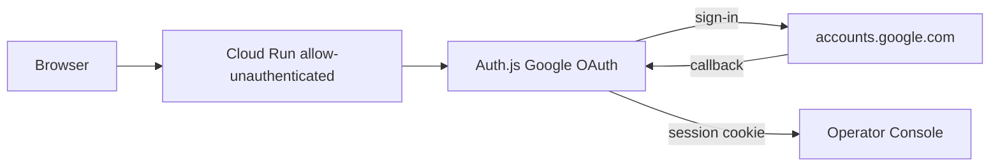

# Replace IAP browser OAuth — iOS consent 401 (Issue #210)

Evidence tier: unit-only (waiver: no tip/payroll money path; Operator Console auth boundary swap + docs. Portal screenshots required G5.)

## Jam / §4 (approved)

**Problem:** After #209, iOS Chrome still hits Google `signin/oauth/consent` (`GeneralOAuthFlow`) with self-duplicating `#fragment` + `rapt=` → 401 malformed. Audience is In production. Failure is **outside** our app (IAP-driven Google reauth).

**Fix:** Replace Cloud Run **browser IAP** with **Auth.js (next-auth) Google OAuth** + email allowlist. Deploy `--allow-unauthenticated` (no `--iap`). Same Cloud Run service / URL. `$0` extra infra.

**UX:** `https://operator-console-887772634501.us-central1.run.app` → session or Google chooser → allowlisted email → console.

| # | Evidence | Pass |
|---|---|---|
| E1 | Session present | Canonical → `/home` screenshot |
| E2 | Idle-sim | Clear app session cookies; open canonical → Google → tap allowlisted → `/home` first try |
| E3 | Deny | Non-allowlisted Google account → blocked (not console) |
| E4 | Deploy | Service has no IAP; `run.googleapis.com/iap-enabled` absent/false |
| E5 | `verify.py --full` + vitest auth/middleware | Green |

Feature-flag decision: **none / out of scope** — auth boundary; not a money-path flag. No FEATURE_FLAGS.md.

Model: Sonnet. Closes #210.

## Architecture



## Citations / stubs

### M1 — Auth.js + identity

| File | Change |
|---|---|
| `apps/operator-console/package.json` | Add `next-auth@5` (Auth.js) |
| `apps/operator-console/auth.ts` (new) | `NextAuth({ providers: [Google], callbacks: { signIn, session } })` allowlist |
| `apps/operator-console/app/api/auth/[...nextauth]/route.ts` (new) | Export handlers |
| `apps/operator-console/middleware.ts` | `export { auth as middleware }` protect all except `/api/auth` |
| `apps/operator-console/lib/auth/identity.ts` | Prefer Auth.js session email; keep BYPASS for local; drop IAP JWT requirement in prod |
| `apps/operator-console/lib/auth/allowlist.ts` (new) | Parse `ALLOWED_EMAILS` env (comma-separated) |

```ts
// allowlist.ts
export function isAllowlisted(email: string, raw = process.env.ALLOWED_EMAILS ?? ""): boolean {
  const set = new Set(raw.split(",").map(s => s.trim().toLowerCase()).filter(Boolean));
  return set.has(email.trim().toLowerCase());
}
```

### M2 — Deploy without IAP

| File | Change |
|---|---|
| `.github/workflows/operator-console-deploy.yml` | `--allow-unauthenticated`; remove `--iap`; drop IAP IAM loop; `--set-secrets` AUTH_SECRET, AUTH_GOOGLE_ID, AUTH_GOOGLE_SECRET, ALLOWED_EMAILS; `AUTH_URL` env |
| `RUNBOOK.md` §17 | Document Auth.js login; remove IAP browser steps as primary; keep CLEAR_LOGIN note obsolete |
| `docs/operator-console/PLAN.md` | Decision 2026-07-28 #210 |

Secrets (provision once): `operator-console-auth-secret`, `operator-console-google-client-id`, `operator-console-google-client-secret`, `operator-console-allowed-emails`.

### M3 — Login UX polish

Minimal `/login` page: brand + “Sign in with Google” (shadcn Button) — Design #27 / ui-polish. No cards clutter.

**Verify M1:**
```bash
cd apps/operator-console && npx vitest run __tests__/identity.test.ts __tests__/allowlist.test.ts
```

**Verify M2/M3:**
```bash
python3 scripts/verify.py --full
```

## Invariants

- Allowlist emails match prior IAP members: `adi@mypalmetto.co`, `aditya.2ky@gmail.com`, `lindsay@mypalmetto.co`
- No tip/payroll formula changes
- Integer cents unchanged
- `$0` infra (no LB/custom domain)

## Milestones

### M1 — Auth.js identity (Sonnet)
### M2 — Deploy + secrets + RUNBOOK (Sonnet)
### M3 — Login page + idle-sim evidence (Sonnet)


### File:line anchors
- [`apps/operator-console/lib/auth/identity.ts`](apps/operator-console/lib/auth/identity.ts):87 `operatorEmail`
- [`apps/operator-console/middleware.ts`](apps/operator-console/middleware.ts):1 middleware export
- [`.github/workflows/operator-console-deploy.yml`](.github/workflows/operator-console-deploy.yml):76 Deploy to Cloud Run
- [`RUNBOOK.md`](RUNBOOK.md):1671 §17 Operator Console

### Docs lock-step
Update `RUNBOOK.md` §17, `docs/operator-console/PLAN.md` decisions log, `PROGRESS.md`, `AGENTS.md` if routing/auth table changes. `check_doc_freshness.py`.

### Branch / PR mechanics
Branch `fix/i210-ios-consent-oauth-replace-iap`; open PR with `gh pr create --base main` as `jarvis-agent-bot328`; never self-merge; babysit; reply every review comment.

## Branch / PR
`fix/i210-ios-consent-oauth-replace-iap` · `gh pr create --base main` · `Closes #210`
