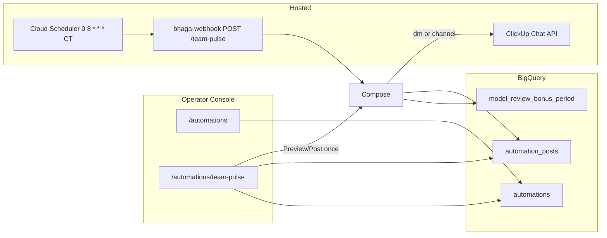

# Team Pulse Automations (Issue #216)

Evidence tier: sandbox-e2e

## Jam / §4 (approved in chat 2026-08-05)

- **Automations page** in Operator Console (`/automations` → `/automations/team-pulse`).
- First automation: ClickUp **Team pulse** (review-bonus leaderboard + motivating template).
- Controllable: enable, days, time, destination (`dm` | `channel`), template, history.
- Default destination: **DM to Adi** (`198109189`); group channel only after promote.
- Localhost console + prod BQ for UX testing (`BYPASS_IAP_EMAIL` + ADC).
- Template-only fill in this PR; LLM variation = follow-up.
- Scheduler: daily 08:00 CT; job no-ops unless enabled + today ∈ days.

### Per-scenario evidence (PR §4)

| # | Scenario | Pass criterion |
|---|---|---|
| E1 | Automations list | Hosted screenshot: Team pulse card + cadence |
| E2 | Detail schedule+template | Hosted screenshot |
| E3 | History table | Hosted screenshot |
| E4 | Save schedule | Toast + reload shows new days |
| E5 | Preview dry-run | Body shown; no ClickUp write |
| E6 | DM post (PR test) | Post once → Adi ClickUp DM; group unchanged |
| E7 | Day gate / idempotency | Unit: skip + no double-post |
| E8 | Compose unit | Fixture → markdown shape |
| E9 | Mobile ~390px | Hosted screenshot |
| E10 | Docs | ARCHITECTURE + RUNBOOK + skill README |
| E11 | Group promote | destination=channel → group post (post-merge / operator flip) |

Feature flag: **none** — additive tables + page; default destination=`dm` cannot spam group. Wrong-numbers risk = display-only leaderboard from existing BQ.

Model routing: Sonnet. One chat per PR.

UX polish (`docs/contributing/ui-polish.md`): reuse `PageHeader`, `Badge`, `Card`, `DataTable`, `Button`/`Input`/`Label`/`Select`, `useConsoleAction`+`ActionToast`. Hover/focus-visible on day chips + buttons; pending disables Post once; ~44px tap; mobile wrap.

## Architecture



## Milestone 1 — Schema + ClickUp skill + compose/post (Sonnet)

### Files

| Path | Change |
|---|---|
| `core/migrations/054_automations.sql` (new) | DDL below |
| `skills/clickup_chat/runner.py` (~101 `_request`) | Add `_request_json` POST; `post_message`; `ensure_dm_channel` |
| `skills/clickup_chat/__init__.py` | Export new symbols |
| `agents/bhaga/scripts/team_pulse.py` (new) | Compose + day-gate + idempotent post + CLI |
| `agents/bhaga/scripts/test_team_pulse.py` (new) | Unit tests E7/E8 |

### DDL (`054_automations.sql`)

```sql
CREATE TABLE IF NOT EXISTS `jarvis-bhaga-prod.bhaga.automations` (
  store           STRING NOT NULL,
  automation_id   STRING NOT NULL,  -- 'team-pulse'
  enabled         BOOL NOT NULL,
  days_of_week    STRING NOT NULL,  -- JSON e.g. '[2,4,0]' Mon=0..Sun=6 ISO? Use Python weekday: Mon=0..Sun=6
  hour_local      INT64 NOT NULL,
  minute_local    INT64 NOT NULL,
  timezone        STRING NOT NULL,
  destination     STRING NOT NULL,  -- 'dm' | 'channel'
  channel_id      STRING,           -- group when destination=channel
  dm_user_id      STRING,           -- ClickUp user id for DM
  workspace_id    STRING NOT NULL,
  template        STRING NOT NULL,
  updated_at      TIMESTAMP,
  updated_by      STRING
);

CREATE TABLE IF NOT EXISTS `jarvis-bhaga-prod.bhaga.automation_posts` (
  store           STRING NOT NULL,
  automation_id   STRING NOT NULL,
  post_date_ct    DATE NOT NULL,
  posted_at       TIMESTAMP NOT NULL,
  destination     STRING NOT NULL,
  channel_id      STRING,
  message_id      STRING,
  content         STRING,
  dry_run         BOOL NOT NULL,
  trigger         STRING NOT NULL,  -- scheduler | once | preview
  updated_by      STRING
);
```

Defaults seeded by `team_pulse.ensure_default_config(store)` on first read:
- days `[1,3,6]` (Tue/Thu/Sun if Mon=0), hour 8, minute 0, tz America/Chicago
- destination `dm`, dm_user_id `198109189`, channel_id `8cr6661-737`, workspace `9017956545`
- template with `{leaderboard}` placeholder

### Signatures

```python
def compose_message(template: str, leaderboard_md: str) -> str: ...
def format_leaderboard(rows: list[dict]) -> str: ...  # group by total_bonus
def should_run_today(days_of_week: list[int], *, today_weekday: int, enabled: bool) -> bool: ...
def already_posted(store, automation_id, post_date_ct) -> bool: ...
def run_team_pulse(*, store: str, dry_run: bool, force: bool, trigger: str) -> dict: ...
```

**Verify:**
```bash
python3 -m pytest agents/bhaga/scripts/test_team_pulse.py -q
BHAGA_DATASTORE=bigquery python3 -c "from core.datastore import ensure_schema; print(ensure_schema())"
```

## Milestone 2 — Webhook scheduler kick (Sonnet)

| Path | Change |
|---|---|
| `cloud/webhook/handler.py` after `/plaid/sync` (~1835) | `POST /team-pulse` with `X-Team-Pulse-Token` (reuse sandbox/plaid token pattern) |
| `cloud/webhook/test_handler.py` | Auth + dry-run dispatch unit |
| `RUNBOOK.md` | Scheduler create/pause + token; Common tasks |

Scheduler (one-time / deploy note — IaC command in RUNBOOK):
```bash
gcloud scheduler jobs create http bhaga-team-pulse \
  --location=us-central1 --schedule='0 8 * * *' --time-zone=America/Chicago \
  --uri='https://bhaga-webhook-4yl5izovxq-uc.a.run.app/team-pulse' \
  --http-method=POST --headers=X-Team-Pulse-Token=<secret>
```

**Verify:**
```bash
python3 -m pytest cloud/webhook/test_handler.py -q -k team_pulse
```

## Milestone 3 — Operator Console UI (Sonnet)

| Path | Change |
|---|---|
| `apps/operator-console/components/shell/nav-items.ts:28-53` | System → Automations (`Bot` icon), href `/automations` |
| `apps/operator-console/app/automations/page.tsx` (new) | List card |
| `apps/operator-console/app/automations/team-pulse/page.tsx` (new) | Detail |
| `apps/operator-console/app/automations/team-pulse/TeamPulseEditor.tsx` (new) | Client editor |
| `apps/operator-console/app/automations/actions.ts` (new) | `saveTeamPulseConfigAction`, `previewTeamPulseAction`, `postTeamPulseOnceAction` |
| `apps/operator-console/lib/bq/queries.ts` | `getAutomation`, `listAutomationPosts`, `openReviewBonusLeaderboard` |
| `apps/operator-console/lib/bq/writes.ts` | `upsertAutomation`, `insertAutomationPost` |
| `apps/operator-console/lib/automations/teamPulse.ts` (new) | Pure compose (mirror Python) |
| `apps/operator-console/lib/automations/clickup.ts` (new) | postMessage / ensureDm (CLICKUP_PAT) |
| `apps/operator-console/lib/actions/registry.ts` | Register 3 actions |
| `apps/operator-console/lib/actions/MUTATING_ACTIONS.md` | Rows |
| `docs/operator-console/ARCHITECTURE.md` | Screen matrix row |
| `apps/operator-console/README.md` | Route row |
| `apps/operator-console/__tests__/team-pulse-compose.test.ts` | Compose unit |

Post once / Preview run in Next server action (localhost + Cloud Run console). Need `CLICKUP_PAT` in console env for Post once (document hydrate / Secret Manager mount — mirror webhook secret name `jarvis-clickup-palmetto-pat`). Localhost: Keychain via optional Python bridge is heavy — use `CLICKUP_PAT` in `.env.local` for DM test (gitignored).

**Verify:**
```bash
cd apps/operator-console && npm test -- --run __tests__/team-pulse-compose.test.ts
python3 scripts/check_operator_console_actions.py
BYPASS_IAP_EMAIL=adi@mypalmetto.co npm run dev   # manual UX vs prod BQ
```

## Milestone 4 — Evidence + PR (Sonnet)

Capture E1–E6 via `capture_evidence.py` + DM post once; babysit.

**Verify:**
```bash
python3 scripts/verify.py --full
python3 scripts/check_plan_readiness.py --plan docs/plans/i216-team-pulse-automations.md
```

## Invariants preserved

- America/Chicago date boundaries for `post_date_ct` + day gate
- Idempotent: one non-dry-run post per `(store, automation_id, post_date_ct)`
- Default destination `dm` — no silent group spam
- Integer cents not involved (display dollars from existing model table)
- Sandbox isolation N/A for ClickUp; dry-run never POSTs

## Docs lock-step

`RUNBOOK.md`, `skills/clickup_chat` README (extend `__init__` docstring), `docs/operator-console/ARCHITECTURE.md`, `apps/operator-console/README.md`, `agents/bhaga/scripts/README.md` (team_pulse row). `check_doc_freshness.py`.

## Branch / PR

`fix/would-want-to-create-some-automation` → `gh pr create --base main` → Closes #216 → babysit → never self-merge.
