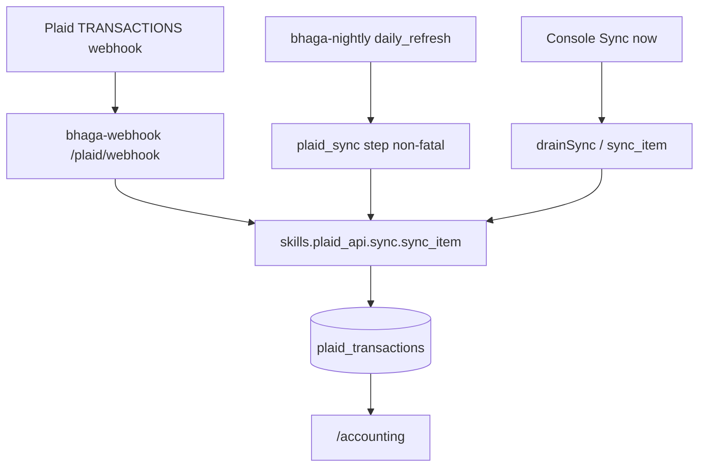

# Plaid Accounting sync resume (Issue #220)

Derived from jam + §4 approved 2026-08-05. Root cause: Chase Item linked 2026-07-23 (`recovery-i168`) with **empty** Plaid `webhook`; `PLAID_WEBHOOK_URL` never set on `operator-console`; no dedicated plaid scheduler. BQ `MAX(date)=2026-07-23`; Plaid holds ~85 unapplied txns through 2026-08-04.

## Locked decisions (jam)

| Decision | Choice |
|---|---|
| Primary ingest | Plaid webhook → `https://bhaga-webhook-4yl5izovxq-uc.a.run.app/plaid/webhook` |
| Catch-up | Existing `bhaga-nightly` → `daily_refresh` non-blocking `plaid_sync` step |
| No new scheduler | Do **not** create a Cloud Scheduler job for `/plaid/sync` |
| Historical drain | **Manual Sync** (or `sync_item`) after wiring; pre-PR operator verify on console/localhost |
| Out of scope | QBO #161, taxonomy/rules, Square pipeline |
| Pre-PR gate | Operator confirms Accounting UI shows post–Jul-23 txns **before** `gh pr create` |

**Evidence tier: sandbox-e2e** (unit + verify.py) **+ prod-live** (Item webhook, Manual Sync drain, Accounting UI).  
**Waiver:** sandbox cannot exercise production Chase Item `ya7xdVa8Qocw3oyNxn5eFzemxvRKXnIXa0LoO`.

## Architecture



## Feature-flag decision

No new flag. Wrong numbers risk is **stale** ledger (missing txns), not silent mis-categorization. Existing `FEATURES.accounting` / `writePlaidLink` stay on. Document cutover in `docs/FEATURE_FLAGS.md` Accounting row + `RUNBOOK.md`.

## Invariants preserved

- Access tokens never in BQ (`skills/plaid_api/auth.py`).
- Idempotent MERGE on `transaction_id` (`skills/plaid_api/sync.py` `_upsert_transactions`).
- Integer-cents N/A (existing Plaid float dollars).
- America/Chicago display windows unchanged.
- `plaid_sync` failure must **not** fail Square/ADP nightly (mirror `ingest_inventory` non-fatal pattern at `daily_refresh.py:2869–2888`).
- Sandbox isolation: nightly prod only; no sandbox write to prod plaid tables from this change.
- No PII/secrets in git or §4.

---

## Milestone 1 — Webhook wiring

**Model: Sonnet 5 medium thinking**

### Changes (file:line)

1. [`.github/workflows/operator-console-deploy.yml:86`](.github/workflows/operator-console-deploy.yml) — add to `--set-env-vars`:

```text
PLAID_WEBHOOK_URL=https://bhaga-webhook-4yl5izovxq-uc.a.run.app/plaid/webhook
```

2. [`skills/plaid_api/client.py`](skills/plaid_api/client.py) — after `item_get` (~L104):

```python
def item_webhook_update(self, access_token: str, webhook: str) -> dict:
    return self._post(
        "/item/webhook/update",
        {"access_token": access_token, "webhook": webhook},
    )
```

3. [`skills/plaid_api/sync.py`](skills/plaid_api/sync.py) — new helper after `list_linked_items`:

```python
def update_item_webhook(store: str, item_id: str, webhook_url: str) -> dict:
    """Set Plaid Item webhook URL (does not sync transactions)."""
```

4. Ops (agent, same PR evidence — not git): update Chase Item:

```bash
PLAID_ENV=production BHAGA_SECRETS_BACKEND=gcp python3 -c "
from skills.plaid_api.sync import update_item_webhook
print(update_item_webhook('palmetto', 'ya7xdVa8Qocw3oyNxn5eFzemxvRKXnIXa0LoO',
  'https://bhaga-webhook-4yl5izovxq-uc.a.run.app/plaid/webhook'))
"
# prove: item/get.webhook == that URL
```

5. Unit: mock `PlaidClient.item_webhook_update` in `skills/plaid_api/test_sync_unit.py`.

**Verify:** `python3 -m pytest skills/plaid_api/test_sync_unit.py -q`  
**Pass:** Item `webhook` non-empty; deploy YAML contains `PLAID_WEBHOOK_URL`.

---

## Milestone 2 — Nightly catch-up

**Model: Sonnet 5 medium thinking**

### Changes

1. [`agents/bhaga/scripts/daily_refresh.py`](agents/bhaga/scripts/daily_refresh.py) — after `refresh_order_reco` block (~L2905), before `runtime_s = ...`:

```python
# ── Plaid Accounting catch-up (Issue #220) ─────────────────────────
# Non-fatal: webhook is primary; this drains missed SYNC_UPDATES.
print("\n[plaid_sync] catching up linked Plaid Items...")
ok, _ = run_step(
    "plaid_sync",
    lambda: _plaid_sync_linked_items(args.store),
    refresh_date=refresh_date,
    dry_run=args.dry_run,
)
if not ok:
    print("[plaid_sync] FAILED (non-fatal) — Accounting ledger may be stale.",
          file=sys.stderr)
```

2. Helper in same file (near other helpers):

```python
def _plaid_sync_linked_items(store: str) -> dict:
    from skills.plaid_api.sync import list_linked_items, sync_item
    results = []
    for row in list_linked_items(store):
        item_id = row.get("item_id")
        if not item_id:
            continue
        r = sync_item(store, item_id)
        results.append({"item_id": item_id, "added": r.added, "modified": r.modified, "removed": r.removed})
        print(f"[plaid_sync] item={item_id} added={r.added} modified={r.modified} removed={r.removed}")
    return {"items": results}
```

3. Ensure `plaid_sync` failure is recorded but **does not** put the step on the aborting `failures` path that returns exit 1 for tip/payroll — same pattern as inventory: check how `run_step` treats inventory. If `run_step` always appends to `failures`, mirror inventory: after failed step, do **not** leave it on `failures` for exit-code gating, OR clear it. **Inspect `run_step` + inventory handling** — inventory currently still records failure; nightly still returns 1 if `failures` non-empty. Confirm inventory is stripped from abort list or accepted as non-fatal exit. Prefer: call sync inside try/except and only `print` + breadcrumb without using `run_step` if `run_step` would abort nightly — **simplest safe pattern:** try/except print, no `run_step`, no marker — always best-effort every night. **Pick:** best-effort try/except without `run_step` marker so a Plaid outage never marks the night failed.

```python
def _plaid_sync_linked_items(store: str) -> None:
    try:
        from skills.plaid_api.sync import list_linked_items, sync_item
    except Exception as exc:
        print(f"[plaid_sync] import failed (non-fatal): {exc}", file=sys.stderr)
        return
    try:
        items = list_linked_items(store)
    except Exception as exc:
        print(f"[plaid_sync] list_linked_items failed (non-fatal): {exc}", file=sys.stderr)
        return
    for row in items:
        item_id = row.get("item_id")
        if not item_id:
            continue
        try:
            r = sync_item(store, item_id)
            print(f"[plaid_sync] ok item={item_id} added={r.added} modified={r.modified} removed={r.removed}")
        except Exception as exc:
            print(f"[plaid_sync] failed item={item_id} (non-fatal): {exc}", file=sys.stderr)
```

4. Docs:
   - [`RUNBOOK.md:1814–1822`](RUNBOOK.md) — require `PLAID_WEBHOOK_URL` on console; document nightly catch-up; no dedicated plaid scheduler; Manual Sync for backfill.
   - [`skills/plaid_api/README.md`](skills/plaid_api/README.md) — webhook update + nightly note.
   - [`docs/FEATURE_FLAGS.md:21`](docs/FEATURE_FLAGS.md) — Accounting row: webhook + nightly catch-up (#220).
   - [`agents/bhaga/scripts/README.md`](agents/bhaga/scripts/README.md) — one line on `plaid_sync` in daily_refresh.

**Verify:** `python3 -c "from agents.bhaga.scripts.daily_refresh import _plaid_sync_linked_items"` import smoke; `python3 scripts/check_doc_freshness.py`  
**Pass:** helper exists; docs mention webhook URL + nightly catch-up; no new scheduler job in plan.

---

## Milestone 3 — Drain, operator verify, PR

**Model: Sonnet 5 medium thinking**; Opus only if sync hard-fails.

1. Drain (agent, with operator watching console):

```bash
BHAGA_DATASTORE=bigquery PLAID_ENV=production BHAGA_SECRETS_BACKEND=gcp python3 -c "
from skills.plaid_api.sync import sync_item
print(sync_item('palmetto', 'ya7xdVa8Qocw3oyNxn5eFzemxvRKXnIXa0LoO'))
"
# expect added>0; then second call added≈0
# BQ: MAX(date) >= 2026-08-04; last_synced_at fresh
```

2. **Pause for operator** — verify on  
   `https://operator-console-887772634501.us-central1.run.app/accounting`  
   (or localhost). **Do not open PR until operator confirms.**

3. `python3 scripts/verify.py --full`

4. PR `--base main`, Refs #220; babysit per `pr-workflow.mdc`.

**Pass:** operator ACK + BQ freshness + verify green.

---

## Per-scenario evidence (PR §4)

| # | Scenario | Pass criterion |
|---|---|---|
| 1 | Item webhook | `item/get.webhook` = bhaga-webhook `/plaid/webhook` URL |
| 2 | Console deploy | `PLAID_WEBHOOK_URL` in `operator-console-deploy.yml` |
| 3 | Nightly catch-up | `_plaid_sync_linked_items` in `daily_refresh.py`; failure non-fatal |
| 4 | Historical drain | Manual/`sync_item`: `MAX(date)≥2026-08-04`; 2nd sync `added≈0` |
| 5 | Pre-PR UI | Operator confirmed Accounting shows post–Jul-23 txns |
| 6 | No new scheduler | Only `bhaga-nightly` remains |
| 7 | Failure isolation | Forced exception path logs non-fatal (unit or code review) |
| 8 | Regression | `verify.py --full` green |
| 9 | Security | No tokens/account numbers in git or §4 |

## Branch / PR mechanics

- Branch: `fix/where-i-dont-see-accountaing-getting` · Issue #220
- One coherent PR; `gh pr create --base main`; bot account; never self-merge
- Reply-to-every-comment gate; babysit skill after open
- Cost: `pr_cost_ledger.py bind-pr` + `sync` after PR exists

## Model routing

| Milestone | Model |
|---|---|
| M1–M2 | Sonnet 5 medium |
| M3 drain/UI | Sonnet; Opus only on hard fail |
| Plan review | Opus if needed |
