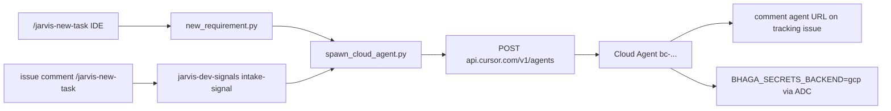

# Cloud-primary Jarvis intake (Issue #228)

## Locked decisions (jam + define-evidence approved)

- **Option A:** both intake surfaces always spawn a **Cursor Cloud Agent**; continue that same agent from laptop/web/mobile.
- **No mandatory local worktree mirror.** Local `--local` escape hatch only for dogfood/lifecycle tests.
- **Secrets:** Cloud Agent uses `BHAGA_SECRETS_BACKEND=gcp` + ADC (SM already holds BHAGA/dev secrets in [`RUNBOOK.md`](RUNBOOK.md) §7). Keychain hydrate stays laptop convenience.
- **Playwright:** Cursor cloud computer use / VM Chromium for UI verify. Touch ID / Keychain-only portals / launchd / CHITRA Socket Mode `/tmp` inboxes stay **laptop-only** (out of §4).
- **Spawn locus (picked):** GitHub Action `intake-signal` always calls Cursor Cloud Agents API (Mac offline OK). In-IDE `/jarvis-new-task` calls the **same** helper. Local `dev_event_listener` **stops** creating sibling worktrees on intake.
- **§4 evidence (updated):** after intake is built, dogfood by using it to drive a **small operator-console change** (separate issue/PR via intake isolation). Issue #228 §4 cites that cloud agent URL + console PR — not a synthetic smoke-only run.

## Target flow



## Architecture

### 1. New helper — [`scripts/spawn_cloud_agent.py`](scripts/spawn_cloud_agent.py)

Direct HTTPS via `urllib.request` (no new pip dep; HL#16). Auth: `CURSOR_AGENT_TOKEN` (Basic, per [Cloud Agents API](https://cursor.com/docs/cloud-agent/api/endpoints.md)).

```python
def spawn_cloud_agent(
    *,
    prompt_text: str,
    repo_url: str = "https://github.com/aditya2kx/jarvis",
    starting_ref: str,           # e.g. fix/i228-...
    work_on_current_branch: bool = True,
    mode: str = "plan",          # jam posture; API has plan|agent, not ask
    name: str | None = None,
    model_id: str | None = None,
    dry_run: bool = False,
) -> dict:  # {agent_id, run_id, url}
    ...
```

- POST `https://api.cursor.com/v1/agents` with `prompt.text`, `repos[{url,startingRef}]`, `workOnCurrentBranch: true`, `mode: "plan"`, `autoCreatePR: false`.
- Idempotency: before spawn, `gh issue view` comments for existing `cursor.com/agents/` / `bc-` URL for this issue; if found, return that URL (no second agent). Also record spawn in listener seen-file style JSON under `metrics/pr_cost/cloud-intake-seen.json` when run from laptop.
- Greppable breadcrumb on failure: `cloud_intake_spawn_failed issue=N branch=... http=...`.

Reuse jam seed from [`scripts/start_pr_session.py`](scripts/start_pr_session.py) `seed_prompt_jam` (~L387) — extend with a cloud variant that points at the brief path **in the clone** and states Ask/jam posture (restate + §4; no implement until `approved:jam` / `approved:define-evidence`).

### 2. Worktree-less branch + issue — extend [`scripts/new_requirement.py`](scripts/new_requirement.py)

Today `_run_one` (~L457) always `create_worktree` + local Cursor open. Split:

| Path | Behavior |
|---|---|
| **Default (cloud)** | Resolve/create issue (`init_phase_tracking`); create remote branch `fix/i{N}-<slug>` from `origin/main` via `git push origin origin/main:refs/heads/<branch>` (no worktree); write brief into a temp or primary-checkout `metrics/pr_cost/` then commit is **not** required — brief content is embedded in cloud prompt + posted on issue; call `spawn_cloud_agent`; comment agent URL on issue; **do not** `open -a Cursor` / sibling wt. |
| **`--local`** | Preserve today’s worktree + deeplink path for dogfood/`verify_lifecycle` / `--no-open` tests. |

CLI: default cloud; `--local` escape; keep `--dry-run`, `--issue`, `--requirement`, `--no-open` (cloud dry-run skips API).

Update [`.cursor/skills/jarvis-new-task/SKILL.md`](.cursor/skills/jarvis-new-task/SKILL.md): after script, stop; tell operator to open the Cloud Agent URL on the issue.

Update [`.cursor/rules/new-requirement-intake.mdc`](.cursor/rules/new-requirement-intake.mdc): front door still `/jarvis-new-task`; outcome is **cloud agent**, not “new Cursor window”.

### 3. GH Action — [`.github/workflows/jarvis-dev-signals.yml`](.github/workflows/jarvis-dev-signals.yml) `intake-signal` (~L117)

After existing emit-signal + `jarvis-work` label:

1. Checkout + Python 3.12 (already).
2. Ensure branch exists (call small Python path or inline `gh api` create ref from default SHA).
3. `CURSOR_AGENT_TOKEN: ${{ secrets.CURSOR_AGENT_TOKEN }}` → `python3 scripts/spawn_cloud_agent.py --issue N --requirement "..." --branch fix/iN-...`.
4. Comment agent URL on issue (helper also comments; Action logs failures with `::error::`).

**Operator one-time:** add `CURSOR_AGENT_TOKEN` to repo Actions secrets (Dashboard → API Keys). Document in RUNBOOK / WORKFLOW.

### 4. Local listener — [`scripts/dev_event_listener.py`](scripts/dev_event_listener.py)

Intake block (~L349) today `_dispatch` → `new_requirement.py` → local worktree. Change intake handling to: **log + skip worktree creation** when Action owns spawn (default). Optional env `JARVIS_INTAKE_LOCAL=1` restores old path for emergency. Prevents double-spawn when Mac is online.

### 5. Cloud environment — [`.cursor/environment.json`](.cursor/environment.json) (new)

```json
{
  "install": "python3 -m pip install -r requirements.txt && cd apps/operator-console && npm ci",
  "start": "echo 'Jarvis cloud env ready; BHAGA_SECRETS_BACKEND=gcp'"
}
```

Install must cover the §4 dogfood (operator-console work in the same VM).

Document Cursor Cloud Agents dashboard secrets (operator provisioning, not in git):

- ADC: SA JSON with `secretAccessor` on `jarvis-bhaga-prod` secrets (or WIF-equivalent Cursor supports), so `get_secret()` works with `BHAGA_SECRETS_BACKEND=gcp`.
- Optional: `GH_TOKEN` bot PAT if Cursor GitHub integration is insufficient for `gh` as `jarvis-agent-bot328`.

Env var in dashboard / `envVars` on spawn (if enabled for account): `BHAGA_SECRETS_BACKEND=gcp`, `GCP_PROJECT=jarvis-bhaga-prod`.

### 6. Secrets path (code + docs)

- [`skills/credentials/registry.py`](skills/credentials/registry.py): no Keychain on Linux — already gated by `BHAGA_SECRETS_BACKEND`. Add a short `audit` hint when backend=gcp and ADC missing.
- Docs: [`docs/WORKFLOW.md`](docs/WORKFLOW.md) §8 rewrite intake rows to cloud-primary; list laptop-only exclusions. [`RUNBOOK.md`](RUNBOOK.md) §7 add “Cloud Agent bootstrap” subsection. [`docs/FEATURE_FLAGS.md`](docs/FEATURE_FLAGS.md): **no new flag** (cloud is default; `--local` / `JARVIS_INTAKE_LOCAL=1` are escape hatches, not silent number risk).
- [`AGENTS.md`](AGENTS.md) / intake rule: cloud agent is the workspace.

### Feature-flag decision

**No FEATURE_FLAGS entry.** Wrong-numbers test fails (intake routing, not tip math). Cost risk controlled by **idempotent spawn** (issue comment scan + seen-file), not a kill switch flag.

## Invariants (must not break)

- Allowlist authors only (`aditya2kx`, `jarvis-agent-bot328`) for intake.
- Link-not-create: `#N` / URL still links existing issue; branch `fix/i{N}-…`.
- Never double-spawn cloud agent for same intake signal/issue.
- Never retry spawn blindly after partial side effect without checking issue comments for existing `bc-` / agent URL.
- Operator gates (jam / define-evidence / merge) still required; cloud does not auto-merge.
- `--local` path keeps existing lifecycle dogfood/`verify_lifecycle` assertions green (or update assertions that assume sibling worktree as primary).

## Milestones

### M1 — Spawn helper + env skeleton (Sonnet)

- Add `scripts/spawn_cloud_agent.py` + `scripts/test_spawn_cloud_agent.py` (urllib mocked).
- Add `.cursor/environment.json` with Python + `apps/operator-console` `npm ci` (needed for §4 console dogfood).
- **Verify:** `pytest scripts/test_spawn_cloud_agent.py -q` PASS; dry-run prints JSON without HTTP.

### M2 — Wire intake surfaces (Sonnet)

- Cloud-default `new_requirement.py`; `--local` preserves old path.
- Update `jarvis-dev-signals.yml` intake-signal; listener intake no-op for worktree.
- Update jarvis-new-task skill + `new-requirement-intake.mdc`; adjust `verify_lifecycle.py` assertions that encode “opens Cursor window” → “spawns cloud / posts agent URL” where needed; keep interrogation-free + link-not-create asserts.
- **Verify:** `pytest scripts/test_new_requirement.py scripts/test_spawn_cloud_agent.py scripts/test_verify_lifecycle.py -q`; `python3 scripts/new_requirement.py --requirement "smoke cloud intake" --dry-run` shows cloud path.

### M3 — Docs + real dogfood via small operator-console change (Sonnet; Opus only if spawn API fights)

- WORKFLOW / RUNBOOK / FEATURE_FLAGS / check_doc_freshness.
- Operator: `CURSOR_AGENT_TOKEN` in GH secrets + Cloud dashboard ADC secret (one-time; agent drives `gh secret set` if key available in Keychain).
- **§4 dogfood (primary evidence):** after intake wiring works on this branch (or just-merged `main`), use **`/jarvis-new-task` or an issue comment** to start a Cloud Agent whose requirement is a **small operator-console change** (exact delta named by the operator at dogfood time — intentionally tiny: copy, nav, chip, or equivalent polish in `apps/operator-console/`). That console work is a **separate tracking issue / PR** (intake isolation); Issue #228’s PR §4 **cites** the cloud agent URL + that console PR as proof the path works.
- Console dogfood must exercise cloud VM: `npm` scripts / `next` or lint in `apps/operator-console`, plus at least one `BHAGA_SECRETS_BACKEND=gcp` secret read if the change touches a secret-backed path (otherwise a one-line `registry audit` / `get_secret` breadcrumb in the same agent transcript still counts).

**Evidence tier: sandbox-e2e** (real cloud intake → real console PR; not BHAGA tip scenario).

## PR §4 evidence contract

1. **Primary:** Cloud intake used to work a small operator-console change — agent URL on the intake issue + link to the resulting console PR (or in-progress agent that opened/updated that PR). No Mac sibling worktree required for that work.
2. At least one intake surface proven: in-IDE `/jarvis-new-task` **or** allowlisted issue-comment `/jarvis-new-task` (prefer proving **both** if cheap; one is enough if the other is unit-covered).
3. Same cloud agent continuable from a second surface (web or desktop Agents Window) — URL/screenshot.
4. In that cloud VM: operator-console tooling runs (`npm ci` already in env install; lint/test or `npm run build` / dev smoke as appropriate for the tiny change) without a local checkout.
5. In that cloud VM: `BHAGA_SECRETS_BACKEND=gcp` + ADC reads one SM secret (`registry` get/audit) — transcript snippet.
6. Link-not-create + unauthorized author + duplicate intake → no second agent (unit and/or live).
7. This PR (`#228` intake): `verify.py --full` green; non-intake signals unchanged.
8. Explicit non-goals: Slack intake; Touch ID; launchd; CHITRA `/tmp` listeners; cloud auto-merge; large console features.

## Docs lock-step

- [`docs/WORKFLOW.md`](docs/WORKFLOW.md) §8 intake → cloud-primary
- [`RUNBOOK.md`](RUNBOOK.md) §7 Cloud Agent bootstrap (CURSOR_AGENT_TOKEN, ADC, `BHAGA_SECRETS_BACKEND=gcp`)
- [`docs/FEATURE_FLAGS.md`](docs/FEATURE_FLAGS.md) note escape hatches only
- [`.cursor/rules/new-requirement-intake.mdc`](.cursor/rules/new-requirement-intake.mdc) + jarvis-new-task skill
- `python3 scripts/check_doc_freshness.py --base origin/main`

## Branch / PR mechanics

- Branch: `fix/another-new-requirement-would-be-anytime` (Issue #228). One PR → `--base main`. Bot `jarvis-agent-bot328`. Never self-merge; babysit after open; `pr_cost_ledger` bind/sync. Advance phases: after this plan approved, record `approved:jam` / `approved:define-evidence` then `advance` through plan→implement→…

## Model routing

- M1–M3 implement: **Sonnet 5 medium thinking**
- Plan review / stuck API auth: **Opus 4.8 thinking medium**
- Doc-only polish: Composer 2.5 OK
