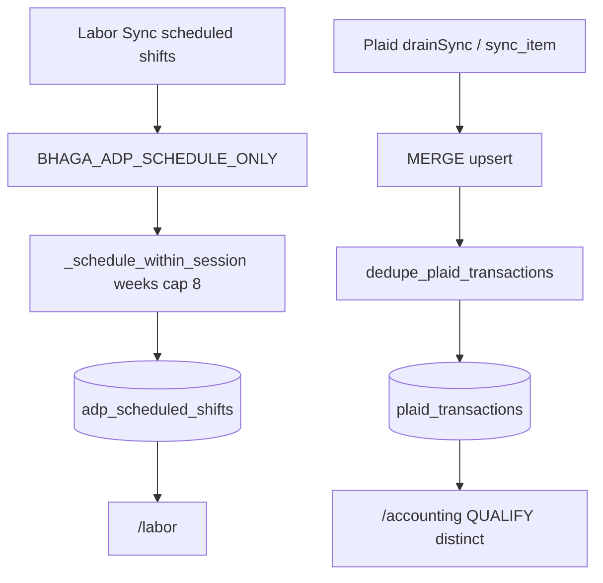

# Labor schedule weeks + Plaid txn dedupe (Issue #230)

Derived from jam + §4 approved 2026-08-08 (chat). Branch `fix/i-want-to-work-on-a-2`.

## Locked decisions (jam)

| Decision | Choice |
|---|---|
| Scope | **Both** R1 (labor schedule horizon/draft) + R2 (accounting duplicates) in this PR |
| Schedule horizon | Scrape forward until week label stops advancing; **hard cap 8** |
| Draft weeks | Include whatever Team Schedule grid exposes; if ADP hides drafts, document limit |
| Accounting root cause | True duplicate `transaction_id` rows in `plaid_transactions` (concurrent MERGE races), not the Internal rule itself |
| Pre-PR gate | Operator plays on **localhost** before `gh pr create` |
| Out of scope | Taxonomy redesign; Labor chart UX redesign |

**Evidence tier: sandbox-e2e** (schedule unit tests + runner horizon logic; Plaid upsert/dedupe unit tests).  
**Prod-live supplement:** BQ before/after distinctness for dedupe repair; localhost Accounting This month.  
**Waiver:** Full ADP headed scrape may need operator Touch ID session — Labor §4 week presence proven via unit + schedule-only when session available; otherwise document.

## Feature-flag decision

No new flag. Schedule horizon change cannot silently wrong-number historical actuals (forward schedule only). Dedupe removes duplicate rows — money totals move toward correct (lower), never invent new txns.

## Invariants preserved

- Idempotent upserts on `transaction_id` (strengthen: post-sync dedupe + read QUALIFY).
- America/Chicago date windows unchanged.
- ADP schedule scrape remains read-only toward ADP.
- Integer-cents N/A (Plaid float dollars unchanged).
- Sandbox isolation for BHAGA nightly unrelated paths.

## Architecture



---

## Milestone 1 — Schedule horizon

**Model: Sonnet 5 medium thinking**

### Changes

1. [`skills/adp_run_automation/schedule_backend.py:62-63`](skills/adp_run_automation/schedule_backend.py) — replace `DEFAULT_WEEKS = 2` with `DEFAULT_WEEKS = 8` and `MAX_SCHEDULE_WEEKS = 8` (document scrape-until-stable).

2. [`skills/adp_run_automation/runner.py:_schedule_within_session` (~L1725)](skills/adp_run_automation/runner.py) — loop `min(weeks, MAX)`; on `_goto_next_week` `RuntimeError` (label unchanged) **break** instead of failing the whole sync when past last available week.

```python
def _schedule_within_session(page, *, weeks: int = None) -> list[dict]:
    weeks = min(weeks or sb.DEFAULT_WEEKS, sb.MAX_SCHEDULE_WEEKS)
    ...
    for i in range(weeks):
        payloads.append(_scrape_one_week(page, frame))
        if i >= weeks - 1:
            break
        try:
            _goto_next_week(page, frame)
        except RuntimeError as exc:
            print(f"[adp_schedule] stop advancing weeks: {exc}")
            break
    return payloads
```

3. Tests in `skills/adp_run_automation/test_schedule_backend.py` (or new `test_runner_schedule_weeks.py`): assert default cap constant; mock/navigation stop behavior if unit-testable without Playwright.

4. Docs: [`docs/operator-console/ARCHITECTURE.md`](docs/operator-console/ARCHITECTURE.md) §14 — “current+next” → “up to 8 forward weeks (stop when chevron does not advance); draft weeks included if visible in Team Schedule grid”.

**Verify:** `python3 -m pytest skills/adp_run_automation/test_schedule_backend.py -q` (+ new test file).  
**Pass:** DEFAULT/MAX=8; scrape loop stops cleanly on failed advance.

---

## Milestone 2 — Plaid dedupe

**Model: Sonnet 5 medium thinking**

### Root cause

`MERGE ... WHEN NOT MATCHED THEN INSERT` is not race-safe under concurrent syncs (webhook + Manual Sync / console + Python). BQ has no enforced unique key → duplicate `transaction_id` rows (~16 extras this month). Ledger + cash flow double-count (Square deposits included).

### Changes

1. [`apps/operator-console/lib/bq/writes.ts`](apps/operator-console/lib/bq/writes.ts) — add:

```typescript
export async function dedupePlaidTransactions(): Promise<number> {
  // DELETE extras keeping latest updated_at (then transaction_id tie-break)
  // return deleted count
}
```

Call from [`apps/operator-console/app/accounting/actions.ts`](apps/operator-console/app/accounting/actions.ts) `drainSync` after upserts (and after suggestInternal/categorize).

2. [`skills/plaid_api/sync.py`](skills/plaid_api/sync.py) — `_dedupe_transactions(bq)` after upsert loop (same SQL); call from `sync_item`.

3. [`apps/operator-console/lib/bq/queries.ts:plaidTransactions`](apps/operator-console/lib/bq/queries.ts) — defense in depth:

```sql
QUALIFY ROW_NUMBER() OVER (
  PARTITION BY t.transaction_id ORDER BY t.updated_at DESC
) = 1
```

4. One-shot prod cleanup (same DELETE SQL) during implement so localhost sees clean data immediately.

5. Unit tests: Python assert SQL contains QUALIFY/ROW_NUMBER dedupe; TS test or Python mirror for merge+dedupe contract. Optional: migration note in `agents/bhaga/scripts/README.md` Operator Console Plaid bullet.

**Verify:**  
```bash
# before/after
bq query: COUNT(*) vs COUNT(DISTINCT transaction_id) → extra_rows=0 after
python3 -m pytest skills/plaid_api/test_sync_unit.py -q
cd apps/operator-console && npm test -- --run related
```

**Pass:** `extra_rows = 0`; Internal rule `op_online_transfer_mskeue8m` still present; Accounting This month no duplicate Square rows.

---

## Milestone 3 — Localhost

**Model: Composer / Sonnet**

```bash
cd apps/operator-console && BYPASS_IAP_EMAIL=adi@mypalmetto.co npm run dev
```

Operator checks `/accounting` This month + `/labor` (Sync if ADP session ready).

**Pass:** Operator confirms playable before PR open.

---

## Docs lock-step

- `docs/operator-console/ARCHITECTURE.md` §14 schedule horizon
- `apps/operator-console/README.md` or Plaid skill README one-liner on post-sync dedupe
- `check_doc_freshness.py` clean

## Branch / PR mechanics

- Branch `fix/i-want-to-work-on-a-2`; PR `--base main`; `Closes #230`
- Bot push; babysit; **no self-merge**
- Cost ledger bind after PR exists
- Localhost gate **before** `gh pr create`

## Model routing

| Milestone | Model |
|---|---|
| M1 schedule | Sonnet 5 medium |
| M2 plaid | Sonnet 5 medium |
| M3 localhost / docs | Composer 2.5 / Sonnet |

## Per-scenario evidence (§4)

| Scenario | Evidence |
|---|---|
| Labor happy | After sync, BQ has week_starts beyond current+next when ADP has them; Labor UI shows hours |
| Labor stop | Cap 8; failed chevron stops without aborting prior weeks |
| Draft | Screenshot or note if grid exposes draft |
| Accounting before | `extra_rows > 0` this month |
| Accounting after | `extra_rows = 0`; Square deposit appears once |
| Internal regression | Online Transfer @ 8933 still `internal_transfers` / excluded |
| Upsert unit | Dedupe SQL / post-sync hook tested |

## PR §4 contract (approved)

See jam chat 2026-08-08 — Labor sandbox-e2e + Accounting prod BQ before/after + localhost operator play.
