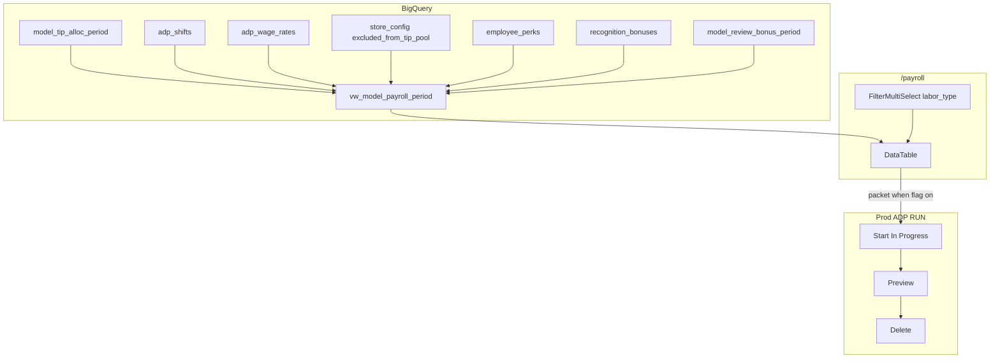

# Payroll & People — rate, OT, FT/Lindsay, gym perks, ADP draft (Issue #251)

Evidence tier: sandbox-e2e

Live Palmetto ADP Start→Preview→**Delete** (never Approve) is extra §4 evidence gathered **before** `gh pr create`. Not `sandbox-live` (that workflow is Square/ADP *scrape* isolation, not RUN payroll write).

Closes #251. Branch: `fix/i-want-to-work-on-some`. One chat per PR. Bot: `jarvis-agent-bot328`. `--base main`. Never self-merge; babysit then operator squash-merge. Push: secret-scan then `git push --no-verify` (`docs/contributing/push-gotchas.md`).

Model routing (`docs/contributing/cost.md`): M1 Sonnet · M2 Sonnet · M3 Sonnet (Opus only if ADP selectors fail twice) · M4 Composer for doc-only, Sonnet for PR body.

Consulted: `CONTRIBUTING.md` (dev loop + §4), `docs/WORKFLOW.md`, `.cursor/rules/bhaga-principles.mdc` + `bhaga.mdc` invariant 6, `docs/contributing/sandbox-evidence.md` G5, `docs/contributing/prod-changes.md` flag test, `docs/contributing/ui-polish.md`, `docs/FEATURE_FLAGS.md`.

## Jam / §4 (operator-approved 2026-08-18)

- Union roster: tip-pool **plus every ADP puncher** in the biweek (file payroll for everyone; FT/PT is a filter, not a roster gate).
- Labor type filter default **both** (`parseLaborTypes` null = all — `apps/operator-console/lib/filters/labor-type.ts:13-35`).
- Columns: Employee → **Rate** → Hours → **OT hours** → Est. wages (incl. OT) → existing tips/bonuses → **Perks** → Est. total.
- Gym: **$40/month = $20/biweek**, ADP **Misc reimbursement**. Review + recognition → ADP **Bonus**.
- Same PR: localhost Playwright vs **prod RUN**: Start → fill Preview → **Delete**. Never Approve/Submit.
- Flag: table/view **no flag**; ADP write **`FEATURES.adpPayrollDraft` default off** + `docs/FEATURE_FLAGS.md` row (Approve would silently move money).

## Architecture



## Invariants (must not break)

- **PT tip math unchanged** except Est. wages may add OT $ (intentional). Tips/review/recognition join keys stay `(period_start, period_end, employee)`.
- **Money:** perk amounts **integer cents** in BQ; dollars only at view/console boundary (`bhaga.mdc` #4).
- **America/Chicago** period bounds (`openPeriod.ts:11-13`, `PALMETTO_ANCHOR_END`).
- **ADP:** never click Approve/Submit/impound Yes. Delete in the same session. If RUN & Done is on, never Finish Later.
- **Idempotent:** `employee_perks` MERGE on `(store, employee, perk_id)`. View `CREATE OR REPLACE`.
- **Sandbox isolation:** ADP ladder is prod RUN only (no ADP sandbox). BQ writes for perks seed use prod `bhaga` (config table, like `store_config`) — not sandbox scrape.

## Feature-flag decision

| Surface | Flag? | Why |
|---|---|---|
| View columns + FT rows + console | **No** | Additive / more-correct OT; cannot Approve money |
| ADP Start/fill/Delete | **Yes** `FEATURES.adpPayrollDraft` + env `BHAGA_ADP_PAYROLL_DRAFT=1` | Could create In Progress; Approve would be catastrophic |

---

## Milestone 1 — BQ roster union, rate, OT, perks

Model: **Sonnet 5 medium thinking**

### `core/migrations/059_payroll_period_roster_perks.sql` (new)

1. Table `employee_perks` (cents):

```sql
CREATE TABLE IF NOT EXISTS `jarvis-bhaga-prod.bhaga.employee_perks` (
  store STRING NOT NULL,
  employee STRING NOT NULL,          -- canonical_name
  perk_id STRING NOT NULL,           -- e.g. gym
  amount_cents INT64 NOT NULL,       -- 2000 = $20.00
  cadence STRING NOT NULL,           -- biweekly
  adp_earning_description STRING,    -- Misc reimbursement
  updated_at TIMESTAMP,
  updated_by STRING
);
-- MERGE keys: store, employee, perk_id
```

2. Seed (same file `INSERT` if not exists): `palmetto`, `Krause, Lindsay`, `gym`, `2000`, `biweekly`, `Misc reimbursement`.

3. Replace `vw_model_payroll_period` (today `core/migrations/049_payroll_recognition_in_period.sql:24-99` FROM `model_tip_alloc_period` only).

Grain = **union**:

- **Tip rows:** existing `t` from `model_tip_alloc_period` (PT). Tips = `t.our_calc`. `hours_worked` / Est. wages = `adp_shifts` totals (`COALESCE(sh.hours_worked, t.hours_worked)`); tip exemptions do not reduce paid hours.
- **Punch rows:** every `adp_shifts` employee in the pay window who is **not** in `t` (Tina, terminated-but-paid, etc.). Labor type is FT iff:

```sql
-- FT iff any of:
--   canonical in SPLIT(store_config.excluded_from_tip_pool, ';')
--   adp_wage_rates.is_salaried
--   adp_wage_rates.excluded_from_labor_pct
```

Hours for FT when `adp_shifts.total_hours` is 0 (prod Lindsay 2026-08-12 sample): wall-clock from `in_time`/`out_time` (`HH:MM`), plus `ot_hours`.

```sql
shift_hours AS (
  SELECT canonical_name AS employee, date,
    COALESCE(NULLIF(total_hours, 0),
      TIME_DIFF(SAFE.PARSE_TIME('%H:%M', out_time), SAFE.PARSE_TIME('%H:%M', in_time), HOUR)
        + TIME_DIFF(...) / 60.0  -- use MINUTE then /60
    ) AS hours,
    COALESCE(ot_hours, 0) AS ot_hours
  FROM adp_shifts
)
```

New columns on the view:

| Column | Source |
|---|---|
| `wage_rate_dollars` | `adp_wage_rates` |
| `ot_hours` | SUM shift OT in period |
| `ot_rate_dollars` | `adp_wage_rates.ot_rate_dollars` |
| `labor_type` | `'Full-time'` / `'Part-time'` |
| `perks` | SUM `employee_perks.amount_cents`/100 for that employee (period-agnostic recurring) |
| `perk_reason` | STRING_AGG perk_id |
| `est_gross_pay` | `ROUND(CAST((hours-ot) AS NUMERIC)*CAST(rate AS NUMERIC)+…, 2)` half-up cents (ADP; not FLOAT64) |
| `est_total_pay` | gross + tips + review + recognition + perks |

Keep 049 recognition/earn CTEs. `wage_diff` still wages-only vs ADP Regular+OT+… (already `049:30-32`).

Apply:

```bash
BHAGA_DATASTORE=bigquery python3 -c "from core.datastore import ensure_schema; print(ensure_schema())"
```

Comment in `agents/bhaga/scripts/status.py` after migration 050 note (~line 264): 059 console-only + same `vw_model_payroll_period` already in `GRAFANA_VIEWS` — no new Grafana target.

### Python/TS math mirrors

- Extend `apps/operator-console/lib/payroll/periodKey.ts:7-18` `estTotalPayDollars` with `otPay` + `perks`.
- New `apps/operator-console/lib/payroll/laborBucket.ts`: `isFullTime({ isSalaried, excludedFromLaborPct, excludedFromTipPool })`.
- Unit: `apps/operator-console/lib/payroll/periodKey.test.ts` (create if missing) + `laborBucket.test.ts`.
- Python: `agents/bhaga/scripts/test_payroll_period_view.py` — string-contains assert that view SQL unions `adp_shifts` and `employee_perks`; fixture math for Lindsay $25 + 1 OT hour + $20 perk.

**Verify (copy):**

```bash
cd apps/operator-console && npx vitest run lib/payroll/periodKey.test.ts lib/payroll/laborBucket.test.ts
python3 -m pytest agents/bhaga/scripts/test_payroll_period_view.py -q
```

Pass: PT fixture without OT/perks matches 049 totals; Lindsay fixture rate 25, perk 20.

---

## Milestone 2 — Console `/payroll`

Model: **Sonnet 5 medium thinking**

UX (`docs/contributing/ui-polish.md`): reuse `FilterMultiSelect` (`components/filters/FilterMultiSelect.tsx:23-37`), `DataTable`, `PageHeader`, muted `text-xs` labels. Focus-visible on the labor-type trigger; ~44px tap; no new palette.

| File | Change |
|---|---|
| `apps/operator-console/lib/bq/queries.ts` `PayrollPeriodRow` `:1538-1558` | Add `wage_rate_dollars`, `ot_hours`, `ot_rate_dollars`, `labor_type`, `perks`, `perk_reason` |
| `apps/operator-console/app/payroll/page.tsx:47-51` | `searchParams` include `labor_type?: string` |
| `page.tsx:205-227` `PageHeader.right` | After Period `FilterSelect`, add `FilterMultiSelect` label **Labor type**, `param=labor_type`, `options={LABOR_TYPE_OPTIONS}`, `selected={parseLaborTypes(sp.labor_type)}`, `basePath="/payroll"`, `extraParams={{ period: selectedPeriodStart }}`. Period select must pass `labor_type` via `extraParams` the same way Labor page does (`labor/page.tsx:402-417`). |
| `page.tsx:130-179` columns | After Employee: Rate (`dollars`, 2 digits — if format lacks 2dp, use `number` digits 2 with `$` via existing dollars). Hours. **OT**. Est. wages. … Perks (`dollars`) + perk_reason. Est. total. |
| Filter rows | `periodRows.filter` with `showsPartTime` / `showsFullTime` (`labor-type.ts:29-35`) on `labor_type` column. Default `null` = both. |
| Headline cards | Totals from **filtered** rows. |
| `FEATURES` | unchanged for this milestone |

Tests: `apps/operator-console/__tests__/payroll-labor-type.test.ts` — parse + filter Lindsay vs PT-only. Column-order helper if extracted.

Capture (after local or Cloud Run console has the view):

```bash
python3 apps/operator-console/scripts/capture_evidence.py --path '/payroll' --label payroll-rate-column
python3 apps/operator-console/scripts/capture_evidence.py --path '/payroll' --label payroll-lindsay-ft
python3 apps/operator-console/scripts/capture_evidence.py --path '/payroll?labor_type=Part-time' --label payroll-labor-type-pt
```

**Verify:**

```bash
cd apps/operator-console && npx vitest run __tests__/payroll-labor-type.test.ts lib/payroll
python3 scripts/check_doc_freshness.py
```

Pass: PT-only hides `Krause, Lindsay`; both shows her; columns ordered as jam.

---

## Milestone 3 — ADP draft skill + nightly hook (flagged) + live delete ladder

Model: **Sonnet 5 medium thinking** (escalate Opus only if selectors fail twice)

### Spike 0 (first, no Start)

Headed Playwright via existing `skills/adp_run_automation/runner.py` login (`enrollment.aspx`, session cache). Navigate Payroll Home. Document: Start, Finish Later, **Delete**, Approve. Screenshot RUN & Done on/off. If **Delete is missing → stop M3 write path**; keep M1–M2 shippable.

Announce before login (possible OTP SMS). No retry of OTP.

### New `skills/adp_run_automation/payroll_draft_backend.py`

```python
def abort_if_approve_locator(page) -> None: ...
def start_regular_payroll(page, *, period_end: str) -> None: ...
def fill_packet(page, rows: list[PayrollPacketRow]) -> None: ...
def screenshot_preview(page, path: Path) -> None: ...
def delete_in_progress_payroll(page) -> None: ...

def run_draft(
    *,
    store: str,
    period_start: str,
    period_end: str,
    dry_run: bool = True,
    allow_prod_draft: bool = False,
    keep_draft: bool = False,
) -> dict: ...
```

`PayrollPacketRow`: employee, regular_hours, ot_hours, bonus_dollars (review+recognition), misc_reimbursement_dollars (perks).

CLI:

```bash
python3 -m skills.adp_run_automation.payroll_draft_backend \
  --store palmetto --period-start 2026-08-10 --period-end 2026-08-17 --dry-run
# live ladder:
python3 -m skills.adp_run_automation.payroll_draft_backend \
  --store palmetto --period-start 2026-08-10 --period-end 2026-08-17 \
  --allow-prod-draft --no-dry-run
```

Guards: denylist Approve/Submit/impound; refuse unless `allow_prod_draft`; `--keep-draft` forbidden in evidence scripts; on fill failure call delete; breadcrumb `adp_payroll_draft` with period + dry_run + deleted=true.

Selectors: `skills/adp_run_automation/selectors/payroll_draft.json` (same shape as `compensation.json:1-20`).

Tests: `skills/adp_run_automation/test_payroll_draft_backend.py` — denylist, dry-run does not call Start (mock page), delete-on-failure.

### Flag + nightly

- `apps/operator-console/lib/config/features.ts:3-33` add `adpPayrollDraft: false`.
- `docs/FEATURE_FLAGS.md` registry row: env `BHAGA_ADP_PAYROLL_DRAFT=1`, default off, remove after ≥1 successful period-end draft+operator-run-for-real.
- `agents/bhaga/scripts/daily_refresh.py` after `process_reviews`: if env set **and** Monday nightly (`refresh_date == closed period_end + 1`, so Sunday hours are in BQ), call `run_draft(..., dry_run=False, allow_prod_draft=True)`. Never Approve. First merge: env **unset** on Cloud Run.

### Invariant doc

`.cursor/rules/bhaga.mdc:78` and `bhaga-principles.mdc` #6: never **Approve/Submit**; Start+Delete / flagged In Progress allowed.

RUNBOOK.md: how to run the ladder; abort list.

### Live evidence **before** `gh pr create` (E8–E12)

1. Empty Start→Delete. 2. Fill Lindsay Misc $20 + Preview vs console. 3. Delete; Payroll Home no In Progress. 4. BQ `adp_earnings` no new check_date. Upload PNGs via `upload_screenshot` / GitHub `evidence-screenshots` release (https URLs only).

**Verify:**

```bash
python3 -m pytest skills/adp_run_automation/test_payroll_draft_backend.py -q
python3 scripts/verify.py --full
```

Pass: dry-run logs packet, no Start; denylist tests; after live ladder, hosted screenshot URLs in PR §4.

---

## Milestone 4 — PR mechanics + verify

Model: **Composer 2.5** for docs toc; **Sonnet** for PR body.

Docs lock-step: `RUNBOOK.md` (ADP draft), `agents/bhaga/scripts/README.md` (view columns), `agents/bhaga/knowledge-base/DOMAIN.md` (perks + FT on payroll view), `.cursor/rules/bhaga.mdc`, `docs/FEATURE_FLAGS.md`, `PROGRESS.md` via follow-up after merge (no direct main). `python3 scripts/check_doc_freshness.py`.

```bash
bash scripts/install-git-hooks.sh
python3 scripts/verify.py --full
gh pr create --base main --head fix/i-want-to-work-on-some --title "..." --body "... Closes #251"
python3 scripts/pr_cost_ledger.py bind-pr --branch fix/i-want-to-work-on-some
python3 scripts/pr_cost_ledger.py sync --pr N
```

Babysit: `python3 scripts/pr_triage.py --pr N`; reply every thread; one push. Do not arm auto-merge.

---

## PR §4 scenarios (copy into PR)

| # | Scenario | Pass |
|---|---|---|
| E1 | Happy rate column | Employee → Rate → Hours → OT → Est. wages. Screenshot `payroll-rate-column` |
| E2 | Happy Lindsay | Rate $25, gym perk $20, labor both. `payroll-lindsay-ft` |
| E3 | PT filter | `labor_type=Part-time` hides Lindsay. `payroll-labor-type-pt` |
| E4 | Perks math | Unit: total includes $20; gym not from Misc reimbursement scrape |
| E5 | Failure no rate | Perales-style: Rate blank, no crash |
| E6 | Paid period | diffs still show; PT diffs unchanged aside from OT in est wages |
| E7 | Polish | FilterMultiSelect + DataTable; hosted shots |
| E8 | Spike 0 | Delete control + RUN & Done documented |
| E9 | Empty draft delete | In Progress gone. `adp-draft-empty-delete` |
| E10 | Filled draft delete | Preview matches packet; then Delete. `adp-draft-filled-delete` |
| E11 | Approve never clicked | unit + dry-run |
| E12 | Idempotent | no new `adp_earnings` check_date |

Post-merge:

```bash
python3 -m agents.bhaga.scripts.status --store palmetto
# BQ: Krause, Lindsay on vw_model_payroll_period at $25 + perks $20
# ADP Payroll Home: no leftover In Progress
```

## Out of scope

- Approving/submitting ADP payroll
- Mapping all Misc reimbursement to gym
- Fixing Perales missing `adp_wage_rates` row
- Turning on Cloud Run `BHAGA_ADP_PAYROLL_DRAFT` in this PR
