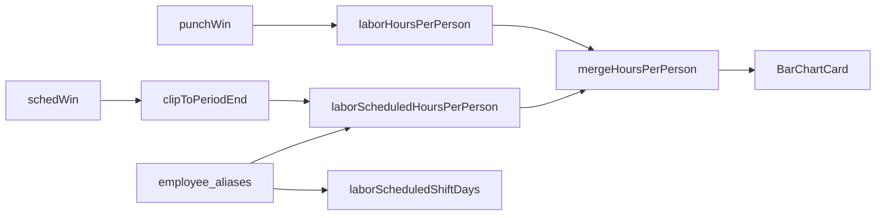

# Labor "Hours per person" shows scheduled hours distinctly (Issue #335)

Derived from jam + §4 approved in chat 2026-09-22 (recorded via `phase_state.py advance --operator-approved`). Branch `fix/update-http-localhost-3000-labor-hours`. Consulted: [CONTRIBUTING.md](CONTRIBUTING.md), [docs/contributing/sandbox-evidence.md](docs/contributing/sandbox-evidence.md), prior console plan [docs/plans/i243-labor-coverage-schedule-always.md](docs/plans/i243-labor-coverage-schedule-always.md), [docs/operator-console/ARCHITECTURE.md](docs/operator-console/ARCHITECTURE.md) L3 (line 524), `user-preferences.mdc` Design #27 (UI polish), B4 (capture_evidence.py).

**Evidence tier: unit-only** (waiver: Operator Console display-only change with no BHAGA pipeline, sheet or ADP path; runtime evidence is operator-reviewed localhost screenshots against prod BQ read-only, hosted via `capture_evidence.py`, which satisfies the portal screenshot gate G5 — no `run-sandbox-e2e` label on the PR, per operator 2026-09-22).

## Behaviour (agreed)

- Actual per person = `adp_shifts` over `punchWin` (the page's existing actual window, [app/labor/page.tsx](apps/operator-console/app/labor/page.tsx) line 173), not raw `win` — same handoff as the month chart.
- Scheduled per person = `adp_scheduled_shifts` over `schedWin` **clipped to Period end** (per-person has no date axis, so the horizon extension past Period end would inflate bars).
- Handoff note: `scheduleTakesOverFrom` clamps at today, so with actuals through 9/20 and today 9/22, 9/21 is in neither window (existing month-chart behaviour, unchanged). The jam numbers were computed from 9/21; §4 case 1 is compared against the reference SQL below run at capture time.
- Four series, same palette as [components/labor/LaborHoursChart.tsx](apps/operator-console/components/labor/LaborHoursChart.tsx) lines 177-181 (`LABOR_CHART_COLORS` from [lib/charts/palette.ts](apps/operator-console/lib/charts/palette.ts)): `parttime`, `fulltime`, `parttime_sched`, `fulltime_sched`; stacked. Series only rendered if any row has a value (matches month-chart legend logic).
- Honours `labor_type` (`showsPartTime` / `showsFullTime` in [lib/filters/labor-type.ts](apps/operator-console/lib/filters/labor-type.ts)) and `pto` (`excludePto` on the scheduled query).
- Sort by combined hours desc; tooltip entries: `Actual`, `Scheduled`, `Total (combined)` (only when both > 0), coloured by the person's bucket.
- Scheduled employee name = `employee_aliases.canonical_name` (store `palmetto`), falling back to trimmed `employee_name`, then `employee_id`. Applied to both the new per-person query and `laborScheduledShiftDays` (fixes coverage swimlanes).



## M1 — Queries + window helper (Sonnet 5 medium)

[apps/operator-console/lib/bq/queries.ts](apps/operator-console/lib/bq/queries.ts):

- Add a shared SQL fragment near line 663 and use it in `laborScheduledShiftDays` (line 686, replacing `COALESCE(NULLIF(TRIM(s.employee_name), ''), s.employee_id) AS employee`) plus a `LEFT JOIN` on aliases:

```ts
const SCHEDULED_EMPLOYEE_SQL =
  "COALESCE(al.canonical_name, NULLIF(TRIM(s.employee_name), ''), s.employee_id)";
function scheduledAliasJoin(): string {
  return `LEFT JOIN ${fq("employee_aliases")} al
       ON al.store = @store AND al.raw_name = TRIM(s.employee_name)`;
}
```
  Pass `store: DEFAULT_STORE` (from `@/lib/auth/identity`) in the params. `employee_aliases` is keyed `(store, raw_name)`, so the join cannot fan out rows.

- Extend `LaborHoursPerPersonRow` (line 271) with `labor_bucket: "parttime" | "fulltime"`; `laborHoursPerPerson` (line 277) joins `adp_wage_rates w ON w.employee_id = s.employee_id` and groups by employee + the same `IF(IFNULL(w.is_salaried, FALSE) OR IFNULL(w.excluded_from_labor_pct, FALSE), 'fulltime', 'parttime')` used at line 687.

- New:

```ts
export interface LaborScheduledHoursPerPersonRow {
  employee: string;
  labor_bucket: "parttime" | "fulltime";
  hours: number;
  [key: string]: unknown;
}
export function laborScheduledHoursPerPerson(
  win: DateWindow,
  opts?: { excludePto?: boolean },
): Promise<LaborScheduledHoursPerPersonRow[]>
```
  `SUM(s.scheduled_hours)` from `adp_scheduled_shifts s` + wage join + alias join, `WHERE s.date BETWEEN @start AND @end AND IFNULL(s.scheduled_hours, 0) > 0` + the existing `ptoClause` pattern (line 635), `GROUP BY employee, labor_bucket HAVING hours > 0`.

[apps/operator-console/lib/labor/actual-schedule-windows.ts](apps/operator-console/lib/labor/actual-schedule-windows.ts) — add:

```ts
/** Clip a schedule window to Period end; null when nothing remains. */
export function clipToPeriodEnd(
  sched: DateWindow | null,
  periodEnd: string,
): DateWindow | null
```

Test: `cd apps/operator-console && npx vitest run __tests__/labor-actuals-boundary.test.ts` — new cases for `clipToPeriodEnd` (null in, end beyond period, end within period, start after period end -> null). Pass: all green.

## M2 — Merge helper + page wiring (Sonnet 5 medium)

New [apps/operator-console/lib/labor/hours-per-person.ts](apps/operator-console/lib/labor/hours-per-person.ts):

```ts
export type HoursPerPersonChartRow = {
  employee: string;
  parttime: number | null;
  fulltime: number | null;
  parttime_sched: number | null;
  fulltime_sched: number | null;
  combined: number;
  tooltipEntries: { label: string; value: string; color?: string }[];
};
export function mergeHoursPerPerson(
  actual: LaborHoursPerPersonRow[],
  scheduled: LaborScheduledHoursPerPersonRow[],
  laborTypes: string[] | null,
): { rows: HoursPerPersonChartRow[]; series: { key: string; label: string; color: string }[] }
```
  Keyed by `employee`; values rounded to 1 dp; drop people whose filtered combined is 0; sort by `combined` desc then name. Series labels match the month chart: `Part-time`, `Full-time`, `Part-time (scheduled)`, `Full-time (scheduled)`.

[apps/operator-console/app/labor/page.tsx](apps/operator-console/app/labor/page.tsx):
- Line 203: `laborHoursPerPerson(win)` -> `punchWin ? laborHoursPerPerson(punchWin).catch(() => []) : Promise.resolve([])`.
- Add to the `Promise.all` (line 200): `perPersonSchedWin ? laborScheduledHoursPerPerson(perPersonSchedWin, { excludePto }).catch(() => []) : Promise.resolve([])`, where `perPersonSchedWin = clipToPeriodEnd(schedWin, win.end)` (not gated on `chartSchedule` — per-person has no Hour-grain issue).
- Replace `hoursPerPerson` / `personChartData` (lines 152, 239-242, 339-342) with `mergeHoursPerPerson(...)`.
- Lines 611-621: wrap in `<div data-testid="labor-hours-per-person">`, `BarChartCard` gets `series={perPerson.series}`, `stacked`, subtitle `"Clocked hours + ADP scheduled for days not yet ingested"` only when a scheduled series exists; empty copy -> `"No clocked or scheduled hours in this Period."`.
- Line 578 note copy: replace "Per-person hours below sum clocked ADP hours over the Period." with "Per-person hours stack clocked hours with scheduled hours (slate) for the days not yet ingested, through Period end."

Test: new `apps/operator-console/__tests__/labor-hours-per-person.test.ts` — actual-only, scheduled-only, both (combined + tooltip), PT-only filter hides FT person, neither-selected returns no rows/series, sort order, series omitted when empty. Run `cd apps/operator-console && npx vitest run && npx tsc --noEmit && npm run lint`. Pass: all green.

### M2 (cont.) — Docs + verify

- [docs/operator-console/ARCHITECTURE.md](docs/operator-console/ARCHITECTURE.md) line 524: L3 now stacks actual (`adp_shifts`, punch window) + scheduled (`adp_scheduled_shifts`, clipped to Period end), PT/FT palette, labor_type + PTO filters; scheduled names via `employee_aliases` (also coverage).
- Copy plan into `docs/plans/i335-labor-hours-per-person-scheduled.md`.
- `python3 scripts/check_doc_freshness.py`, `python3 scripts/check_plan_readiness.py --plan docs/plans/i335-labor-hours-per-person-scheduled.md`, `python3 scripts/verify.py --full`. Pass: all green.

## M3 — Localhost demo, operator review gate (Sonnet 5 medium)

Run after M2 (incl. `verify.py --full`) is green; no PR, push, or `phase_state.py advance --to pr-evidence` before the operator says OK.

1. `cd apps/operator-console && npm run dev` (background; confirm `Ready` on http://localhost:3000). Prod BQ read via the laptop's ADC (`python3 scripts/gcp_access_probe.py` first).
2. Run the reference SQL below and post the expected per-person table in chat.
3. Post these clickable URLs, one per §4 scenario, and ask the operator to review:
   - http://localhost:3000/labor?range=this_month (cases 1, 2, 8, 9)
   - http://localhost:3000/labor?range=this_month&labor_type=Part-time (case 3)
   - http://localhost:3000/labor?range=this_month&pto=exclude (case 4)
   - http://localhost:3000/labor?range=last_month (case 5)
   - http://localhost:3000/labor?range=custom&from=2026-09-23&to=2026-09-30 (case 6)
4. Pause with `AskQuestion` (approve / changes needed). Any change requests: fix, re-run M2 tests + `verify.py --full`, re-demo. Wait indefinitely (Preference 24).

Pass: operator approves the localhost build in chat.

## M4 — Evidence from the approved build + PR (Sonnet 5 medium)

With the same dev server still running (the build the operator approved), capture and host screenshots:

```bash
python3 apps/operator-console/scripts/capture_evidence.py \
  --path '/labor?range=this_month' --label per-person-this-month \
  --path '/labor?range=this_month&labor_type=Part-time' --label per-person-pt \
  --path '/labor?range=this_month&pto=exclude' --label per-person-pto-exclude \
  --path '/labor?range=last_month' --label per-person-last-month \
  --path '/labor?range=custom&from=2026-09-23&to=2026-09-30' --label per-person-future \
  --scroll-to '[data-testid=labor-hours-per-person]'
python3 apps/operator-console/scripts/capture_evidence.py \
  --path '/labor?range=this_month' --label coverage-and-month-chart
```

Reference SQL for case 1 (run at capture time; mirror `scheduleTakesOverFrom`):

```sql
DECLARE thru DATE DEFAULT (SELECT MAX(date) FROM `jarvis-bhaga-prod.bhaga.vw_labor_daily_live`
  WHERE IFNULL(hourly_hours,0)+IFNULL(fulltime_hours,0)>0);
DECLARE sched_from DATE DEFAULT GREATEST(DATE_ADD(thru, INTERVAL 1 DAY), CURRENT_DATE('America/Chicago'));
-- actual: adp_shifts date BETWEEN month_start AND DATE_SUB(sched_from, INTERVAL 1 DAY)
-- scheduled: adp_scheduled_shifts date BETWEEN sched_from AND month_end, names via employee_aliases
```

### Per-scenario evidence (PR §4)

1. Happy — `this_month`: per-person actual/scheduled match reference SQL within 0.1 h; combined = actual + scheduled.
2. Alias — "Johnson, Dolce" is one bar; no "Johnson, Dolce J" bar.
3. Filter — `labor_type=Part-time` hides full-time people / series.
4. Filter — `pto=exclude` lowers scheduled for anyone with PTO in window (verify against SQL with `hour_kind != 'pto'`).
5. Legacy — `last_month`: no scheduled series; bars equal pre-change clocked-only totals.
6. Future-only Period: schedule-only bars, no crash.
7. Failure — scheduled query error / empty: clocked-only bars (`.catch(() => [])`), covered by unit test.
8. Regression — "Labor hours by month" chart unchanged.
9. Coverage — Staffing coverage swimlane shows "Johnson, Dolce" once.
10. `vitest` + `python3 scripts/verify.py --full` green.
11. Post-merge — prod `/labor?range=this_month` smoke (case 1 + 2).

## Feature-flag decision

No flag / no FEATURE_FLAGS.md entry. Read-only BQ display change on the Operator Console; cannot produce wrong tip or payroll cents (Payroll page and solo-hours are untouched).

## Invariants preserved

- BQ reads only; no writes, no ADP interaction.
- Integer cents / tip + payroll math untouched.
- America/Chicago boundary via existing `scheduleTakesOverFrom` / `actualPunchWindow` / `scheduledShiftWindow`; a day is never counted as both actual and scheduled.
- Alias join is 1:1 on `(store, raw_name)`; no row fan-out.
- Sandbox isolation N/A (console UI).

## UX polish (Design #27)

Reuses `BarChartCard` stacked mode, `LABOR_CHART_COLORS`, legend and `tooltipEntries` pattern already used by the month chart; muted subtitle / empty copy per existing page style. Hover shows the custom tooltip; bar height calc (line 617) unchanged so long rosters stay readable.

## Branch / PR mechanics

PR opens only after the M3 localhost approval. Do **not** add the `run-sandbox-e2e` or `sandbox-live` labels (the Sandbox e2e check still reports on `opened` and passes without the label). §4 = the hosted localhost screenshots + reference SQL output + vitest/verify output; run `python3 scripts/check_evidence_readiness.py --pr N` before pushing. One branch = one coherent change; `gh pr create --base main` as `jarvis-agent-bot328`, `Refs #335`; `--no-verify` push only after `verify.py --full` is green; never self-merge; reply to every review comment; babysit via `pr_triage.py`; bind cost ledger after PR opens.

## Model routing

M1-M4: Sonnet 5 medium thinking (M2 doc edits could drop to Composer 2.5, but they share the M2 chat). Opus only if review blocks.

## Addendum — M3 localhost review (operator, 2026-09-22)

Operator approved the stacked per-person chart and asked, in the same PR, for a
**separate single-person chart** where Aggregation and the other filters apply
(reuse the existing Aggregation filter; same PR). Implemented as:

- `?person=` `FilterSelect` in the new card's header (options = people in the
  L3 chart under the current filters; stale/missing -> top bar). Carried through
  every other filter's `extraParams`.
- `LaborHoursChart` gains `person` (title "Hours by <grain> — <name>", no
  store-level sales hint) and `headerRight`; the page passes no goal.
- Data: both charts are built in TS from day-level rows —
  `laborHoursPerPersonDaily(punchWin)` (replaces `laborHoursPerPerson`; keeps
  today, unlike `laborActualShiftDays`) and the existing
  `laborScheduledShiftDays(schedWin)` rows. That removed the planned
  `laborScheduledHoursPerPerson` query and `clipToPeriodEnd`; the Period-end cut
  is a date filter in `mergeHoursPerPerson(…, periodEnd)`.
- Hour of day: note instead of a chart. Stat Average at Weekday divides by the
  count of that weekday in the chart window.
- Rounding: half-up on exact minutes (Ortiz Aug 5,241 min = 87.35 h -> 87.4; the
  pre-change page showed 87.3 from float truncation). Legacy case 5 therefore
  matches pre-change totals except at exact .x5 values.

Added §4 cases: 12 single-person weekly (Dolce, this month) sums to the L3 bar;
13 `30d` + Monthly spans Aug + Sep (+ Oct schedule on the extended spine);
14 Part-time filter with a full-time `person` falls back to the top part-timer;
15 Hour of day shows the note.
