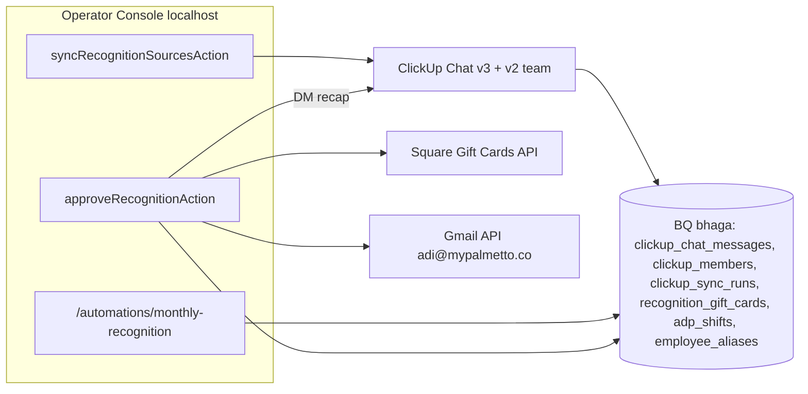

# Monthly recognition — MVP / High Five drafts + Square gift cards (Issue #369)

Evidence tier: sandbox-e2e

Branch `fix/want-to-work-on-a-new-2` · tracking issue #369 · jam + define-evidence approved in chat
2026-10-06. Localhost review first (`BYPASS_IAP_EMAIL` + ADC); PR opens only after the operator
signs off on localhost.

## Jam outcome (approved)

- Operator Console `/automations/monthly-recognition`: pick a **payroll cycle** → recognition
  month (default = calendar month before `period_end`'s month, overridable).
- Data is **pre-synced** into BQ (Sync button + auto-sync when > 1 h stale; nightly copy in M4):
  `#monthly-recognition` (`8cr6661-2837`), `#running-austin-palmetto` (`8cr6661-737`),
  Shift Coverage & Trades (`8cr6661-1617`) — top-level + thread replies — plus ClickUp members
  (name + email).
- Winners parsed from the month's nomination thread results line (`Results: 1. Jacob → MVP`,
  `MVP → Linh`, `High Five → Kenya + Dolce`).
- **Why panel** per winner: nomination quotes, aux-channel mentions (checklist shoutout counts,
  shift-notes form counts summarized), `adp_shifts` month stats; flags (prefix name match,
  shifts outside month).
- **Draft** (shown before anything is created): per winner first/last name, email, gift cards
  (count × amount), total, payroll bonus (reference), channel post, per-winner email, DM recap.
- **Approve** → Square DIGITAL gift cards created + activated on the Austin location
  (`L9DDZF3CQS8AK`), emailed to each winner from adi@mypalmetto.co, DM recap to Adi
  (`198109189`). Channel post is a separate button (once per month).
- September 2026 cards were already bought manually on 2026-10-06 → September is preview-only;
  live proof = one **$1 test card to Adi**.

## Architecture



All parsing / matching / drafting is pure TS in `apps/operator-console/lib/recognition/*`
(single implementation). The M4 nightly step only copies raw ClickUp rows.

## Milestone 1 — Schema, sync, parser, context (Sonnet)

### Files

| Path | Change |
|---|---|
| `core/migrations/087_monthly_recognition.sql` (new) | DDL below |
| `apps/operator-console/lib/automations/clickup.ts:23` (`clickupFetch`) | add `listChannelMessages(channelId, {sinceMs, maxPages})`, `listReplies(messageId)`, `listWorkspaceMembersWithEmail()` |
| `apps/operator-console/lib/recognition/sync.ts` (new) | `syncRecognitionSources(store, trigger)` |
| `apps/operator-console/lib/recognition/parse.ts` (new) | pure parser (signatures below) |
| `apps/operator-console/lib/recognition/context.ts` (new) | pure Why-panel builder |
| `apps/operator-console/lib/recognition/month.ts` (new) | `awardMonthForPeriod(periodEnd)` |
| `apps/operator-console/lib/bq/queries.ts:2763` (after `listPayPeriodsWithPaidStatus`) | recognition reads |
| `apps/operator-console/lib/bq/writes.ts:1060` (after `upsertAutomation`) | MERGE helpers |
| `apps/operator-console/__tests__/recognition-parse.test.ts` (new) | fixtures from real Aug / Sep / May messages |
| `apps/operator-console/__tests__/recognition-context.test.ts` (new) | Why panel + flags |

### DDL (`087_monthly_recognition.sql`)

```sql
CREATE TABLE IF NOT EXISTS `jarvis-bhaga-prod.bhaga.clickup_chat_messages` (
  store STRING NOT NULL, channel_id STRING NOT NULL, message_id STRING NOT NULL,
  parent_message_id STRING,          -- NULL = top-level
  user_id STRING, posted_at TIMESTAMP NOT NULL, content STRING,
  reply_count INT64, synced_at TIMESTAMP NOT NULL
);
CREATE TABLE IF NOT EXISTS `jarvis-bhaga-prod.bhaga.clickup_members` (
  workspace_id STRING NOT NULL, user_id STRING NOT NULL, username STRING,
  email STRING, synced_at TIMESTAMP NOT NULL
);
CREATE TABLE IF NOT EXISTS `jarvis-bhaga-prod.bhaga.clickup_sync_runs` (   -- append-only
  store STRING NOT NULL, run_id STRING NOT NULL, trigger STRING NOT NULL,
  started_at TIMESTAMP NOT NULL, finished_at TIMESTAMP, status STRING NOT NULL,
  messages_upserted INT64, members_upserted INT64, error STRING, updated_by STRING
);
CREATE TABLE IF NOT EXISTS `jarvis-bhaga-prod.bhaga.recognition_gift_cards` (
  store STRING NOT NULL, award_month STRING NOT NULL,   -- 'YYYY-MM' or 'test-…'
  idempotency_key STRING NOT NULL,                      -- rec-<store>-<month>-<user>-<n>
  clickup_user_id STRING NOT NULL, award STRING NOT NULL,
  recipient_first STRING, recipient_last STRING, recipient_email STRING,
  card_index INT64 NOT NULL, amount_cents INT64 NOT NULL, location_id STRING NOT NULL,
  square_gift_card_id STRING, gan_last4 STRING,          -- full GAN never stored
  status STRING NOT NULL,                                -- pending|created|activated|emailed|failed
  email_message_id STRING, error STRING,
  approved_by STRING, created_at TIMESTAMP NOT NULL, updated_at TIMESTAMP NOT NULL
);
```

MERGE keys: messages `(channel_id, message_id)`; members `(workspace_id, user_id)`; gift cards
`(idempotency_key)`. Channel-post dedupe reuses `automation_posts` (migration 054) with
`automation_id='monthly-recognition'`, `post_date_ct = <award month>-01`, `trigger='channel'`.

### Sync rules

- Channels from `RECOGNITION_CHANNELS` in `lib/recognition/sync.ts` (ids above; also added to
  `agents/bhaga/knowledge-base/store-profiles/palmetto.json` `clickup` block, no hardcoding drift).
- Top-level: page newest→oldest (limit 100) until `posted_at < now − 35 d` (first sync: 75 d);
  `#monthly-recognition` always full.
- Replies: refetch for every top-level whose `reply_count` changed vs BQ or posted < 14 d ago.
- Members: `/api/v2/team` every sync.
- Rate: ≤ 100 req/min (ClickUp PAT limit) — sequential with 250 ms spacing; one sync in flight
  (`clickup_sync_runs` row `status='running'` < 10 min blocks a second).

### Signatures (`parse.ts`, `context.ts`, `month.ts`)

```ts
export type Award = "MVP" | "High Five";
export type ResultLine = { award: Award; names: string[]; mentionIds: string[] };
export function monthOfThread(content: string, postedAtIso: string): string | null; // 'YYYY-MM'
export function parseResults(content: string): ResultLine[];                      // [] if not a results msg
export type MemberMatch = { userId: string | null; first: string; last: string;
  email: string | null; how: "mention" | "exact" | "prefix" | "ambiguous" | "none" };
export function matchMember(name: string, mentionId: string | null, members: Member[]): MemberMatch;
export function matchRoster(first: string, last: string, roster: string[]): { canonical: string | null; how: "exact" | "last-name" | "none" };
export function awardMonthForPeriod(periodEndIso: string): string;               // '2026-10-04' → '2026-09'
export type WhyItem = { source: "nomination" | "running" | "coverage"; at: string; author: string; text: string; url: string };
export type WhyPanel = { items: WhyItem[]; checklistShoutouts: number; shiftNotes: number;
  shifts: { days: number; hours: number; opening: number; closing: number } | null; flags: string[] };
export function buildWhyPanel(input: { winner: MemberMatch; month: string; windowEndIso: string;
  messages: ChatRow[]; members: Member[]; shifts: ShiftStat | null }): WhyPanel;
```

**Verify:**
```bash
cd apps/operator-console && npx vitest run __tests__/recognition-parse.test.ts __tests__/recognition-context.test.ts
BHAGA_DATASTORE=bigquery python3 -c "from core.datastore import ensure_schema; print(ensure_schema())"   # applies 087 (additive)
```
Pass criterion: Aug fixture → Jacob MVP / Dolce High Five; Sep → Linh MVP (prefix → Linhchi,
flag), Kenya + Dolce High Five; May weekly-update → MVP Dolce, High Five z/Myles/Tina (3);
Kenya flag `shifts outside award month`.

## Milestone 2 — Square + Gmail + issue orchestration (Sonnet; Opus review of money path)

### Files

| Path | Change |
|---|---|
| `skills/square_api/grant.py:50` (`OAUTH_SCOPES`) | add `GIFTCARDS_READ GIFTCARDS_WRITE PAYOUTS_READ` (superset — nightly scopes unchanged) |
| `apps/operator-console/lib/recognition/square.ts` (new) | token from Secret Manager `square_palmetto_oauth` (same pattern as `lib/plaid/client.ts:222`) + `createGiftCard`, `activateGiftCard`, `getGiftCard` |
| `apps/operator-console/lib/recognition/gmail.ts` (new) | `sendEmail({to, subject, text})` via refresh token (`GMAIL_SENDER_*` env) |
| `apps/operator-console/scripts/gmail_sender_grant.py` (new) | one-time loopback OAuth (`gmail.send`) for adi@mypalmetto.co → Keychain `jarvis-gmail-palmetto-sender` + prints `.env.local` lines |
| `apps/operator-console/lib/recognition/issue.ts` (new) | `issueRecognitionCards(plan, deps)` — pure orchestration with injected deps |
| `apps/operator-console/lib/recognition/draft.ts` (new) | `composeChannelPost`, `composeWinnerEmail`, `composeDmRecap`, `groundedParagraph` (Gemini, falls back to template) |
| `apps/operator-console/lib/config/features.ts:53` | `recognitionGiftCards: process.env.CONSOLE_RECOGNITION_GIFT_CARDS === "1"` |
| `apps/operator-console/__tests__/recognition-issue.test.ts` (new) | idempotency + resume |
| `apps/operator-console/__tests__/recognition-draft.test.ts` (new) | copy + grounding guard |

### Square calls (Square-Version `2025-01-23`)

```ts
// POST /v2/gift-cards
{ idempotency_key: `${key}-create`, location_id, gift_card: { type: "DIGITAL" } }
// POST /v2/gift-cards/activities
{ idempotency_key: `${key}-activate`, gift_card_activity: { type: "ACTIVATE", location_id,
  gift_card_id, activate_activity_details: { amount_money: { amount: cents, currency: "USD" },
  buyer_payment_instrument_ids: ["palmetto-recognition-comp"], reference_id: key } } }
// GET /v2/gift-cards/{id}  → state ACTIVE, balance_money.amount === cents, gan (email only)
```

### Orchestration rules (invariants)

- Money is **integer cents** end-to-end; `amount_cents` INT64.
- **Idempotent**: one BQ row per card key; Square idempotency keys per step; re-Approve skips
  `emailed` rows and resumes only missing steps (`pending→created→activated→emailed`).
- **Never auto-retry a side effect** (card create/activate, email, DM). A failure writes
  `status='failed'` + `error` and a greppable breadcrumb
  `[recognition] BREADCRUMB step=<create|activate|verify|email|dm> key=<key> err=<…>`; the
  operator re-clicks Approve to resume (Square idempotency keys make the repeat safe).
- Activation is verified by read-back (`getGiftCard`) before the email is sent.
- Full GAN only in the outgoing email; BQ + DM keep `gan_last4`.
- Feature flag `recognitionGiftCards` (env `CONSOLE_RECOGNITION_GIFT_CARDS=1`): flag off ⇒
  Approve disabled, previews + Sync + DM still work. Flag decision: this path **moves money**,
  so it is flagged (service env, config change not deploy — user-preferences #29).
- Draft grounding: Gemini paragraph accepted only if it contains the winner's first name, no `$`,
  no employee names absent from the Why panel, ≤ 600 chars; else template from nomination text.
- America/Chicago for award month + window boundaries.

### Provisioning (one-time, laptop/ADC — RUNBOOK §Square / Gmail)

```bash
python3 scripts/gcp_access_probe.py
BHAGA_SECRETS_BACKEND=gcp python3 -m skills.square_api.grant --store palmetto   # consent w/ new scopes
python3 apps/operator-console/scripts/gmail_sender_grant.py                    # adi@mypalmetto.co
```

**Verify:**
```bash
cd apps/operator-console && npx vitest run __tests__/recognition-issue.test.ts __tests__/recognition-draft.test.ts
BHAGA_SECRETS_BACKEND=gcp python3 -c "from skills.square_api import auth; print('ok')"   # + token/status scopes check
```
Pass criterion: issue tests cover happy path, crash after create (resume activates same card),
crash after activate (resume emails, no new card), email failure (status failed, no retry),
re-approve fully-issued month (0 Square calls).

## Milestone 3 — Page, actions, localhost walkthrough (Sonnet)

### Files

| Path | Change |
|---|---|
| `apps/operator-console/app/automations/page.tsx:48` | second `Card` link "Monthly recognition" (same Card/Badge pattern) |
| `apps/operator-console/app/automations/monthly-recognition/page.tsx` (new) | RSC: period `FilterSelect`, month override, loads BQ snapshot |
| `apps/operator-console/app/automations/monthly-recognition/RecognitionEditor.tsx` (new) | client: winners table, Why panels, previews, buttons |
| `apps/operator-console/app/automations/monthly-recognition/actions.ts` (new) | `syncRecognitionSourcesAction`, `previewRecognitionAction`, `reshapeRecognitionPostAction`, `dmRecognitionDraftAction`, `approveRecognitionAction`, `sendTestGiftCardAction`, `markGiftCardsIssuedAction` |
| `apps/operator-console/lib/actions/registry.ts:67` + `MUTATING_ACTIONS.md:33` | register the 7 actions |

Localhost review changes (operator, 2026-10-06): no channel post — the draft is DM'd to the
operator in two messages (summary, then the clean post to forward); "why" drafts automatically on
load; **Reshape with a prompt** (`lib/recognition/reshape.ts` guards @mentions); automation posts
(checklist shout-outs, shift-notes forms) never reach Gemini; mentions render as `@Name` chips;
**I already issued these** records hand-bought cards as ledger status `external`.
| `apps/operator-console/.env.example:19` | `GMAIL_SENDER_*`, `CONSOLE_RECOGNITION_GIFT_CARDS` |

UX (`docs/contributing/ui-polish.md`): reuse `PageHeader`, `FilterSelect`, `Card`, `Badge`
(award + match-confidence chips; amber = confirm), `DataTable`, `Button`, `Input`,
`useConsoleAction` + `ActionToast`. Copy-email button per row; editable first/last/email/cards;
confirm checkbox required for `prefix`/`ambiguous` matches before Approve enables. States:
hover/focus-visible on all controls, pending disables every send button, ~44px tap targets,
wraps at 390px. Approve shows a confirm step with totals (cards, $ loaded, est. 2.5% load fee).

**Verify:**
```bash
python3 scripts/check_operator_console_actions.py
cd apps/operator-console && npx vitest run && npx tsc --noEmit && npm run lint
BYPASS_IAP_EMAIL=adi@mypalmetto.co npm run dev      # localhost walkthrough L1–L6, C1–C3, G1–G3
```

## Milestone 4 — Pre-PR hardening (after operator localhost sign-off) (Sonnet)

- Nightly raw copy: **deferred to a follow-up issue** — the page auto-syncs on load when > 1 h
  stale, which covers a once-a-month workflow; a nightly copy would duplicate the TS sync in Python.
- Cloud console env: secrets are read at runtime via Secret Manager (`lib/recognition/secrets.ts`),
  not mounted — console SA granted `secretAccessor` on `square_palmetto_oauth` +
  `gmail_sender_palmetto`; `CONSOLE_RECOGNITION_GIFT_CARDS=1` set on the service post-merge.
- Docs lock-step: `apps/operator-console/README.md`, `docs/operator-console/ARCHITECTURE.md`,
  `lib/actions/MUTATING_ACTIONS.md`, `RUNBOOK.md` (Square re-consent, Gmail sender, gift-card
  resume), `PROGRESS.md` dated line; run `python3 scripts/check_doc_freshness.py`.
- Evidence capture via `apps/operator-console/scripts/capture_evidence.py` (emails + GANs
  redacted), then PR mechanics below.

**Verify:**
```bash
python3 scripts/verify.py --full
python3 scripts/check_plan_readiness.py --plan docs/plans/i369-monthly-recognition.md
```

## PR §4 evidence (per scenario)

| # | Scenario | Pass criterion |
|---|---|---|
| L1 | Sync (happy path) | counts + last-synced shown; second sync 0 dupes (BQ `COUNT(*)` = `COUNT(DISTINCT key)`) |
| L2 | Sep cycle 2026-09-21→10-04 | Linhchi Huynh (prefix flag), Kenya Berding, Dolce Johnson w/ name/email/reason |
| L3 | Aug cycle (legacy month) | Jacob Garcia MVP, Dolce Johnson High Five |
| L4 | October (no results) | empty state; send buttons disabled |
| L5 | Page load after sync | served from BQ, no ClickUp call, < 1 s |
| L6 | DM me the post | two DMs to Adi (summary, clean post); channel untouched |
| L7 | Reshape | prompt rewrite keeps every @mention; dropped-mention rewrite rejected |
| G6 | Bought by hand | "I already issued these" → status `external`, badge "Issued by you", issue button disabled, 0 Square calls |
| C1 | Why panels | nominations + running + coverage items, shoutout/form counts, shifts, flags |
| C2 | Grounded drafts | every claim traceable; "referrals" only as quote; Kenya "extra closing shifts" |
| C3 | Aug regression | Jacob panel shows hours fact |
| S1 | Square re-consent | token scopes ⊇ old + GIFTCARDS_READ/WRITE + PAYOUTS_READ; nightly Square export still works |
| S2 | Load-fee check | payout entries for 2026-10-06 eGift orders reported (GIFT_CARD_LOAD_FEE present/absent) |
| G1 | September | preview only; "already bought 2026-10-06" note; no Square call |
| G2 | Live $1 test (happy path) | 1 card on `L9DDZF3CQS8AK`, ACTIVE, balance 100; email to Adi; DM recap |
| G3 | Re-approve | 0 new cards/emails/DMs; "already issued" |
| G4 | Failure + recovery (unit) | crash-after-create / after-activate / email-fail resume w/o duplicates |
| G5 | Unit | keys, integer cents, email body |
| P1 | Pre-PR | docs, redacted screenshots desktop + 390px |

## Invariants preserved

- Additive only: new tables + new page; no existing table/behavior changes (backward-compatible).
- Integer cents; America/Chicago boundaries; no hardcoded sheet IDs (channel ids in store profile).
- Idempotent upserts for every write; side effects never auto-retried; breadcrumb on failure.
- Read-only toward ADP (only `adp_shifts` reads); payroll bonus shown as reference, not written.
- No PII in git; emails only in BQ + outgoing mail; GAN never persisted.

## Branch / PR mechanics + model routing

- Single branch `fix/want-to-work-on-a-new-2`; one PR, opened only after localhost sign-off via
  `gh pr create --base main` as bot account `jarvis-agent-bot328` (`GH_TOKEN`), `Closes #369`;
  babysit per `pr-workflow.mdc`; never self-merge — operator merges.
- Model routing (cost playbook `docs/contributing/cost.md`): M1/M3/M4 Sonnet; M2 Sonnet with an
  Opus review of `issue.ts` (money path). One chat per PR.
