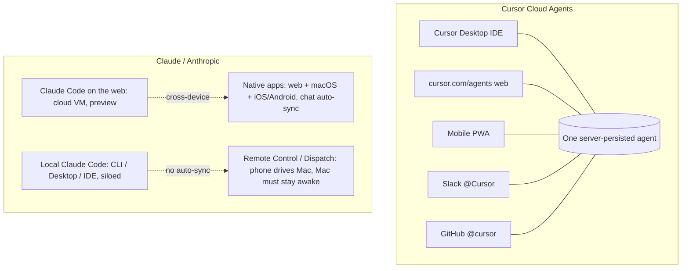

# Research: Code From Any Device With Continuous Context — Cursor Cloud Agents vs Claude Code

Status: RESEARCH / NOT FINALIZED. This documents options and tradeoffs. The "Current lean"
section is explicitly non-binding.

Last updated: 2026-05-30
Author context: written during the BHAGA cloud cutover, when the operator asked
"how does Cursor Cloud Agent compare to Claude / Claude for Work, and can I keep one
continuous coding context across Mac, iPhone, etc."

---

## 1. The goal

Be able to **code (ask, build, review, ship) from any device — Mac, iPhone, web — while
continuing the same conversation and context**, without depending on a specific laptop
(which is being decommissioned).

Two layers to the goal:
- **Continuity of conversation/context** across devices.
- **Agentic coding** (an agent that edits a repo, runs tests, opens PRs) reachable from anywhere.

This is adjacent to, but separate from, the BHAGA "bhaga should always answer me" thread
(see Section 7), which is about a Slack-reachable assistant for the tip pipeline.

---

## 2. TL;DR

- Both ecosystems now have a **cloud coding agent** (clone a GitHub repo in a hosted VM,
  run tests, open a PR): **Cursor Cloud Agents** (GA) and **Claude Code on the web**
  (research preview).
- **Cursor** offers a *single* unified model: one server-persisted agent reachable from
  the Cursor IDE, web, phone PWA, Slack, GitHub, Linear, API — and continuable inside this
  Cursor IDE via the Agents Window / "Open in Cursor."
- **Claude** offers *best-in-class native mobile apps* with automatic chat sync, but its
  *coding* continuity is more fragmented: cloud sessions sync, local CLI/Desktop sessions
  do not, and the phone-to-Mac bridges (Remote Control / Dispatch) need the Mac awake.
- **Mobile reality:** Cursor = PWA only (no native app); Claude = native iOS/Android app.
  Both phones are good for kicking off / steering / reviewing / merging, weak for hands-on editing.
- **We are already entrenched in Cursor** (this repo, this conversation, an active subscription),
  which materially lowers the cost of standardizing on it.

---

## 3. The two ecosystems at a glance

---

## 4. Head-to-head comparison

Dimensions that matter for "code anywhere + one continuous context":

- **Cloud coding agent (VM clones repo, runs tests, opens PR)**
  - Cursor: Yes, generally available.
  - Claude: Yes (Claude Code on the web), but research preview, GitHub-only for push-back.

- **Same agent/session continues across Mac / web / phone**
  - Cursor: Yes — one server-persisted cloud agent reachable from every surface.
  - Claude: Yes for cloud sessions; local CLI/Desktop sessions are siloed (do not auto-sync).

- **Continue the coding session inside this Cursor IDE (on Mac)**
  - Cursor: Yes — Agents Window + "Open in Cursor"; bidirectional local <-> cloud handoff.
  - Claude: No — can "teleport" a cloud session to the terminal with full history, not into the Cursor IDE.

- **Native mobile app**
  - Cursor: No — PWA only ("Add to Home Screen").
  - Claude: Yes — first-class native iOS/Android apps.

- **Plain chat sync across devices**
  - Cursor: Only via cloud agents.
  - Claude: Automatic and seamless across web/desktop/mobile (their core strength).

- **Top model**
  - Cursor: Can pin Opus 4.8 (cloud agents always run Max Mode).
  - Claude: Opus 4.6 default on Max / Team Premium.

- **Mental model**
  - Cursor: Single — "your agents follow you everywhere."
  - Claude: Two systems — general chat sync vs Claude Code's cloud/Remote-Control/Dispatch bridges.

- **Human gate before prod deploy**
  - Both: Agents open PRs; neither auto-merges/auto-deploys. Human merge stays the gate.

- **Already set up for us**
  - Cursor: Yes — this repo, this conversation, active subscription, BHAGA cloud built here.
  - Claude: No — new ecosystem, new setup.

---

## 5. Cross-device continuity: what actually syncs

### Cursor
- **Cloud Agents are server-side persisted** and reachable from Desktop, Web
  (`cursor.com/agents`), the mobile **PWA**, Slack, GitHub, Linear, and the API/SDK. Start on
  Mac, continue the *same* agent on web/phone.
- **Local IDE chats are device-local** — there is no documented cross-device sync of local
  (non-cloud) chats. Continuity only holds for *cloud* agents.
- **"Move to Cloud"** transfers conversation history/context to a cloud agent but does **not**
  snapshot uncommitted/dirty files (cloud agent starts from clean git). Commit/stash first.
- Cloud agent chats appear in the Cursor IDE via the **Agents Window**; Slack runs offer
  **"Open in Cursor."**

### Claude
- **General chat conversations auto-sync** across web/macOS/iOS/Android via the account
  (plus chat search + memory). This is the seamless "start on Mac, continue on iPhone" path —
  but for *chat*, not necessarily for *coding sessions*.
- **Claude Code on the web** cloud sessions persist across devices (start on laptop, review on
  phone), keep running if you close the browser, can auto-fix CI/review comments, and can be
  pulled to the terminal via `--teleport` (with full conversation history).
- **Local Claude Code sessions are siloed per surface** (CLI session does not show in Desktop/web
  automatically) — an open, frequently-requested gap.
- **Remote Control / Dispatch** let the phone drive a *local* session in real time, but the
  **Mac must stay awake/running**; closing the terminal or sleep ends the session.

---

## 6. Mobile, cost, and maturity

### Mobile
- **Cursor:** PWA only (no App Store app, no offline). Good for prompt / review diffs / merge PRs.
  Deep editing is a desktop-IDE experience.
- **Claude:** Native iOS/Android. Excellent for chat + steering/reviewing agents; weak for
  hands-on editing/typing lots of code.

### Cost (relevant tiers)
- **Cursor:** Cloud Agents require a paid plan (Pro $20 / Pro+ $60 / Ultra $200 / Teams $40/user).
  Cloud agents bill at the model's API rate and **always run Max Mode** (usage-based on top of
  plan; spend limit prompted). Opus 4.8 is the most expensive option.
- **Claude:** Pro $20 (Claude Code on Sonnet 4.6; Opus available but burns quota), **Max 5x $100**
  (Opus 4.6 default — sweet spot for solo cross-device), Max 20x $200, Team Standard $20/seat,
  Team Premium $100/seat (Opus), Enterprise $20/seat + API usage. API Opus ~ $5/$25 per MTok.

### Maturity / risk
- **Cursor Cloud Agents:** GA, stable.
- **Claude Code on the web / Remote Control / Dispatch / self-hosted sandboxes:** mostly
  research preview or very new (Feb–May 2026) — expect churn, some rough edges (e.g. a fixed
  push-to-main 403 sandbox bug), no cloud secrets store yet, GitHub-centric, IP-allowlist /
  zero-data-retention orgs blocked from cloud sessions.

---

## 7. Implication for the BHAGA "bhaga should answer / build for me" thread

Findings from the BHAGA investigation:
- The cloud webhook ([cloud/webhook/handler.py](cloud/webhook/handler.py)) only reacts to **OTP
  codes** and **READY** words; any other DM is logged and dropped (`_handle_event`, lines ~492-540,
  `"No OTP found in message"`). It has **no Slack-posting code** at all — it cannot ack or answer.
- Free-form "ask bhaga anything" was **never an autonomous capability** — the old laptop listener
  only sent a canned "queued" ACK; real answers came from a live Cursor/Claude session. So this is
  a **build**, not a restore.

Options considered for making bhaga answer + build:

- **Option A — Minimal ACK:** webhook replies to any non-OTP/non-READY message with an honest
  "I handle OTP/READY/status here." Zero new infra, ends the silence. No real answers.
- **Option B — Pay-per-question LLM job:** webhook enqueues the question and triggers a Cloud Run
  job that runs an LLM over pre-computed sheet context and posts the answer back. ~Free infra +
  cents/question. Needs an LLM key in Secret Manager.
- **Option C — Always-on conversational service:** persistent Cloud Run service with multi-turn
  memory + tools. Best UX, leaves free tier (min-instances >= 1), highest effort.
- **Option D (emergent) — Cursor Cloud Agents + thin sheet-Q&A:** use **Cursor Cloud Agents**
  for the heavy "build improvements with Opus from anywhere" need (no custom code), and build only
  a **thin sheet-Q&A responder** into the existing bhaga webhook for instant grounded data answers
  ("what's Friday's labor %?"). Reuses the already-mounted `SLACK_BOT_TOKEN`
  (`skills/slack/adapter.py:115 send_message`) and the service-account Sheets read path.

Key realization: **Cursor Cloud Agents largely IS the "ask bhaga to build improvements with Opus
from any device" feature** — natively, no custom webhook. That makes Option D the lowest-effort way
to cover both "build anywhere" and "answer my data questions," with the human PR-merge gate intact.

Robustness pattern for any LLM Q&A: **Python pre-computes the aggregates; the LLM only phrases/
reasons** (never does arithmetic over raw cells) — this makes even a cheap model reliable and
makes model choice mostly about wording quality, not correctness.

Model choice notes (if we build Q&A): at this volume cost is negligible across Claude/GPT/Gemini
(pennies/month). So optimize for accuracy + ops simplicity, not cost. Claude Sonnet = strongest
careful tabular reasoning; Gemini via Vertex = GCP-native (no extra key, IAM auth, consolidated
billing). Build provider-agnostic so the model is a config flag.

---

## 8. Decision factors / open questions

- Is a **native mobile app** (Claude) a hard requirement, or is a **PWA** (Cursor) acceptable for
  on-the-go kick-off/review/merge?
- How much **hands-on editing on the phone** is actually needed vs. directing/reviewing agents?
- Tolerance for **research-preview churn** (Claude Code web/Remote Control/Dispatch) vs. GA stability (Cursor)?
- Willingness to run **two ecosystems** (Claude app for casual chat + Cursor for coding) vs. one?
- For BHAGA Q&A specifically: build the thin responder (Option D) now, or rely solely on Cursor
  Cloud Agents and skip in-DM data answers?
- Cost ceiling for Opus-in-Max-Mode cloud runs (both ecosystems price Opus similarly).

---

## 9. Current lean (NON-BINDING — for discussion only)

For the stated goal (build/iterate on the Jarvis repo from any device with continuous context),
the lean is **Cursor Cloud Agents as the primary system**, because:
- One unified, server-persisted agent reachable from this Mac IDE, web, phone PWA, Slack, GitHub;
- Bidirectional with the Cursor IDE we already use (Agents Window / Open in Cursor);
- We are already set up here (repo, subscription, BHAGA cloud) — lowest switching cost;
- Opus 4.8 pinnable; PR-only output keeps the prod gate.

Accept the one real tradeoff: **PWA instead of a native phone app.** Optionally keep the **Claude
native app** alongside for casual on-the-go chat, where Anthropic's sync is genuinely nicer.

For BHAGA: lean toward **Option D** — adopt Cursor Cloud Agents for "build anywhere," add a thin
sheet-Q&A responder to the bhaga webhook for instant data answers. Nothing here is committed.

---

## 10. Sources

Cursor (official docs):
- Cloud Agents overview: https://cursor.com/docs/cloud-agent.md
- Cloud Agents help: https://cursor.com/help/ai-features/cloud-agents.md
- Agents Window: https://cursor.com/docs/agent/agents-window.md
- Slack integration: https://cursor.com/docs/integrations/slack.md
- Capabilities (MCP, computer use): https://cursor.com/docs/cloud-agent/capabilities.md
- Security & network: https://cursor.com/docs/cloud-agent/security-network.md
- Setup / caching: https://cursor.com/docs/cloud-agent/setup.md
- Automations: https://cursor.com/docs/cloud-agent/automations.md
- Opus 4.8 model: https://cursor.com/docs/models/claude-opus-4-8.md
- Models & pricing: https://cursor.com/docs/models-and-pricing.md
- SDK (TS): https://cursor.com/docs/sdk/typescript.md ; Cloud Agent API: https://cursor.com/docs/cloud-agent/api/endpoints.md

Anthropic / Claude (current as of 2026-05; several are research preview):
- Claude Code on the web docs: https://code.claude.com/docs/en/claude-code-on-the-web ; quickstart: https://code.claude.com/docs/en/web-quickstart
- Claude Code on the web help: https://support.claude.com/en/articles/12618689-claude-code-on-the-web
- Remote Control: https://code.claude.com/docs/en/remote-control
- Dispatch setup: https://devgent.org/en/claude-dispatch-setup-guide-en/
- Chat search & memory (cross-device): https://support.claude.com/en/articles/11817273-use-claude-s-chat-search-and-memory-to-build-on-previous-context
- Team plan: https://claude.com/pricing/team ; help: https://support.claude.com/en/articles/9266767-what-is-the-team-plan
- Claude Code pricing deep dives: https://www.claudecodecamp.com/p/claude-code-pricing ; https://www.ssdnodes.com/blog/claude-code-pricing-in-2026-every-plan-explained-pro-max-api-teams/
- Claude Agent SDK: https://anthropic.com/engineering/building-agents-with-the-claude-agent-sdk
- Local-session-sync gap (open issue): https://github.com/anthropics/claude-code/issues/59641

Internal (BHAGA repo):
- Webhook handler (OTP/READY only, no Slack-post): [cloud/webhook/handler.py](cloud/webhook/handler.py)
- Slack send helper (already available): [skills/slack/adapter.py](skills/slack/adapter.py)
- Operator runbook: [RUNBOOK.md](RUNBOOK.md)
